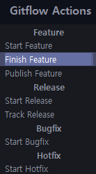
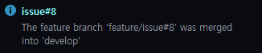
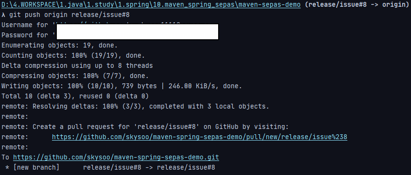

# git 사용법

# 1. 기본

### 1.1 로컬 저장소 초기화 ( 해당 디렉토리를 git repository로 사용하겠다는 것)
~~~
git init
~~~

### 1.2 원격 저장소 연결
~~~
git remote add origin https://github.com/skysoo/gradle-spring-kafka.git
~~~

### 1.3 원격 저장소 삭제
~~~
git remote remove origin
~~~

### 1.4 연결 확인
~~~
git remote -v
~~~

### 1.5 git 대상 파일 상태 확인
~~~
git status
~~~

### 1.5 스냅샷을 찍거나 커밋할 시점이다.
~~~
git add .
~~~

### 1.6 commit 명령어로 스냅샷을 찍는다.
~~~
git commit -m "<커밋내용>"
~~~

### 1.7 push 명령어로 원격지에 업로드한다.
~~~
git push -u origin master(기존 브랜치)
~~~

### 1.8 원격지에서 데이터 pull 하기
~~~
git pull origin master<브랜치>
~~~

### 참조. Git Status

# 2. git branch

### 2.1 현재 브랜치에서 새로운 브랜치 생성하고 체크아웃하기
~~~
git checkout -b <새로운 브랜치>
~~~

### 2.2 브랜치 전환
~~~
git checkout <다른 브랜치>
~~~

### 2.3 원격지에 새로운 브랜치를 생성해서 데이터를 push 하려면
~~~
git push -u origin <새로운 브랜치>
~~~

### 2.4 브랜치 목록 확인
~~~
git branch -v
~~~

### 2.5 git 브랜치 삭제
~~~
 git branch -d <branchname>
 ~~~

### 2.6 git 원격지 브랜치 삭제
~~~
 git push origin --delete <branchname>
 ~~~

# 3. git merge

### 3.1 merge할 브랜치로 변경
~~~
git checkout master
~~~

### 3.2 master 브랜치로의 merge 수행
~~~
git merge develop
~~~

### 3.3 merge 내역 remote 저장소로 Push
~~~
git push origin master
~~~

# 4. git reset

> git reset의 대상 트리는 HEAD, Index, Working Directory 3가지이다.

### 4.1 soft reset
* soft reset은 HEAD 트리의 브랜치를 지정한 커밋 버전으로 이동 시킨다.
* 즉, git commit 명령을 되돌리는 것이다.
~~~
git reset --soft HEAD~   # 직전 commit version

git reset --soft <commit version 지정>
~~~

### 4.2 mixed reset (default)
* mixed reset은 HEAD 와 Index 트리의 브랜치를 지정한 커밋 버전으로 이동 시킨다.
* 즉, git add 명령을 되돌리는 것이다. Staging Area까지 비우는 것.
~~~
git reset --mixed HEAD~   # git reset HEAD~ 와 같다.
~~~

### 4.3 hard reset
* hard reset은 워킹 디렉토리의 데이터까지 이전 커밋 버전으로 초기화 하는 위험한 명령어이다.
* 해당 옵션은 되돌리는 방법도 없다.
~~~
git reset --hard HEAD~
~~~

### 4.4 특정 파일 reset
* 아래 명령은 default reset(--mixed) 이므로 HEAD와 Index까지 되돌린다.
~~~
git reset <reset 대상 파일>
~~~

### 4.5 마지막 commit 수정
* commit 파일 이름이나 내용 변경
~~~
git commit --amend
~~~

### 4.6 git 원격지 파일 삭제
~~~
git rm --cached -r ./.idea
~~~

### 4.7 untracked file (commit 되지 않은 파일) 삭제
~~~
git clean -fd
~~~

# 5. git merge

### 5.1 git merge 시킬 브랜치로 이동
~~~
git checkout master
~~~

### 5.2 git merge
~~~
git merge develop
~~~

# 6. git log

### 6.1 패치목록 2개를 보여준다.
~~~
git log -p -2
~~~

### 6.2 간단하게 출력 ( 포맷팅도 할 수 있다 )
~~~
git log --pretty=oneline

git log --pretty=format:"%H %an %cn %s" --graph

%H : 해시값
%an : 저자 이름
%cn : 커미터 이름
%s : 커밋 내용
~~~

### 6.3 통계
~~~
git log --stat
~~~

### 6.4 조회 제한 조건
~~~
git log --since=2.weeks
~~~

# 7. git tag

### 7.1 tag 목록
~~~
git tag
~~~

### 7.2 git tagging
~~~
git tag -a <tag> -m "<tag 설명>"
~~~

### 7.3 tag도 remote에 push 해줘야한다.
~~~
git push origin v1.0
~~~

> 참조 <https://git-scm.com/book/ko/v2/Git-%EB%8F%84%EA%B5%AC-Reset-%EB%AA%85%ED%99%95%ED%9E%88-%EC%95%8C%EA%B3%A0-%EA%B0%80%EA%B8%B0>

# 8. git flow

### * git flow branch
1. master : 최종 배포에 사용되는 안정적인 버전
2. develop : 다음 배포를 위해 개발중인 최신 버전
3. feature : 특정 기능 개발을 위한 브랜치
4. release : 배포 점검을 위한 브랜치
5. hotfix : 긴급 버그 픽스를 위한 브랜치
6. support : 버전 호환성 문제를 처리하기 위한 브랜치

### 8.1 Feature
~~~
git flow feature start <branch name>
~~~
1. feature/branch name 으로 브랜치 생성
2. 생성된 브랜치로 checkout

~~~
git flow feature finish <branch name>
~~~
1. develop branch로 checkout
2. feature branch의 변경 사항을 develop branch로 merge
3. feature branch 삭제

### 8.2 Release
~~~
git flow release start <branch name>
~~~
1.  release/branch name 으로 브랜치 생성
2.  생성된 브랜치로 checkout

~~~
git flow release finish <branch name>
~~~
1. release branch를 master branch에 merge
2. release 이름으로 태그 등록
3. release branch를 develop branch로 재병합
4. release branch 삭제

# 9. git flow process

### 9.1 git issue 등록

### 9.2 ide task 작성 or gitflow feature start

### 9.3 추가 기능 or 변경 사항 commit

### 9.4 gitflow feature finish

### 9.5 gitflow release start

### 9.6 Local release branch push to Remote

### 9.7 release branch merge to master

### 9.8 release branch delete

### 9.9 Pull From Remote master To Local master

# git error solution

### 1. git 연관성 오류
~~~
git pull origin master

From https://github.com/skysoo/spring-jpa-demo
 * branch            master     -> FETCH_HEAD

fatal: refusing to merge unrelated histories
~~~

> SOLUTION
~~~
git pull origin master --allow-unrelated-histories
~~~

### 2. git 서버 계정 정보 변경(비밀번호 변경 or 2차 인증 추가) 후 Intellij 에서 push / pull 안되는 오류
~~~
remote: HTTP Basic: Access denied
remote: You must use a personal access token with 'read_repository' or 'write_repository' scope for Git over HTTP.
remote: You can generate one at http://192.168.10.8/profile/personal_access_tokens
fatal: Authentication failed for 'http://192.168.10.8/root/gitlab-runner-test.git/'
~~~

> SOLUTION
~~~
1. 설정 정보 초기화
git config --system --unset credential.helper

1. 다시 git command 실행
git pull origin master

1. 계정/비밀번호 요구
이때, 비밀번호에 token을 넣는다.
~~~