# 1. REST

HTTP 1.0 (1996)
WWW의 전송 프로토콜로서 HTTP를 사용하였다.

로이 필딩은 어떻게하면 이미 전세계에 퍼져있는 웹서버의 중단없이 HTTP를 업데이트할 수 있을까?를 고민하였고 그결과

REST (1998)
를 만들고 2000년에 논문을 발표했다.

# 2. API

Salesforce API(2000) 공개된 초최의 API => 너무 복잡했다.

FLICKR(플리커)에서 (2004)에 SOAP과 REST 의 여러 형태의 API를 발표했다.

하지만 SOAP보다 REST가 훨씬 간결했다.

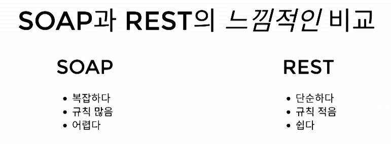

그렇게 REST가 자연스레 정착하나 싶었다.. 그런데, 2008년에 CMS를 위한 표준으로 CMIS가 나왔는데, 로이 필딩이 이런말을 했다.

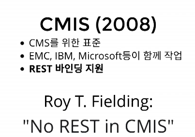

또 2016년에 마이크로소프트가 REST API 가이드라인을 제시했는데, 이것 역시 로이 필딩의 기준에 미치지 못했다.

> 이것은 REST API가 아니라 HTTP API라고 해야한다.

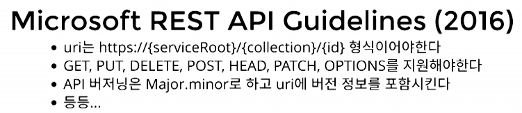

## 2-1. 그럼 로이 필딩이 말하는 REST API는 무엇인가?

1. REST API는 반드시 hypertext-driven 이어야 한다.
2. REST API를 위한 최고의 버저닝 전략은 버저닝을 안하는 것이라고 했다.

HTTP만 잘 따라도 아래의 REST 스타일을 대체로 잘 지킬수 있다.

여기서 code-on-demand란 서버에서 클라이언트로 코드를 보내서 실행할 수 있어야 한다는 것으로 JavaScript를 의미한다.

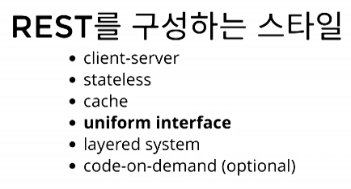

하지만 위의 조건 중 Uniform Interface를 잘 지키지 못한다.

## 2-2. 그럼 Uniform Interface는 무엇인가?

아래의 제약 조건을 따르는 것을 의미한다.

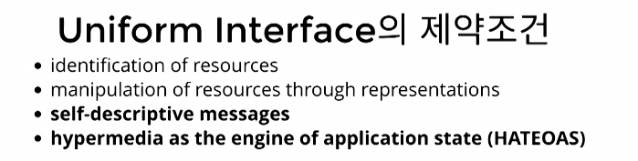

1. 리소스가 URI로 표현되어야 한다.
2. 리소스를 만들거나 업데이트하거나 삭제할 때, HTTP Message에 표현을 담아서 전송을 해야한다.
3. 메시지는 스스로를 설명해야 한다.
4. HATEOAS를 지켜야한다.

그리고 3,4번의 내용은 대부분의 REST API 서비스라고 자칭하는 곳에서도 지켜지지 못하고 있는 것이다.

### 2-2-1 3번. 메시지는 스스로를 설명해야 한다.

예시1)

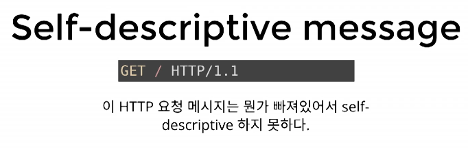

그럼 아래 코드는? 물론 목적지인 HOST가 나오기 때문에 어느정도 충족했다.

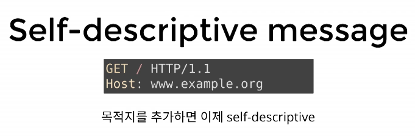

예시2)

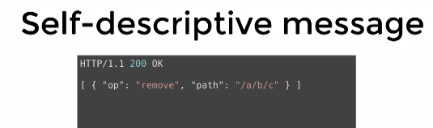

위 코드는 어떤 문법으로 작성되었는지 모르기 때문에 Self-descriptive 하지 않다.

그럼 아래 코드처럼 Content-Type을 추가해주면? 어느정도 충족한다.

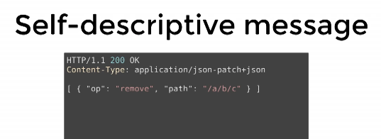

하지만 완벽하지 않다. 바로 op와 path에 여전히 해석의 여지가 남아있기 때문이다.

> 즉, 메시지에 해석이 필요한 여지가 남아있다면 그것은 Self-descriptive 하지 않다는 것이다.

### 2-2-2. 4번. HATEOAS를 지켜야한다.

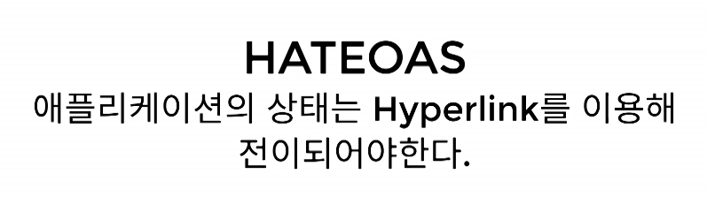

아래의 상태 전이를 Hyperlink를 통해 전이 되어야 한다.

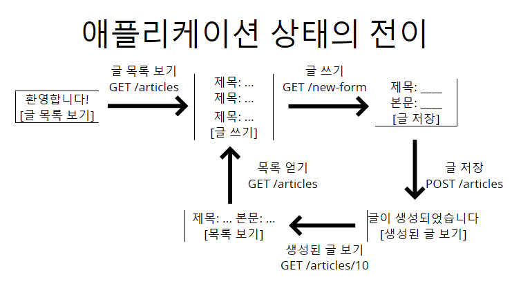

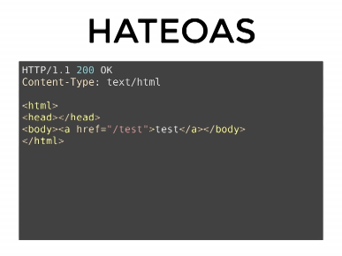 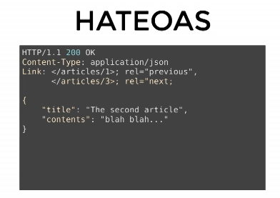

위처럼 html, json 등 다양한 방법으로 HATEOAS를 표현할 수 있다.

> 그렇다면 왜 위의 제약 조건들 Uniform Interface를 지켜야 하나? 바로 그것이 최초의 질문에 대한 답이기 때문이다.

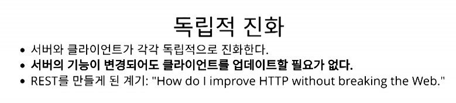

> 그럼 로이 필딩이 말하는 이 모든 조건을 충족하며 실제로 REST API를 잘 지키고 있는 서비스는 무엇인가?

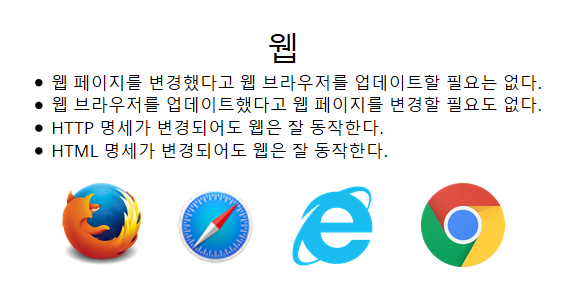

HTTP 명세가 1.0 -> 2.0으로 변경을 해도,
HTML 명세도 5.0이 나왔을 때도 문제없이 잘 동작했다.

> 그럼 어떻게 웹은 REST API 의 까다로운 조건을 충족하는 서비스를 만들 수 있었을까?

W3C : HTML,
IETF : HTTP

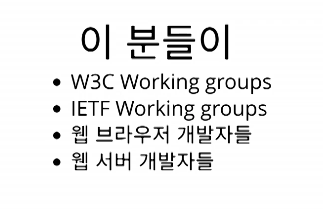 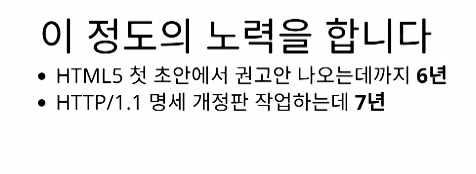

하위 호환성을 지키기 위한 집착으로 만들어진 서비스이기 때문이다.

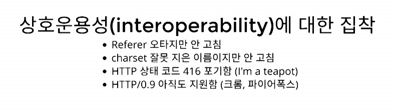

아무리 HTML, HTTP 명세가 제대로 작성되어도 아래와 같이 웹 서버가 브라우저 호환성을 제대로 고려하지 않고 개발되었을 때 문제는 발생한다. 그나마 HTML, HTTP 명세가 잘 작성되어 있기 때문에 비교적 덜 보게된다.

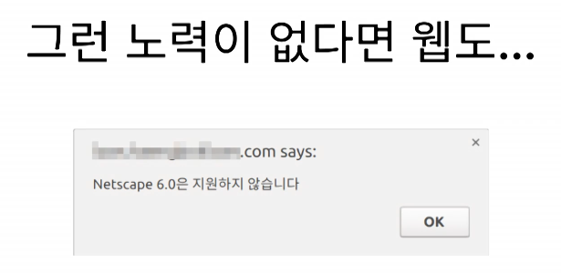

# 3. REST가 웹의 독립적 진화에 도움을 주었나

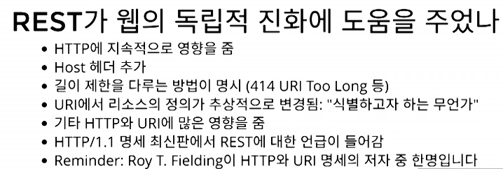

## 3-1. REST는 성공했는가?

웹은 독립적으로 진화하고 있기 때문에 성공!!

# 4. 그럼 REST API는?

지켜야 한다.

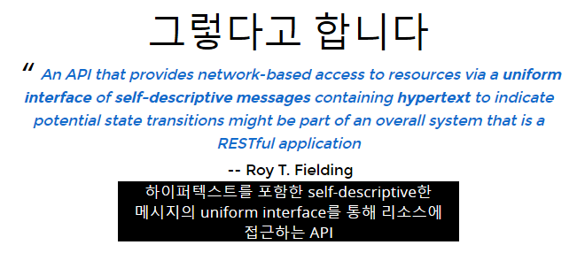

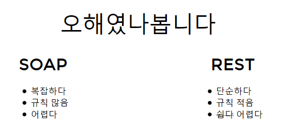

# 5. 원격 API는 꼭 REST API 여야 하는가?

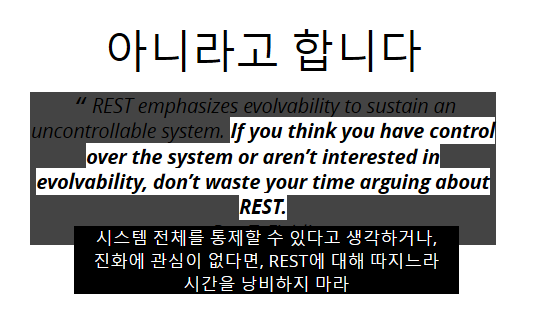

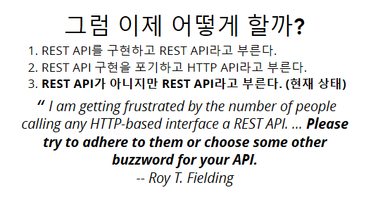

# 6. 그럼 이제 어떻게 할까?

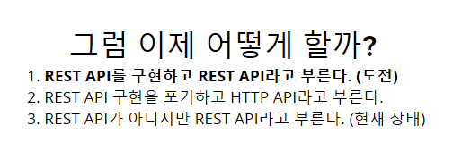

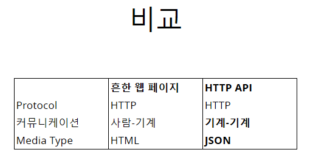 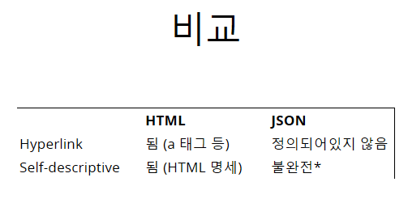

# 7. HTML과 JSON 비교

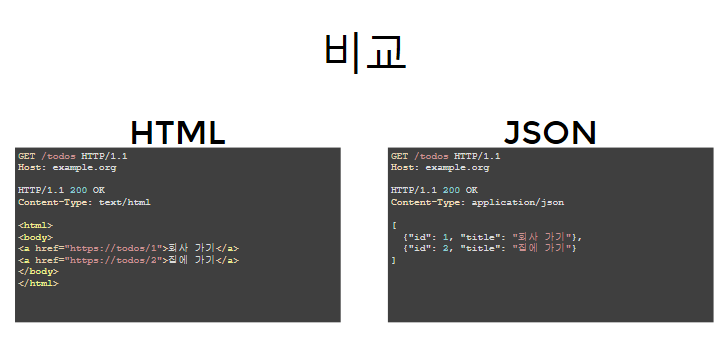

## 7-1. Self-descriptive

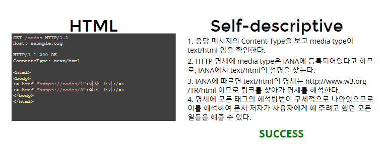
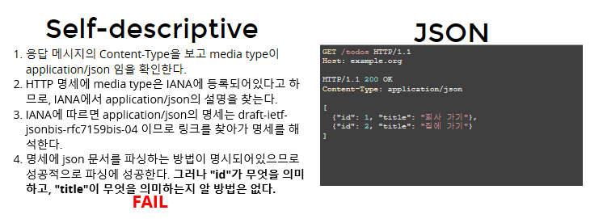

## 7-2. HATEOAS

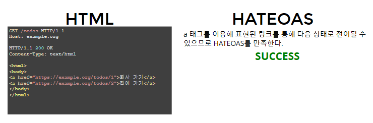
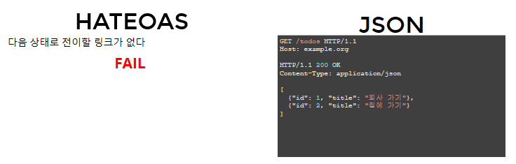

# 8. 그런데 Self-descriptive와 HATEOAS가 독립적 진화에 어떻게 도움이 되나?

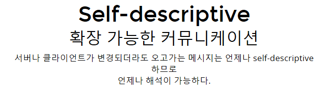
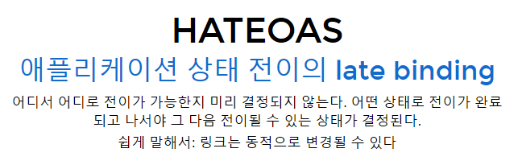

# 9. JSON을 Self-descriptive하고 HATEOAS를 충족하는 코드로 바꿔보자.

## 9-1. Self-descriptive

1. Media type 사용

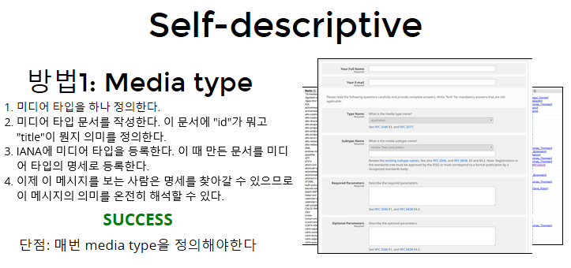

2. Profile 사용

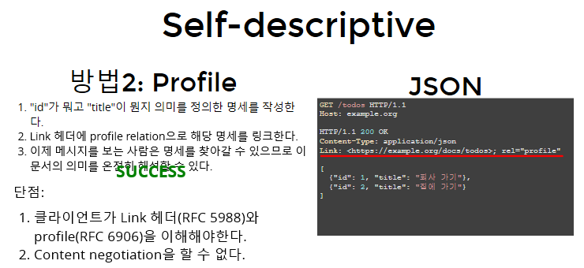

## 9-2. HATEOAS

1. data 사용

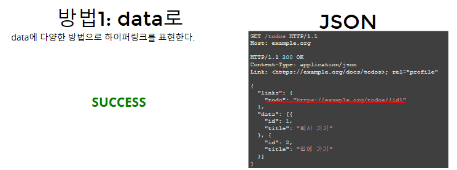

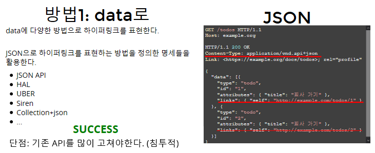

2. HTTP 헤더 사용

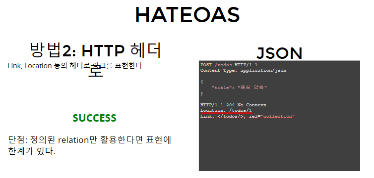

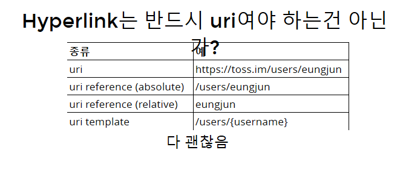

# 10. Media type 등록은 필수인가?

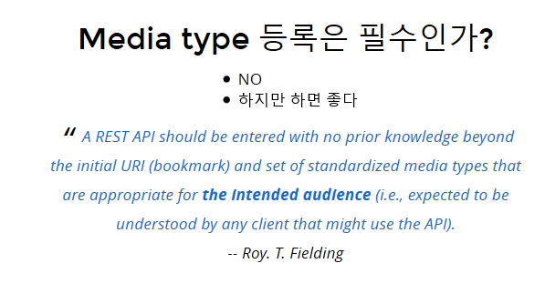

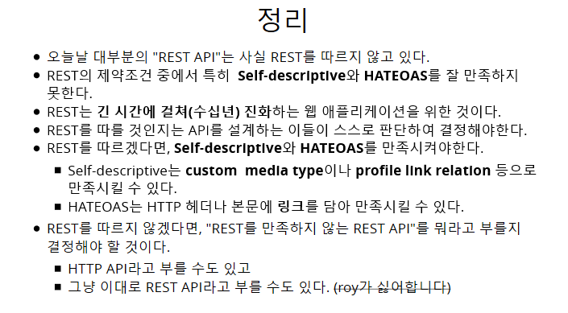
