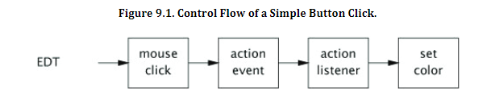
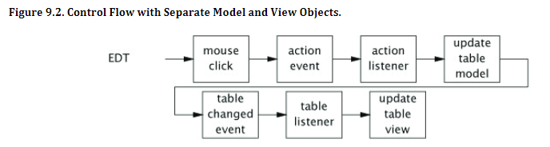

[Chatper 9. GUI Applications](#chatper-9-gui-applications)

[9.1 Why are GUIs Single-threaded?](#91-why-are-guis-single-threaded)

[9.2 Short-running GUI Tasks](#92-short-running-gui-tasks)

[9.3 Long-running GUI Tasks](#93-long-running-gui-tasks)

[9.4 Shared Data Models](#94-shared-data-models)

[9.5 Other Forms of Single-threaed Subsystems](#95-other-forms-of-single-threaed-subsystems)

[요약](#요약)

# Chatper 9. GUI Applications

Swing을 사용한 GUI 프로그램은 스레딩 문제가 있다. Thread-safety를 위해서 특정 작업은 Swing 이벤트 스레드에서 실행해야 하지만 작업 시간이 긴 이벤트는 실행할 수 없다는 것이다.

GUI 프레임워크 자체는 단일 스레드 하위 시스템이지만 응용 프로그램은 그렇지 않을 수 있기 때문에 GUI 코드를 작성할 때 여전히 스레딩 문제를 신중하게 고려해야 한다.

# 9.1 Why are GUIs Single-threaded?

멀티 스레드 GUI 프레임워크를 작성하려는 시도가 많았지만 경쟁 조건과 교착 상태에 대한 지속적인 문제때문에 결국 모두 하나의 결론으로 도달했다.

바로 전용 스레드가 큐에서 이벤트를 가져와서 어플리케이션에서 정의한 이벤트 핸들러로 전달하는 단일 스레드 이벤트 큐 모델(AWT) 이다.

> 결론 GUI 프레임워크는 단일 스레드로 제한된다. Swing 단일 스레드 규칙 : Swing 구성 요소 및 모델은 이벤트 디스패치 스레드에서만 생성, 수정 및 쿼리해야 한다. 

## 9.1 Sequential Event Processing

멀티 스레드 GUI 프레임워크에서 교착 상태를 유발하는 또 다른 유인은 MVC 패턴의 보급이다. MVC는 GUI 구현을 단순화하지만 일관되지 않은 LOCK 순서의 위험을 높인다.

AWT 및 Swing의 이벤트 처리 구조는 기계적으로 Executor와 유사하다.
* 작업은 순차적으로 처리된다.
* 하나의 작업은 다음 작업이 시작되기 전에 완료되며 두 작업이 겹치지 않는다.
* 다른 작업의 간섭에 대해 신경쓸 필요가 없다.

# 9.2 Short-running GUI Tasks

태스크가 짧고 GUI 개체에만 액세스하는 한 스레딩 문제를 거의 완전히 무시하고 이벤트 스레드에서 모든 작업을 수행 할 수 있다.

### Listing 9.1 Implementing SwingUtilities Using an Executor.
~~~java
public class SwingUtilities {
    private static final ExecutorService exec = Executors.newSingleThreadExecutor(new SwingThreadFactory());
    private static volatile Thread swingThread;

    private static class SwingThreadFactory implements ThreadFactory {
        public Thread newThread(Runnable r) {
            swingThread = new Thread(r);
            return swingThread;
        }
    }

    public static boolean isEventDispatchThread() {
        return Thread.currentThread() == swingThread;
    }

    public static void invokeLater(Runnable task) {
        exec.execute(task);
    }

    public static void invokeAndWait(Runnable task) throws InterruptedException, InvocationTargetException {
        Future f = exec.submit(task);
        try {
            f.get();
        } catch (ExecutionException e) {
            throw new InvocationTargetException(e);
        }
    }
}
~~~

### Listing 9.2 Executor Built Atop SwingUtilities.
~~~java
public class GuiExecutor extends AbstractExecutorService {     
    // Singletons have a private constructor and a public factory     
    private static final GuiExecutor instance = new GuiExecutor();

    private GuiExecutor() {
    }

    public static GuiExecutor instance() {
        return instance;
    }

    public void execute(Runnable r) {
        if (SwingUtilities.isEventDispatchThread()) r.run();
        else SwingUtilities.invokeLater(r);
    }     // Plus trivial implementations of lifecycle methods 
}
~~~

### Listing 9.3 Simple Event Listener.
~~~java
final Random random = new Random();
final JButton button = new JButton("Change Color");
    ...
button.addActionListener(new ActionListener() {
    public void actionPerformed(ActionEvent e) {
        button.setBackground(new Color(random.nextInt()));
    }
});
~~~

# 9.3 Long-running GUI Tasks

### Listing 9.4 Binding a Long-running Task to a Visual Component.
~~~java
ExecutorService backgroundExec = Executors.newCachedThreadPool();
...
button.addActionListener(new ActionListener() {
    public void actionPerformed(ActionEvent e){
        backgroundExec.execute(new Runnable(){
            public void run(){
                doBigComputation();
            }
        });
    }
});
~~~

버튼을 누를 때 트리거되는 작업은 이벤트 스레드와 백그라운드 스레드간에 번갈아 실행되는 세 개의 순차적 작업으로 구성된다. - Thread Hopping 
1.  첫 번째 하위 작업은 사용자 인터페이스를 업데이트하여 장기 실행 작업이 시작 되었음을 표시하고 백그라운드 스레드에서 두 번째 하위 작업을 시작 한다.
2. 두 번째 하위 작업은 이벤트 스레드에서 다시 실행되도록 세 번째 하위 작업을 큐에 넣는다.
3. 이를 반영하도록 사용자 인터페이스를 업데이트한다.

### Listing 9.5 Long-running Task with User Feedback.
~~~java
button.addActionListener(new ActionListener() {
    public void actionPerformed(ActionEvent e){
        button.setEnabled(false);
        label.setText("busy");
        backgroundExec.execute(new Runnable(){
            public void run(){
                try{doBigComputation();
                }finally{
                    GuiExecutor.instance().execute(new Runnable(){
                        public void run(){
                            button.setEnabled(true);
                            label.setText("idle");
                        }
                    });
                }
            }
        });
    }
});
~~~

실행하는데 시간이 오래 걸리는 작업은 사용자가 취소할 수 있다. 이 때 취소 가능한 작업을 관리하도록 설계된 Future 를 사용하는 것이 훨씬 쉽다.

### Listing 9.6 Cancelling a Long-running Task.
스레드의 중단 상태를 폴링하고 중단시 조기에 반환하는 작업이다.

runningTask는 이벤트 스레드에 국한되어 있기 때문에 설정하거나 확인할 때 동기화가 필요하지 않으며 시작 버튼 리스너는 한번에 하나의 백그라운드 작업만 실행된다.

~~~java
Future<?> runningTask = null;    // thread-confined 
 ... 
startButton.addActionListener(new ActionListener() {     
    public void actionPerformed(ActionEvent e) {         
        if (runningTask != null) {             
            runningTask = backgroundExec.submit(new Runnable() {                 
                public void run() {                    
                    while (moreWork()) {                        
                        if (Thread.currentThread().isInterrupted()) {                            
                            cleanUpPartialWork();                            
                            break;                        
                        }                        
                        doSomeWork();                    
                    }                 
                }             
            });    
        }; 
    }
}); 
cancelButton.addActionListener(new ActionListener() {     
 public void actionPerformed(ActionEvent event) {         
     if (runningTask != null)             
         runningTask.cancel(true); 
 }
});
~~~

# 9.4 Shared Data Models

주 스레드에서 데이터 모델 구성 요소에 접근하지 마라.

> 하나 이상의 스레드에서 데이터 모델을 공유해야하고 스레드로부터 안전한 데이터 모델을 구현하는 것이 바람직하지 않은 경우 분할 모델 설계를 고려해라.

### Listing 9.7 Background Task Class Supporting Cancellation, Completion Notification, and Progress Notification.
Future를 사용하면서 취소 구현을 단순화 할 수 있었다. FutureTask에는 완료 알림과 유사한 done hook도 있다. 이벤트 스레드에서 완료 작업을 Trigger로 수행함으로써 BackgroundTask 클래스를 구성할 수 있다.

~~~java
abstract class BackgroundTask<V> implements Runnable, Future<V> {
    private final FutureTask<V> computation = new Computation();
    private class Computation extends FutureTask<V> {
        public Computation() {
            super(new Callable<V>() {
                public V call() throws Exception {
                    return BackgroundTask.this.compute() ;
                }
            });
        }
        protected final void done() {
            GuiExecutor.instance().execute(new Runnable() {
                public void run() {
                    V value = null;
                    Throwable thrown = null;
                    boolean cancelled = false;
                    try {
                        value = get();
                    } catch (ExecutionException e) {
                        thrown = e.getCause();
                    } catch (CancellationException e) {
                        cancelled = true;
                    } catch (InterruptedException consumed) {

                    } finally {
                        onCompletion(value, thrown, cancelled);
                    }
                };
            });
        }
    }
    protected void setProgress(final int current, final int max) {
        GuiExecutor.instance().execute(new Runnable() {
            public void run() { onProgress(current, max);
            }
        });
    }
    // Called in the background thread
    protected abstract V compute()  throws Exception;
    // Called in the event thread
    protected void onCompletion(V result, Throwable exception, boolean cancelled)  { }
    protected void  onProgress(int current, int max)  { }
    // Other Future methods forwarded to computation
}
~~~

### Listing 9.8 Initiating a Long-running, Cancellable Task with BackgroundTask.

Background-Task를 사용하여 Listing9.6의 예제를 다시 캐스팅한다.

~~~java
public void runInBackground(final Runnable task) {
    startButton.addActionListener(new ActionListener() {
        public void actionPerformed(ActionEvent e) {
            class CancelListener implements ActionListener {
                BackgroundTask<?> task;

                public void actionPerformed(ActionEvent event) {
                    if (task != null) task.cancel(true);
                }
            }
            final CancelListener listener = new CancelListener();
            listener.task = new BackgroundTask<Void>() {
                public Void compute() {
                    while (moreWork() && !isCancelled()) doSomeWork();
                    return null;
                }

                public void onCompletion(boolean cancelled, String s, Throwable exception) {
                    cancelButton.removeActionListener(listener);
                    label.setText("done");
                }
            };
            cancelButton.addActionListener(listener);
            backgroundExec.execute(task);
        }
    });
}
~~~

우리는 FutureTask 및 Executor를 사용하여 GUI의 응답 성을 손상시키지 않고 백그라운드 스레드에서 장기 실행 작업을 실행하는 간단한 프레임 워크를 구축했다.

# 9.5 Other Forms of Single-threaed Subsystems

스레드 제한은 GUI에 국한되지 않는다. 

# 요약
GUI 프레임 워크는 거의 항상 모든 프레젠테이션 관련 코드가 이벤트 스레드에서 작업으로 실행되는 단일 스레드 하위 시스템으로 구현된다.

단일 이벤트 스레드, 오래 실행되는 작업은 응답 성을 손상시킬 수 있으므로 백그라운드 스레드에서 실행되어야 한다.

SwingWorker 또는 BackgroundTask와 같은 도우미 클래스 취소, 진행 표시 및 완료 표시에 대한 지원을 제공하는 여기에 빌드 된 클래스는 두 가지가 모두있는 장기 실행 작업의 개발을 단순화 할 수 있다.