# Java ORM 표준 JPA

> 참고 강의 <https://www.inflearn.com/course/ORM-JPA-Basic/dashboard>

[Java ORM 표준 JPA](#java-orm-표준-jpa)

[목표](#목표)

  [1. 등장 배경](#1-등장-배경)

  [1.1 지루한 CURD](#11-지루한-curd)

  [1.2 패러다임의 불일치](#12-패러다임의-불일치)

  [ORM (Object-relational mapping)](#orm-object-relational-mapping)

  [2.JPA 소개](#2jpa-소개)

  [2.1 JPA를 왜 사용해야 하는가?](#21-jpa를-왜-사용해야-하는가)

  [버전 설정](#버전-설정)

  [2.2 JPQL](#22-jpql)

  [3. 영속성 컨텍스트](#3-영속성-컨텍스트)

  [3.1 영속성 컨텍스트의 이점](#31-영속성-컨텍스트의-이점)

  [3.2 엔티티의 생명 주기](#32-엔티티의-생명-주기)

  [3.3 플러쉬](#33-플러쉬)

  [3.4 준영속 상태](#34-준영속-상태)

  [4. JPA 관계 설정](#4-jpa-관계-설정)

  [4.1 기본키 매핑](#41-기본키-매핑)

  [4.2 단방향 연관 관계](#42-단방향-연관-관계)

  [4.3 양방향 연관 관계와 연관 관계의 주인1-기초](#43-양방향-연관-관계와-연관-관계의-주인1-기초)

### 목표
1. 객체와 테이블을 제대로 설계하고 매핑하는 방법
2. 기본키와 외래키 매핑
3. 1:N, N:1, 1:1, N:M 매핑
4. 실무 노하우 + 성능까지 고려

# 1. 등장 배경
## 1.1 지루한 CURD
* 객체 필드 추가 - 모든 SQL 수정이 불가피하다.

* JDBC
  * java에서 db에 접근하기 위해 사용하는 라이브러리
=> sql문 작성 및 db에 종속적이기 때문에 table,column 변경시 코드 다 변경

## 1.2 패러다임의 불일치
* 객체 vs 관계형 데이터베이스
* 객체 : 추상화, 캡슐화, 정보은닉, 상속, 다형성 지원
* 객체 -> SQL 변환
* 개발자 = SQL 매퍼

RDB는 객체에서의 상속 관계와 유사한 상속이란 개념은 없다. (그나마 유사한것 테이블의 슈퍼타입, 서브타입 관계)

## ORM (Object-relational mapping)

* 객체는 객체대로 설계
* 관계형 DB는 관계형 DB대로 설계
* ORM 프레임워크가 매핑해주겠다.

> JPA는 JAVA 어플과 JDBC 사이에서 동작

* JPA 역할
   - Entity 분석
   - SQL 생성
   - JDBC API 사용
   - 패러다임 불일치 해결

> JDBC > MyBatis, Jdbc Template (SQL Mapper) > JPA

* JPA는 SQL조차 작성할 필요가 없다.
* 자바 컬렉션에 객체를 저장하고 조회하듯이 사용한다.
* JPA가 대신 쿼리를 짜는 것이다.

# 2.JPA 소개

JPA : Java Persistent API

* EJB - 엔티티 빈(자바표준)
  => 성능도 안나오고

* 하이버네이트 - 오픈소스

* JPA - 자바표준
  => 하이버네이트 만든 사람이 와서 다시 만듦

## 2.1 JPA를 왜 사용해야 하는가?
1. 생산성 ( CRUD )
2. 유지보수 ( 기존 필드 변경시 모든 SQL 수정 )
3. 패러다임의 불일치 해결 ( 상속, 연관관계, 객체 그래프 )
4. 성능 최적화 ( 1차 캐시와 동일성 보장, 트랜잭션을 지원하는 쓰기 지연, 지연 로딩 )

### 버전 설정
spring 기준으로 여러 툴을 연동해서 사용할 것이다.
spring boot의 버전 지원 정보를 확인하여 맞는 공식적으로 지원하는 버전을 사용하는 것이 좋다.
> https://docs.spring.io/spring-boot/docs/2.2.5.RELEASE/reference/html/appendix-dependency-versions.html#appendix-dependency-versions

## 2.2 JPQL

JPA는 SQL을 추상화한 객체 지향 쿼리 언어

JPQL은 엔티티 객체를 대상으로 쿼리를 작성한다.

SQL은 테이블을 대상으로 쿼리를 작성한다.

이것의 장점은 DB자체가 바뀌어도 신경쓸 필요가 없다.

# 3. 영속성 컨텍스트

EntityManager.persist(entity);

> entity를 db에 저장하는게 아니라 entity를 영속성 컨텍스트에 저장한다는 뜻

> EntityManager를 통해 영속성 컨텍스트에 접근한다.

영속성 컨텍스트는 논리적인 개념 (눈에 보이지 않음)

### 3.1 영속성 컨텍스트의 이점

1. 엔티티 조회, 1차 캐시
2. 엔티티 등록, 트랜잭션을 지원하는 쓰기 지연 (성능 향샹-불필요한 커넥션을 맺지 않는다)
3. 엔티티 수정, 변경감지 (1차 캐시에 스냅샷 존재한다. - 캐시 안의 엔티티가 변경이 있을 때, update query를 작성한다.)

## 3.2 엔티티의 생명 주기

1. 비영속 (new/transient)
    => 영속성 컨텍스트와 연관된 코드가 없는 경우
2. 영속 (managed)
    => persist(), find()등 객체를 영속성 컨텍스트에 저장하는 단계
3. 준영속 (detached)
    => detach()
4. 삭제 (removed)
   => remove()

> 영속 상태일 때는 db에 쿼리가 날라가지 않고, commit()을 하는 순간 db에 쿼리가 날라감

## 3.3 플러쉬

commit 할 때 일어난다.

영속성 컨텍스트의 반영 내역을 db에 전송한다.

em.flush() 직접 호출 가능

1. 쿼리 실행할 때
2. commit 할 때

FlushModeType.AUTO
FlushModeType.COMMIT (쿼리실행시에는 flush하지 않음(db 내용과 동기화하지 않음 ))

> 플러쉬를 하더라도 1차 캐시에 있는 내용을 지우지는 않는다.

## 3.4 준영속 상태
em.detach(entity) - 특정 entity만 준영속 상태화 / em.clear() / em.close() 실행 시 일어난다.

# 4. JPA 관계 설정

## 4.1 기본키 매핑

@Id - 직접 할당

@GeneratedValue - 자동 생성
  1. AUTO (아래 3가지 중 DB 방언에 맞춰서 자동으로 생성)
  2. Identity - MySQL, PostgreSQL
  3. SEQUENCE - Oracle
  4. TABLE

영속성 컨텍스트에서 관리를 하려면 기본키가 있어야하는데, 시퀀스 자동할당은 db에 값이 들어가봐야 기본키를 알 수 있는 문제가 발생한다.
=> JPA 기본은 commit 시점에 쿼리를 날리지만, Identity 같은 경우는 persist 단계에서 쿼리를 날린다.

> 위와 같은 이유로 Identity를 사용하면 쿼리를 한번에 모아서 날리는 이점이 없어지므로 성능 향상의 이점이 사라진다는 단점이 생긴다.

반면 SEQUENCE는 쿼리를 한번에 모았다가 보내는게 가능하다.
nextcall로 시퀀스id를 미리 가져온다. 어쨌든 이것도 네트워크를 타는것은 사실이다.

> 그래서 allocationSize 라는게 존재한다. 지정한 크기만큼 한번의 nextcall로 가져온다.

## 4.2 단방향 연관 관계

* 방향 : 단방향, 양방향
* 다중성 : 다대일, 일대다, 일대일, 다대다
* 연관관계의 주인 : 객체 양방향 관계는 주인이 있다.

## 4.3 양방향 연관 관계와 연관 관계의 주인1-기초
* 양방향 객체 연관 관계를 표현하더라도 테이블 연관 관계는 변하는게 없다.

* 객체의 양방향 연관 관계는 서로 다른 단방향 연관 관계가 2개로 포인트가 2개이다.
* 테이블의 양방향 연관 관계는 FK키로 포인트가 1개이다.

* 단방향 2개 중 연관관계의 주인 테이블을 정해라.
> 외래키가 있는 곳을 주인으로 정해라.
> 외래키가 있는 곳은 무조건 N이 된다.

~~~java
  Member 테이블
  @ManyToOne
  private Team team;

  Team 테이블
  @OneToMany(mappedBy = "team")
  private List<Member> members = new ArrayList<>();
  ~~~

mappedBy는 조회만 가능하며 가짜 매핑이라한다.

이렇게 해야 성능 이슈와 설계가 깔끔하게 된다.

## 4.3.1 양방향 매핑시 가장 많이 하는 실수
연관관계에서 주인이 아닌 쪽에 값을 셋팅하는 경우
즉, mappedBy쪽의 객체에 값을 셋팅하는 것은 문제가된다. mappedBy는 읽기만 가능하기 때문.

> 1. 따라서 순수 객체 상태를 고려해서 양방향 연관관계를 매핑해줄 때는 항상 양쪽에 값을 설정하자.

* 연관관계 편의 메서드

Team team1 = new Team();
team1.setName("TeamC");
entityManager.persist(team1);

Member member1 = new Member();
member1.setName("박지성");
member1.setTeam(team1);         // ** 포인트1
entityManager.persist(member1);

team1.getMembers().add(member1);  // ** 포인트2

그렇다면 양방향 연관관계 매핑시에 양쪽에 값을 세팅해준다면 이렇게 관리 포인트가 2군데가 된다.

이럴때 2군데 다 일일히 넣어주기 번거롭다 한다면 연관관계의 주인쪽에서 반대편 값까지 한번에 세팅을 해주는 방법이 있다.

~~~java
public void setTeam(Team team) {
        this.team = team;
        team.getMembers().add(this);
}
~~~

이렇게되면 포인트2 관련 코딩을 하지 않아도 된다.

> 2. 연관관계 편의 메서드는 한쪽에만 선언 해주는것이 좋다.

> 3. 양방향 매핑시 무한 루프를 조심하자 toString(), lombok, JSON 생성 라이브러리(entity를 json으로 바꿀때)
* toString() - lombok에서 toString() 쓰지마라.
* JSON 생성 라이브러리 - 컨트롤러에서 entity를 절대 반환하지 마라. -> 필요하다하면 값만 가지는 DTO로 변환해서 반환해라.

# 5. 정리
## 5.1 양방향 매핑 정리

1. 단방향 매핑만으로 이미 연관관계 매핑은 완료해야 한다.
2. 양방향 매핑은 반대 방향으로 조회(객체 그래프 탐색) 기능이 추가된 것 뿐
3. JPQL에서 역방향으로 탐색할 일이 많음
4. 단방향 매핑을 잘 하고 양방향은 필요할 때 추가해도 됨(테이블에 영향을 주지 않음)

## 5.2 연관관계의 주인을 정하는 기준

1. 비즈니스 로직을 기준으로 연관관계의 주인을 선택하면 안됨
2. 연관관계의 주인은 외래키의 위치를 기준으로 정해야함 (@OneToMany - Team > Member)

## 5.3 단방향 연관 관계 만으로도 개발하는데 및 설계도 다 가능하다.

1. But 개발 상의 편의, 조회 등을 위해서는 양방향
2. 실무에서 보다 복잡한 쿼리를 사용하면서 JPQL 사용시 양방향으로 조회해야할 일이 생긴다.

> 핵심은 단방향으로 설계를 하는게 가장 깔끔하고 조금 더 객체 지향적으로 코딩을 하고 싶다할 때 양방향을 써라. -> 비즈니스 관계를 잘 파악해야 한다.

## 5.4 다양한 연관 관계 매핑

* 고려 사항
  * 다중성
  * 단방향, 양방향
  * 연관관계의 주인

1. 다대일[N:1] - @ManyToOne - 연관관계의 주인 (FK) 자연스럽다

2. 일대다[1:N] - @OneToMany - One에 연관관계의 주인 (FK)
    1. 단방향 매핑
    => 일대다 단방향 매핑을 할 수 있지만 권장하진 않는다. => 엔티티가 관리하는 외래키가 다른 테이블에 있다.(어마어마한 단점)
    => 쿼리상에서 헷갈리는 경우가 많이 발생한다.
    => @JoinColumn을 꼭 사용해야한다. 그렇지 않으면 조인 테이블 방식을 사용한다. => 중간 테이블을 하나 생성해버린다.

    1. 양방향 매핑
    @ManyToOne
    @JoinColumn(name = "COMPANY_ID", insertable = false, updatable = false)
    private Company company;

> 일대다 단방향 매핑 보다는 다대일 양방향 매핑으로 설계하는 것을 권장 (설계적으로 조금 손해를 보더라도)

> 연관관계의 주인이라함은 Insert, Update가 가능하다는 것. 즉, 연관관계의 주인만 데이터에 대한 Insert, Update를 할 수 있어야 한다.

3. 일대일[1:1] - @OneToOne
    1. 주 테이블이나 대상 테이블 중에서 외래키 선택
    2. 양방향 매핑하려면 반대편에 mappedBy 적용

  - 주 테이블에 외래키
    - 주 객체가 대상 객체의 참조를 가지는 형식
    - 객체지향 개발자 선호
    - JPA 매핑 편리
    - 장점: 주 테이블만 조회해도 대상 테이블에 데이터가 있는지 확인 가능
    - 단점: 값이 없으면 외래키에 null 허용

  - 대상 테이블에 외래키
    - 전통적인 데이터베이스 개발자 선호
    - 프록시 기능의 한계로 지연로딩을 설정해도 항상 즉시 로딩됨

4. 다대다[N:M] - @ManyToMany
    => 실무에서는 사용하면 안된다.

# 6. 고급 매핑

## 6.1 상속 관계 매핑
기본적으로 관계형 DB에서는 상속 관계가 없다.

대신 슈퍼 타입 - 서브 타입 이라는 모델링 기법이 상속 개념과 유사

* 슈퍼타입-서브타입 논리 모델을 물리 모델로 구현하는 방법
  * 각각 테이블로 변환 -> 조인 전략 (굉장히 정규화된 방식)
  * 통합 테이블로 변환 -> 단일 테이블 전략 (심플, 성능)
  * 서브타입 테이블로 변환 -> 구현 클래스마드 테이블 전략 (중복 발생)

* @Inheritance(strategy = InheritanceType.JOINED)
    * 각 서브 테이블이 다 생성된다.
    * 명시적이라는 장점이다(정규화)
    * 외래키 참조 무결성 제약 조건 사용 가능
    * 조회시 조인을 많이 사용하는 편, 성능 저하 가능성 -> 큰 단점은 아니라고 생각

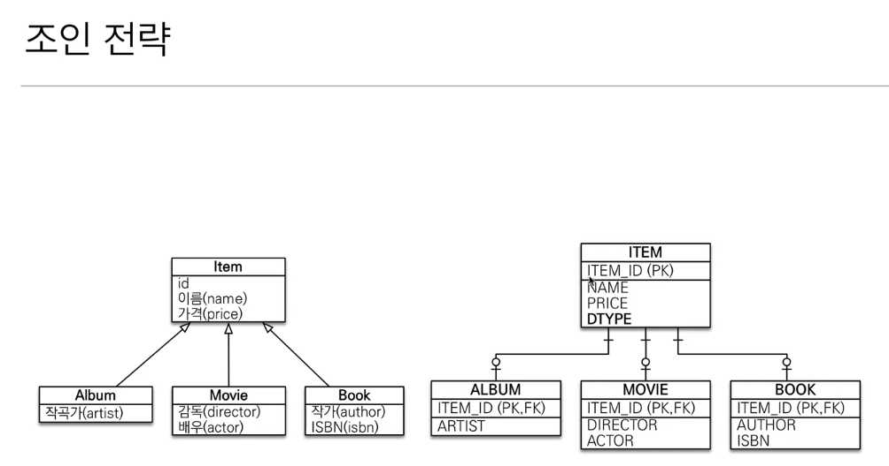

* @Inheritance(strategy = InheritanceType.SINGLE_TABLE)
   * 성능이 좋다.
   * 슈퍼테이블만 생성된다.
   * 서브테이블 값만 들어가고 나머지 필드는 null로 들어간다. (자식 컬럼 모두 null 허용되어야 한다)
   * Join 필요도 없고 쿼리도 한번만 나간다.
   * @DiscriminatorColumn 필수다. 한 테이블에 다 때려박기 때문에 구분자가 필수이다.

* @Inheritance(strategy = InheritanceType.TABLE_PER_CLASS)
    * 슈퍼테이블은 만들지 않는다.
    * 서브테이블에 슈퍼테이블의 컬럼을 중복해서 다 넣는다.
    * 성능이 안좋다. 조회시 union으로 모든 테이블을 다 뒤진다.

* @DiscriminatorColumn(name= "`DTYPE`") - 대상은 슈퍼 테이블
상속 관계에서 해당 컬럼까지 넣어주면 dtype 이 생기고 서브 테이블이 어떤건지 같이 Insert 된다.

* @DiscriminatorValue("M") - 대상은 서브 테이블
슈퍼 테이블의 DTYPE 테이블에 들어갈 값을 지정할 수 있다. 이 어노테이션이 없으면 테이블명이 기본으로 들어간다.

> 상속 관계 전략을 바꾸더라고 코드를 손댈것이 별로 없다. -> 어노테이션만 손대면 된다.

## 상속 관계 정리
1. 슈퍼 테이블은 abstract로 선언한다. - 단, 슈퍼클래스만 따로 정의할 일이 없다고 판단했을 경우
2. @DiscriminatorColumn 어노테이션은 필수이다. - DTYPE
3. TABLE_PER_CLASS, 구현 클래스마다 테이블 전략, 현업에서 쓰면 안되는 방법!

Everywhere

## 6.2 Mapped super class,

@MappedSuperclass

상속 관계 매핑없이 상위 테이블의 값을 쓰고 싶을 때

* 이것으로 정의된것은 엔티티 X, 테이블과 매핑 X
* 조회, 검색 불가
* 직접 생성해서 사용할 일 없으므로 추상클래스로 사용해라.
* 단순히 엔티티가 공통으로 사용하는 매핑 정보를 모으는 역할

# 7. 프록시와 연관관계 관리

* 참조된 모든 객체를 다 조회해야할 필요가 있나? - 불필요한 성능 저하 유발
  * 참조된 객체들 중 내가 조회하고 싶은 특정 객체만 조회하는것을 JPA는 지원한다.

## 7.1 프록시

~~~java
// find()는 실행 시점에서 쿼리가 나감(실제 조회값)
Teamone findMember = entityManager.find(Teamone.class, teamone.getId());

// getReference()는 조회를 미루는 가짜(프록시) 객체 조회
Teamone findMember = entityManager.getReference(Teamone.class, teamone.getId());
~~~

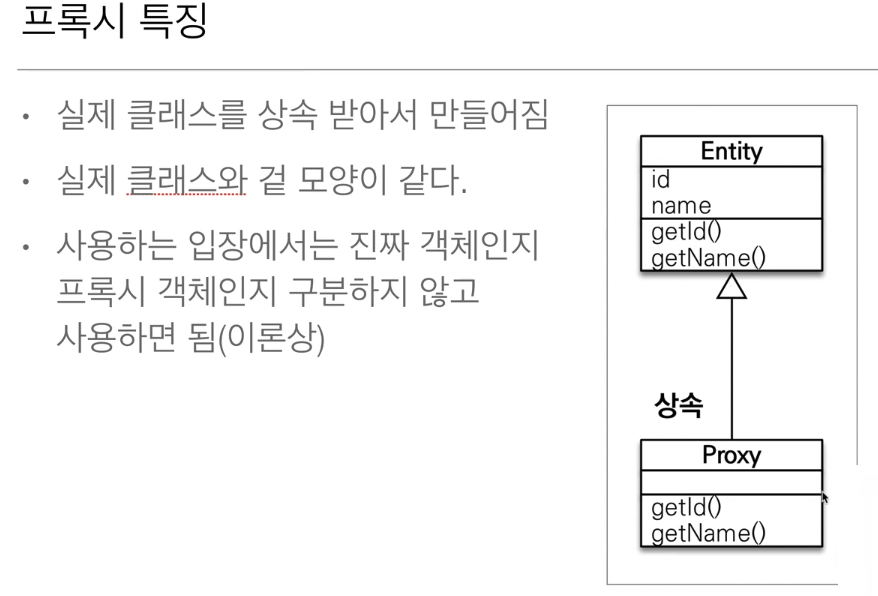

~~~java
Teamone teamone1 = entityManager.find(Teamone.class, teamone.getId());
Teamone teamone3 = entityManager.find(Teamone.class, teamone2.getId());

System.out.println("t1 == t2 " + (teamone1.getClass() == teamone3.getClass()));

> true
~~~

~~~java
Teamone teamone1 = entityManager.find(Teamone.class, teamone.getId());
Teamone teamone3 = entityManager.getReference(Teamone.class, teamone2.getId());

System.out.println("t1 == t2 " + (teamone1.getClass() == teamone3.getClass()));

> false

// == 비교가 아니라 instanceof 를 사용해야 한다.
System.out.println("t1 == t2 " + (teamone1 instanceof Teamone));
System.out.println("t1 == t2 " + (teamone3 instanceof Teamone));
~~~

* getReference()를 호출하더라도 이미 영속성 컨텍스트에 있는 내용은 프록시가 아닌 실제 엔티티를 반환한다.
~~~java
Teamone find = entityManager.find(Teamone.class, teamone.getId());
System.out.println("t1 : "+find.getClass());

Teamone reference = entityManager.getReference(Teamone.class, teamone.getId());
System.out.println("t1 reference : "+reference.getClass());

System.out.println("a == a : "+ (find == reference));

> true
~~~

* 같은 프록시 반환
~~~java
Teamone find = entityManager.getReference(Teamone.class, teamone.getId());
System.out.println("t1 : "+find.getClass());

Teamone reference = entityManager.getReference(Teamone.class, teamone.getId());
System.out.println("t1 reference : "+reference.getClass());

System.out.println("a == a : "+ (find == reference));

> true

Teamone reference = entityManager.getReference(Teamone.class, teamone.getId());
System.out.println("t1 : "+reference.getClass());

Teamone find = entityManager.find(Teamone.class, teamone.getId());
System.out.println("t1 reference : "+find.getClass());

System.out.println("a == a : "+ (find == reference));

> true
~~~

> JPA에서는 실제 엔티티든 프록시든 같은 값을 가져오면 같은 객체로 본다.
1. 실제 엔티티에서 값을 먼저 꺼내고, 프록시에서 같은 값을 꺼내도 둘 다 타입은 엔티티
2. 프록시에서 값을 먼저 꺼내고, 실제 엔티티에서 같은 값을 꺼내도 둘 다 타입은 프록시

~~~java
// 초기화 여부 확인
System.out.println("isLoaded : "+ persistenceUnitUtil.isLoaded(reference));

// 강제 초기화 (참고로 JPA는 강제 초기화 표준 지원 안함)
Hibernate.initialize(reference);
~~~

> 결론 - Reference를 많이 사용하진 않지만 이걸 알아야 즉시 로딩과 지연 로딩에 대해 이해하기 쉽다.

## 7.2 즉시 로딩과 지연 로딩

* 지연 로딩
~~~java
// 지연 로딩
@ManyToOne(fetch = FetchType.LAZY)
@JoinColumn(name = "team_id")
private Team team;
~~~

  * 지연로딩으로 설정된 엔티티 객체는 처음에 프록시로 가져온다.
  * 그리고 프록시 내 다른 값이 필요한 경우(프록시 초기화가 진행된다)

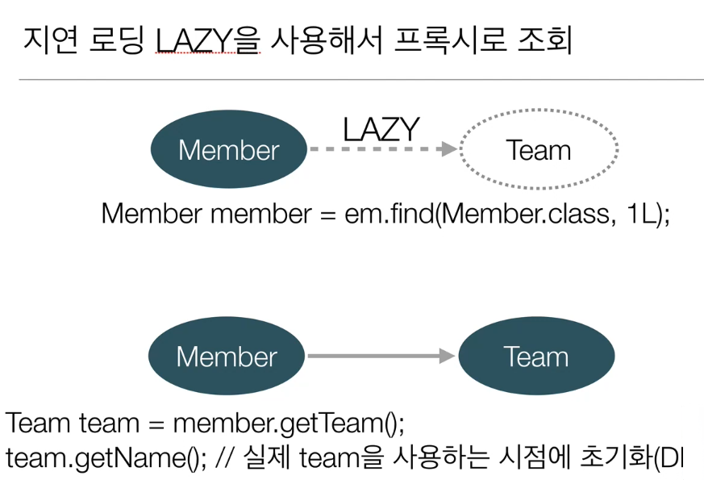

* 즉시 로딩
~~~java
// 즉시 로딩
@ManyToOne(fetch = FetchType.EAGER)
@JoinColumn(name = "team_id")
private Team team;
~~~

  * 프록시가 아닌 실제 엔티티 객체를 가져온다.
  * 초기화가 진행되지도 않음

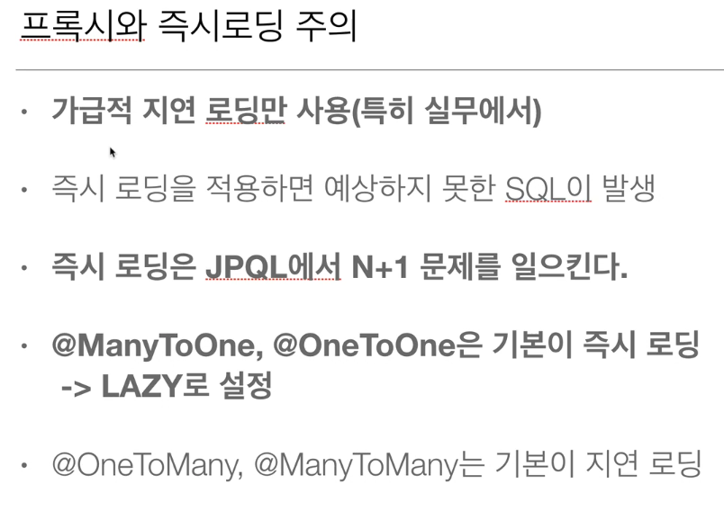

> 실무에서는 즉시 로딩을 쓰면 안된다!

> 기본적으로 연관 관계는 지연 로딩으로 셋팅해놓고, 한번에 여러 엔티티를 가져와야하는게 있다면 fetch join을 사용해라.

## 7.3 영속성 전이(CASCADE) 와 고아 객체

* 영속성 전이(CASCADE)
엔티티 객체마다 persist를 해주고 싶지 않고, 특정 엔티티를 중심으로 개발하고 싶을 때, 해당 테이블만 persist 해줘도 된다.

~~~java
@OneToMany(mappedBy = "parent",cascade = CascadeType.PERSIST)
private List<Child> childList = new ArrayList<>();
~~~

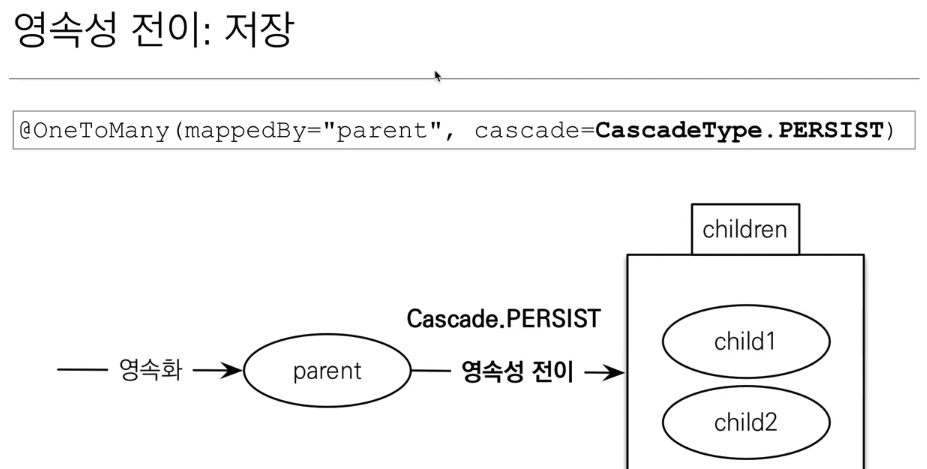

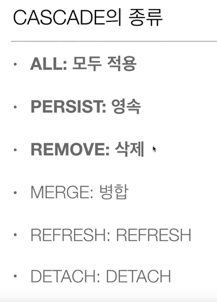

> 실제 사용할 때는 ALL or PERSIST에 사용해라.

* 정리
> 언제 쓰냐? - CASCADE 를 사용하는 곳은 하위 테이블의 관리를 상위 테이블에서만 관리할 때 (소유자가 하나일 때)

* 고아 객체

* orphanRemoval=true 옵션은 CascadeType.DELETE 와 같은 동작을 한다.
~~~java
@OneToMany(mappedBy = "parent", cascade = CascadeType.ALL)
private List<Child> childList = new ArrayList<>();

@OneToMany(mappedBy = "parent", orphanRemoval = true)
private List<Child> childList = new ArrayList<>();
~~~

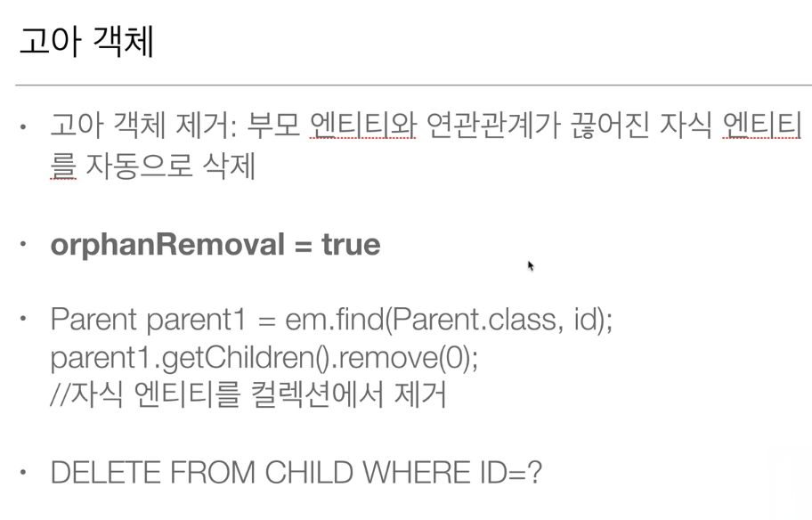

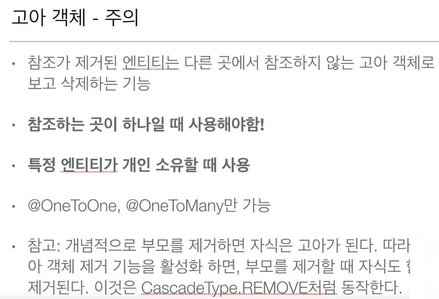

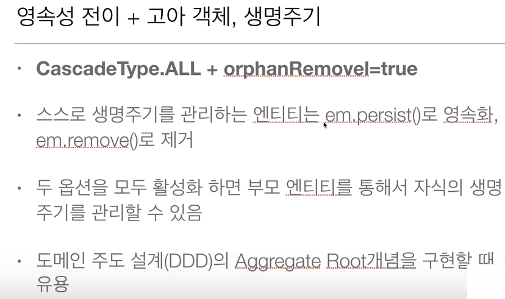

# 8. 값 타입

## 8.1 기본값 타입

* 엔티티 타입
  * @Entity로 정의하는 객체
  * 데이터가 변해도 식별자로 지속해서 추적 가능
  * 예) 회원 엔티티의 키나 나이 값을 변경해도 식별자로 인식 가능

* 값 타입
  * int, Integer, String 처럼 단순히 값으로 사용하는 자바 기본 타입이나 객체
  * 식별자가 없고 값만 있으므로 변경시 추적 불가
  * 예) 숫자 100을 200으로 변경하면 완전히 다른 값으로 대체

  1. 기본값 타입
    * 생명 주기를 엔티티에 의존
      * 회원을 삭제하면 이름, 나이 필드도 같이 삭제 됨
    * 값 타입은 공유하면 안된다. 절대로

       1. 자바 기본 타입(int, double)
       2. 래퍼 클래스(Integer, Long)
       3. String

   ~~~java
   // 기본 타입은 항상 값을 복사함
    public class ValueMain {
      public static void main(String[] args) {
          int a = 10;
          int b = a;

          b = 20;

          System.out.println("a = " + a);
          System.out.println("b = " + b);
      }
    }
   ~~~

## 8.2 임베디드 타입(복합 값 타입)
  * 새로운 값 타입을 직접 정의할 수 있음
  * JPA는 임베디드 타입이라고함
  * 주로 기본값 타입을 모아서 복합 값이라고도 함
  * int, String 같은 값타입 (변경하면 끝, 추적 안됨)

  * 장점
    * 재사용
    * 높은 응집도-> 임베디드 클래스의 내용만으로 필요한 메서드를 추가하거나 활용도가 높아진다.
    * Period,isWork() 처럼 해당 값 타입만 사용하는 의미있는 메소드를 만들 수 있다.
    * 임베디드 타입을 포함한 모든 값 타입은 값 타입을 소유한 엔티티에 생명주기를 의존한다.

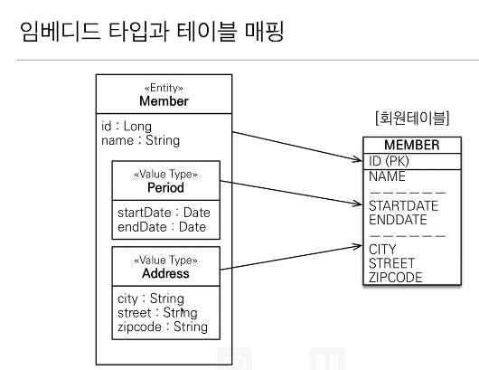

* 임베디드 값타입 사용 방법
~~~java
//address
@Embedded
private Address address;

@Getter
@Setter
@NoArgsConstructor
@Embeddable
public class Address {
    private String city;
    private String street;
    private String zipcode;
}
~~~

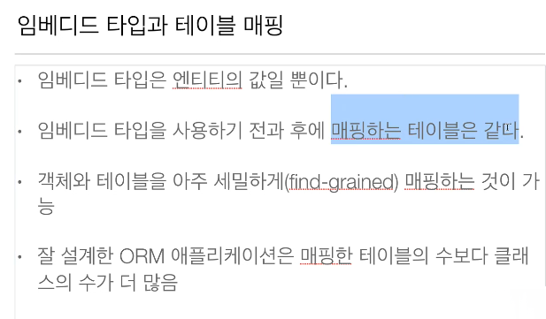

* 엔티티가 임베디드 타입을 가지는 것은 당연히 가능하다.
* 또한 임베디드 타입이 엔티티를 가질수가 있다.

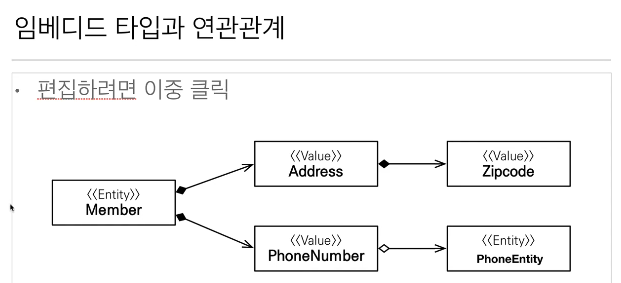

* 한 엔티티에서 같은 임베디드 값타입을 사용한다면?

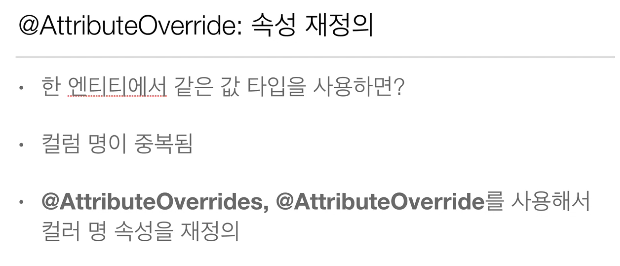
~~~java
@Embedded
@AttributeOverrides({
        @AttributeOverride(name="city",
                column=@Column(name="HOME_CITY")),
        @AttributeOverride(name="street",
                column=@Column(name="HOME_STREET")),
        @AttributeOverride(name="zipcode",
                column=@Column(name="HOME_ZIPCODE"))
})
private Address homeAddress;

@Embedded
@AttributeOverrides({
        @AttributeOverride(name="city",
                column=@Column(name="WORK_CITY")),
        @AttributeOverride(name="street",
                column=@Column(name="WORK_STREET")),
        @AttributeOverride(name="zipcode",
                column=@Column(name="WORK_ZIPCODE"))
})
private Address workAddress;
~~~

## 8.3 값 타입과 불변 객체

* 값 타입은 복잡한 객체 세상을 조금이라도 단순화 하려고 만든 개념이다. 따라서 값 타입은 단순하고 안전하게 다룰 수 있어야 한다.

~~~java
// 같은 address 객체를 두 엔티티에 저장할 때 아무 이상 없다.
Address address = new Address("Busan","Seogu","05008");

Member member1 = new Member();
member1.setName("member");
member1.setHomeAddress(address);
member1.setPeriod(new Period(LocalDateTime.now().minusMinutes(10),LocalDateTime.now()));
entityManager.persist(member1);

Member member2 = new Member();
member2.setName("member");
member2.setHomeAddress(address);
member2.setPeriod(new Period(LocalDateTime.now().minusMinutes(10),LocalDateTime.now()));
entityManager.persist(member2);

// 하지만 공유된 객체의 값을 바꾸면?
member1.getHomeAddress().setCity("Seoul");

> member1 엔티티의 임베디드 객체 값만 바꿨는데,
> member2 엔티티의 임베디드 객체 값도 같이 바뀌는 문제 발생
~~~

* 항상 값을 복사해서 사용해라. - 공유 참조로 인한 부작용은 피할 수 있다.
~~~java
Address address = new Address("Busan","Seogu","05008");

Member member1 = new Member();
member1.setName("member");
member1.setHomeAddress(address);
member1.setPeriod(new Period(LocalDateTime.now().minusMinutes(10),LocalDateTime.now()));
entityManager.persist(member1);

// 기존 임베디드 객체를 복사해서 사용해라.
Address address1 = new Address(address.getCity(),address.getStreet(),address.getZipcode());

Member member2 = new Member();
member2.setName("member");
member2.setHomeAddress(address1);
member2.setPeriod(new Period(LocalDateTime.now().minusMinutes(10),LocalDateTime.now()));
entityManager.persist(member2);

member1.getHomeAddress().setCity("Seoul");

> 이렇게 사용해야 한다.
~~~

* 객체의 공유 참조는 피할 수 없다.

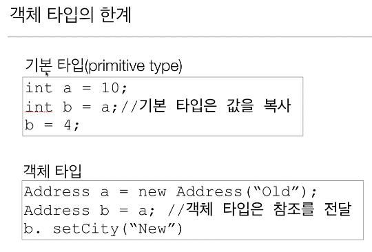

* 해결 방법 - 불변 객체로 만든다 -> 부작용을 원천 차단하라.

~~~java
@ThreadSafe
@Getter
@NoArgsConstructor(force = true)
@Embeddable
public final class Address {
    private final String city;
    private final String street;
    private final String zipcode;

    private Address(AddressBuilder builder){
        this.city = builder.city;
        this.street = builder.street;
        this.zipcode = builder.zipcode;
    }

    public static class AddressBuilder {
        private final String city;
        private final String street;
        private final String zipcode;

        public AddressBuilder(String city, String street, String zipcode) {
            this.city = city;
            this.street = street;
            this.zipcode = zipcode;
        }

        public Address build(){
            return new Address(this);
        }
    }
}

// Client
Address address = new Address.AddressBuilder
                    ("Busan","Seo-Gu","05008")
                    .build();
~~~

~~~java
// 값을 통으로 갈아 끼워라.
Address address1 = new Address("Seoul",address.getStreet(),address.getZipcode());
member1.setHomeAddress(address1);
~~~

## 8.4 값 타입의 비교

~~~java
// 값 비교
int a = 10;
int b = 10;
System.out.println(a==b);

// 객체 비교
Address addressA = new Address.AddressBuilder
        ("Busan","Seo-Gu","05008")
        .build();
Address addressB = new Address.AddressBuilder
        ("Busan","Seo-Gu","05008")
        .build();
System.out.println(addressA == addressB);

member1.setHomeAddress(address1);

~~~

~~~java
// 아래 어노테이션을 사용해서 Equals 를 오버라이드하여 사용해야 한다.
@EqualsAndHashCode
public final class Address
~~~

## 8.5 값 타입 컬렉션

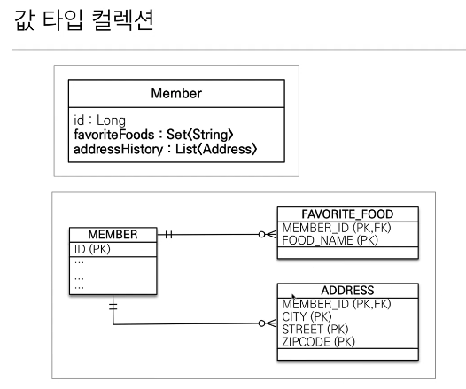

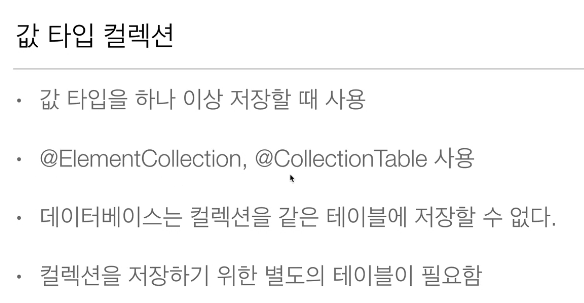

* 값 타입 컬렉션들은 모두 지연 로딩이다.
* 또한 영속성 전이(CASCADE.ALL), 고아 객체 제거 기능(orphanRemoval = true)

> 컬렉션만 변경되도 실제 DB 데이터가 변경된다.

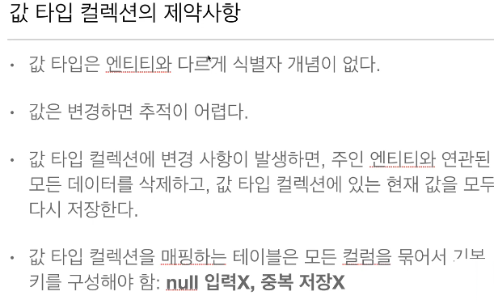

> 값 타입 컬렉션의 값을 변경하면 DB에는 테이블에 포함된 데이터를 다 지운다.(몇개가 됐든지) 그리고 최종적으로 남은 컬렉션 데이터를 다시 Insert 한다.

> 따라서 값 타입 컬렉션은 사용하면 안된다!!!! Id가 있는것이 아니기 때문에 값 변경 추적도 힘들다...

> 값타입 테이블에 참조키가 생기는 순간부터 값 타입이라고 하기 힘들다...

> 따라서 실무에서는 값 타입 컬렉션 대신 일대다 관계를 쓰는 것이 낫다..

* 실무에서는 값 타입 컬렉션 대신 일대다 관계로 매핑
~~~java
@Getter
@Table(schema = "`JPATEST`")
@Entity
public class AddressEntity {
    @Id
    @Column(name = "address_entity_id")
    @GeneratedValue
    private Long id;

    private Address address;

    public AddressEntity() {
    }

    public AddressEntity(String city, String street, String zipcode) {
        this.address = new Address.AddressBuilder(city,street,zipcode).build();
    }
}}

@OneToMany(cascade = CascadeType.ALL, orphanRemoval = true)
@JoinColumn(name = "member_id")
private List<AddressEntity> newAddressHistory = new ArrayList<>();

// client
member.getNewAddressHistory().add(new AddressEntity("Seoul_old1","Dondaemun-Gu","02908"));
~~~

> 그럼 언제 쓰나? 단순한 값을 멀티 체크 할 때...정도? 그냥 쓰지마라.

* 정리
  * 값 타입은 정말 값 타입이라 판단될 때만 사용
  * 엔티티와 값 타입을 혼동해서 엔티티를 값 타입으로 만들면 안됨
  * 식별자가 필요하고, 지속해서 값을 추적, 변경해야 한다면 그것은 값 타입이 아닌 엔티티

## 8.6 값 타입 실전 예제

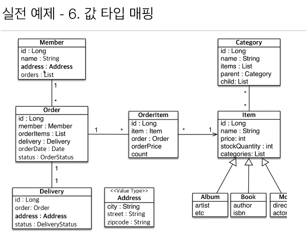

# 9. JPQL1

## 9.1
JPA는 다양한 쿼리 방법을 지원

1. JPQL
2. JPA Criteria
3. QueryDSL
4. 네이티브 SQL - 데이터베이스에 종속적인 쿼리가 나가야 되는 경우 사용
5. JDBC API 직접 사용, MyBatis, SpringJDBCTemplate 함께 사용

> 대부분은 JPQL로 해결이 가능하다.

## 9.2 JPQL

1. JPA를 사용하면 엔티티 객체를 중심으로 개발
2. 검색 쿼리- 테이블이 아닌 엔티티 객체를 대상으로 검색
3. 모든 DB 데이터를 객체로 변환해서 검색하는 것은 불가능
4. 어플리케이션이 필요한 데이터만 DB에서 불러오려면 결국 검색 조건이 포함된 SQL이 필요

## 9.3 Criteria
JAVA 표준 스펙

1. JPQL은 동적 쿼리를 만들기가 어렵다.
   =>  NULL 처리, 조건문 처리, 문자열 더하기 등등

2. 쿼리를 컴파일 시점에 오류를 잡아준다.
3. 하지만 SQL 관점에서는 객체 지향스럽지 않다.

~~~java
CriteriaBuilder cb = entityManager.getCriteriaBuilder();
CriteriaQuery<Member> query = cb.createQuery(Member.class);

Root<Member> m = query.from(Member.class);

CriteriaQuery<Member> cq = query.select(m).where(cb.equal(m.get("username"), "kim"));
List<Member> resultList = entityManager.createQuery(cq)
        .getResultList();
~~~

> 실무에서는 굳이 쓸 필요 없다. - 대신에 QueryDSL 사용해라.

## 9.4 QueryDSL
오픈 소스이다.

1. 초기 셋팅이 조금 귀찮지만 해놓으면 쿼리 실수 같은 것들을 컴파일단에서 잘 잡아준다.
2. 또한 동적 쿼리 작성이 용이하다.

> 실무 사용 권장 - 레퍼런스 http://www.querydsl.com/static/querydsl/4.0.1/reference/ko-KR/html_single/

## 9.5 네이티브 SQL
JPQL로 해결하는 없는 특정 DB에 의존적인 기능

~~~java
entityManager.createNativeQuery("select * from MEMBER"
~~~

> 진짜 생쿼리를 넣는다. -> 컨텍스트 영속성을 관리하지 않기 때문에 flush()를 수동으로 해줘야 한다.

# 10. JPQL 기본 문법

1. JPQL은 테이블이 아닌 엔티티 객체를 대상으로 동작한다.
2. JPQL은 결국 SQL로 변환하여 실행된다.

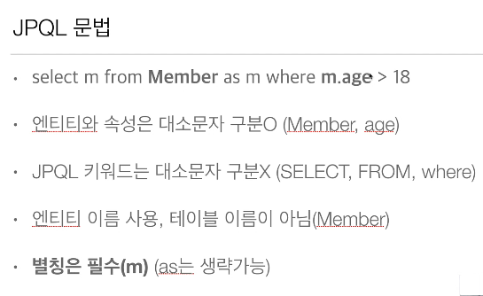

~~~java
// Type 정보를 알 수 있을 때
TypedQuery<Member> query = entityManager
                    .createQuery("select m from Member m",Member.class);

List<Member> resultList = query.getResultList();

resultList.forEach(i-> System.out.println(i.getUsername()));

// Type 정보를 받을 수 없을 때
Query query = entityManager
                    .createQuery("select m.username, m.age from Member m");

List<Member> resultList = query.getResultList();

resultList.forEach(i-> System.out.println(i.getUsername()));
~~~

## 10.1 getResultList()

1. 반드시 결과 값이 하나여야 한다.
   1. 결과 값이 없거나
   2. 결과 값이 두개 이상이라면 무조건 Exception 발생한다... 굉장히 별로다.

## 10.2 파라미터 바인딩

1. 이름 기준
~~~java
// chining
TypedQuery<Member> query = entityManager
                    .createQuery("select m from Member m where m.username=:username",Member.class)
                    .setParameter("username","PSS");

~~~

1. 위치 기준

> 위치 기반 바인딩은 쓰지마라.

# 11. 프로젝션

# 책 추천

1. 객체 지향의 사실과 오해
2. 오브젝트
