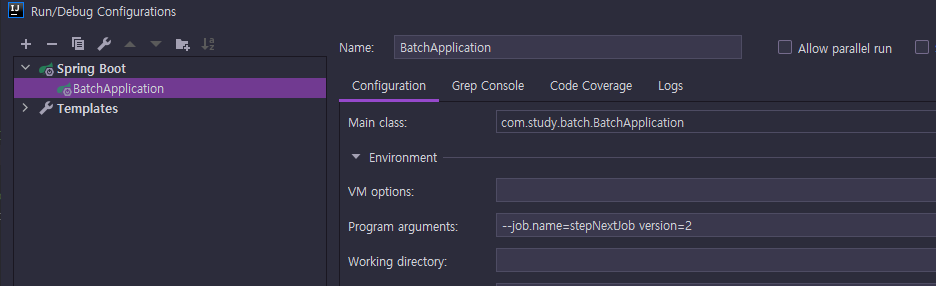
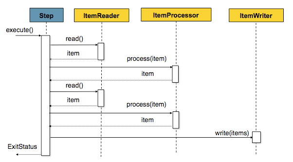
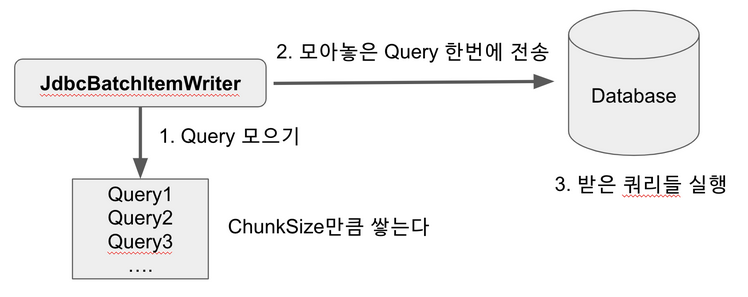

# Spring Batch 개념

# 1. SpringBatch 메타 데이터 테이블

## 1. BATCH_JOB_INSTANCE

- Job Parameter (외부에서 받을 수 있는 데이터 - args)에 따라 데이터가 생성되는 테이블
- Job Parameter로 날짜를 넘기면 Spring Batch 에서는 해당 날짜 데이터로 조회/가공/입력 등의 작업이 가능하다.
- 같은 Batch Job이라도 Job Parameter가 다르면 BATCH_JOB_INSTANCE 에는 입력되며, 같다면 입력되지 않는다.
- 같은 Job Parameter로는 Application을 실행시킬 수 없다. > 성공한 기록이 있을 때만 재수행이 안된다.

```JAVA
@Bean
    @JobScope
    public Step simpleStep1(@Value("#{jobParameters[requestDate]}") String requestDate){
        return stepBuilderFactory.get("simpleStep")
                .tasklet(((stepContribution, chunkContext) -> {
                    log.info(">>>>> This is Step1");
                    log.info(">>>>> requestDate = {}", requestDate);
                    return RepeatStatus.FINISHED;
                }))
                .build();
```

## 2. BATCH_JOB_EXECUTION

JOB_INSTANCE와는 부모-자식 관계 이다.

JOB_INSTANCE가 부모이다.

JOB_EXECUTION은 자신의 부모 JOB_INSTANCE가 성공/실패했던 모든 JOB 내역을 가지고 있다.

## 3. BATCH_JOB_EXECUTION_PARAM

BATCH_JOB_EXECUTION 테이블이 생성될 당시에 입력 받은 Job Parameter를 담고 있다.

# 2. 실행할 Batch Job 지정하기

```java
spring:
    batch:
        job:
        names: ${job.name:NONE} # job name으로 할당이 되면 할당된 값으로, 할당되지 않으면 NONE 값을 사용한다는 의미로 NONE이 들어왔을 때는 어떠한 JOB도 실행하지 않는다.
```

> 실제 운영 환경에서는 java -jar batch-application.jar --job.name=simpleJob 과 같이 배치를 실행합니다.



# 3. 조건별로 Step 실행하기

```java
@Bean
    public Job stepNextConditionalJob() {
        return jobBuilderFactory.get("stepNextConditionalJob")
                .start(conditionalJobStep1())
                .on("FAILED") // FAILED 일 경우
                .to(conditionalJobStep3()) // step3으로 이동한다.
                .on("*") // step3의 결과 관계 없이
                .end() // step3으로 이동하면 Flow가 종료한다.
                .from(conditionalJobStep1()) // step1로부터
                .on("*") // FAILED 외에 모든 경우
                .to(conditionalJobStep2()) // step2로 이동한다.
                .next(conditionalJobStep3()) // step2가 정상 종료되면 step3으로 이동한다.
                .on("*") // step3의 결과 관계 없이
                .end() // step3으로 이동하면 Flow가 종료한다.
                .end() // Job 종료
                .build();
    }

    @Bean
    public Step conditionalJobStep1() {
        return stepBuilderFactory.get("step1")
                .tasklet((contribution, chunkContext) -> {
                    log.info(">>>>> This is stepNextConditionalJob Step1");
                    /**
                     ExitStatus를 FAILED로 지정한다.
                     해당 status를 보고 flow가 진행된다.
                     **/
                    contribution.setExitStatus(ExitStatus.FAILED);

                    return RepeatStatus.FINISHED;
                })
                .build();
    }
```

> 중요한 것은 on이 캐치하는 상태값이 BatchStatus가 아닌 ExitStatus라는 점이다.

# 4. Batch Status vs Exit Status

## 4-1. Batch Status

Job 또는 Step의 실행 결과를 Spring에서 기록할 때 사용하는 Enum 이다.

> COMPLETED, STARTING, STARTED, STOPPING, STOPPED, FAILED, ABANDONED, UNKNOWN

## 4-2. Exit Status

Step의 실행 후 상태를 의미하며, 이 값은 Enum이 아니다.

> Spring Batch는 기본적으로 ExitStatus 코드는 Step의 BatchStatus와 같도록 설정되어 있다.

Exit Status 에 없는 코드 값을 반환하려면 별도의 로직이 필요하다.

```java
public class SkipCheckingListener extends StepExecutionListenerSupport {

    public ExitStatus afterStep(StepExecution stepExecution) {
        String exitCode = stepExecution.getExitStatus().getExitCode();
        if (!exitCode.equals(ExitStatus.FAILED.getExitCode()) &&
              stepExecution.getSkipCount() > 0) {
            return new ExitStatus("COMPLETED WITH SKIPS");
        }
        else {
            return null;
        }
    }
}
```

# 5. Decide

위 4번 항목의 조건별 분기 코드는 2가지 문제가 존재한다.

1. Step이 담당하는 역할이 2개 이상이 된다.
2. 다양한 분기 로직 처리의 복잡함

따라서 Step들의 Flow 속에서 분기만 담당하는 JobExecutionDecider를 구현해서 사용하자.

```java
@Bean
public Job deciderJob(){
    return jobBuilderFactory.get("deciderJob")
            .start(startStep())
            .next(decider()) // 홀수 | 짝수 구분
            .from(decider()) // decider의 상태가
                .on("ODD") // ODD라면
                .to(oddStep()) // oddStep로 간다.
            .from(decider()) // decider의 상태가
                .on("EVEN") // ODD라면
                .to(evenStep()) // evenStep로 간다.
            .end() // builder 종료
            .build();
}

@Bean
public JobExecutionDecider decider() {
    return ((jobExecution, stepExecution) -> {
        Random random = new Random();
        int randomNum = random.nextInt(50) + 1;
        log.info("램덤 숫자 : "+randomNum);
        if (randomNum % 2 == 0) return new FlowExecutionStatus("EVEN");
        else return new FlowExecutionStatus("ODD");
    });
}
```

# 6. JobParameter 와 Scope

Spring Batch의 경우 내,외부에서 파라미터를 받아 여러 Batch 컴포넌트에서 사용할 수 있게 지원하고 있다.
이 파라미터를 Job Parameter라고 한다.
Job Parameter를 사용하기 위해서는 Batch 전용 Scope를 선언해야만 한다.

## 6-1. 사용법

Batch Scope는 크게 @StepScope와 @JobScope 2가지가 있다.

@JobScope는 Step 선언문에서 사용 가능하고,
@StepScope는 Tasklet이나 ItemReader, ItemWriter, ItemProcessor에서 사용 가능하다.

Job Parameter의 타입으로 사용할 수 있는 것은 Double, Long, Date, String이 있다.

> @Value("#{jobParameters[파라미터명]}")

jobParameters 외에도 jobExecutionContext, stepExecutionContext 등도 SpEL로 사용할 수 있습니다.
@JobScope에선 stepExecutionContext는 사용할 수 없고, jobParameters와 jobExecutionContext만 사용할 수 있습니다.

## 6-2. Scope 빈 생성 라이프 사이클

Spring Batch가 Spring 컨테이너를 통해 지정된 Step의 실행 시점에 해당 컴포넌트를 SpringBean으로 생성한다.

Bean의 생성 시점은 지정된 Scope가 실행되는 시점이 된다.

> MVC의 request scope와 비슷하다. 요청이 왔을 때, request scope가 생성되고 response를 반환하면 삭제되는 것처럼 JobScope, StepScope 역시 Job과 Step 실행 시점에 생성되고 작업이 끝나면 삭제된다.

Batch 관련 빈의 생성 시점을 어플리케이션 실행 시점이 아닌 Job, Step의 실행 시점으로 지연시켜서 얻는 이점은 크게 2가지가 존재한다.

1. Job Parameter의 Late Binding이 가능하다.
   즉, Application 실행 시점이 아니라도 Controller나 Service와 같은 비즈니스 처리 단계에서 할당 시킬수 있다.

2. 동일한 컴포넌트를 병렬 혹은 동시에 사용할 때 유용하다.
   @StepScope 없이 Tasklet이 있는 Step을 병렬로 실행 시키면 서로 다른 Step에서 하나의 Tasklet을 상태를 마구잡이로 변경하려고 할 것이지만, @StepScope를 사용한다면 각각의 Step에서 별도의 Tasklet을 생성하고 관리하기 때문에 위와 같은 문제를 해결할 수 있다.

> Job Parameter를 사용하기 위해서는 꼭 @JobScope, @StepScope로 빈을 생성해야 한다.

## 6-3. Job Parameter vs 시스템 변수

1. Spring Batch에서 자동으로 관리해주는 Parameter 관련 메타 테이블이 전혀 관리되지 않는다.

2. Late Binding이 어렵다.

3. Job Parameter에 따라 각각의 Batch 컴포넌트들을 사용하면 되니 변경이 심한 경우에도 쉽게 대응할 수 있다.

```java
@Slf4j
@RequiredArgsConstructor
@RestController
public class JobLauncherController {

    private final JobLauncher jobLauncher;
    private final Job job;

    @GetMapping("/launchjob")
    public String handle(@RequestParam("fileName") String fileName) throws Exception {

        try {
            JobParameters jobParameters = new JobParametersBuilder()
                                    .addString("input.file.name", fileName)
                                    .addLong("time", System.currentTimeMillis())
                                    .toJobParameters();
            jobLauncher.run(job, jobParameters);
        } catch (Exception e) {
            log.info(e.getMessage());
        }

        return "Done";
    }
}
```

## 6-4. 주의 사항

@JobScope는 Proxy_mode를 사용하는 것과 같다.

이 Proxy_mode를 사용하면서 발생할 수 있는 문제가 있다.

```java
@Bean
@JobScope
public Step simpleStep1(@Value("#{jobParameters[requestDate]}") String requestDate){
    return stepBuilderFactory.get("simpleStep1")
            .tasklet(((stepContribution, chunkContext) -> {
                log.info(">>>>> This is Step1");
                log.info(">>>>> requestDate = {}", requestDate);
                return RepeatStatus.FINISHED;
//                    throw new IllegalArgumentException("step1 에서 실패합니다.");
            }))
            .build();
}


@Scope(
    value = "job",
    proxyMode = ScopedProxyMode.TARGET_CLASS
)
@Retention(RetentionPolicy.RUNTIME)
@Documented
public @interface JobScope {
}
```

1. 문제상황

```java
@Bean
public ItemReader<Person> reader() {
    Map<String, Object> paramMap = new HashMap<>();
    paramMap.put("firstName","Seongsoo");

    JpaPagingItemReader<Person> reader = new JpaPagingItemReader<>();
    reader.setEntityManagerFactory(entityManagerFactory);
    reader.setQueryString("select p From Person p where p.firstName=:firstName");
    reader.setParameterValues(paramMap);
    reader.setPageSize(10);

    return reader;
}


//Test Code
@SpringBootTest
@TestPropertySource(properties = {"job.name=" + JobConfiguration.JOB_NAME})
public class JobTests {
    @Autowired
    private JobLauncherTestUtils jobLauncherTestUtils;

    @Test
    public void test(){
        JobExecution jobExecution = jobLauncherTestUtils.launchJob();
        assertThat(jobExecution.getStatus(), is(BatchStatus.COMPLETED));
    }
}
```

위 예제에서 파라미터를 입력 받는 Reader를 가진 Step을 구현하기 위해 reader() 및 test() 코드 수정

```java
@Bean
@StepScope
public ItemReader<Person> reader(@Value("#{jobParameters[firstName]}") String firstName) {
    Map<String, Object> paramMap = new HashMap<>();
    paramMap.put("firstName",firstName);

    JpaPagingItemReader<Person> reader = new JpaPagingItemReader<>();
    reader.setEntityManagerFactory(entityManagerFactory);
    reader.setQueryString("select p From Person p where p.firstName=:firstName");
    reader.setParameterValues(paramMap);
    reader.setPageSize(10);

    return reader;
}


//Test Code
@SpringBootTest
@TestPropertySource(properties = {"job.name=" + JobConfiguration.JOB_NAME})
public class JobTests {
    @Autowired
    private JobLauncherTestUtils jobLauncherTestUtils;

    @Test
    public void test(){
        JobParameters jobParameters = new JobParameterBuilder().addString("firstName", "Seongsoo").toJobParameters();

        assertNull(personRepository.findByFirstName("SEONGSOO"));

        JobExecution jobExecution = jobLauncherTestUtils.launchJob(jobParameters);

        assertThat(jobExecution.getStatus(), is(BatchStatus.COMPLETED));
        assertThat(personRepository.findByFirstName("SEONGSOO").getFirstName(), is("SEONGSOO"));
    }
}
```

위 테스트는 실패하는데 이유는 reader()의 리턴값인 reader 객체는 프록시 객체를 리턴하기 때문이다.

> @StepScope 때문에 ItemReader()의 프록시 객체를 리턴한다. 따라서 read() 메서드 밖에 없고 stream을 open/close하는 메서드는 전혀 없다. 이는 모두 ItemStream() 인터페이스에서 관리한다.

따라서 step의 stream을 등록하는 과정에서 if절을 통과하지 못해서 실패하는 것이다.

EntityManagerFactory에서 EntityManager를 생성하는 것은 등록된 stream이 진행하는데 stream이 없다보니 open메소드를 수행하지 못하고 결국 EntityManager가 생성되지 않아 null point exception이 발생한 것이다.

해결책은 간단하다. 메소드의 리턴 타입을 구현체의 타입으로 직접 적용하는 것이다.

```java
@Bean
@StepScope
public JpaPagingItemReader<Person> reader(@Value("#{jobParameters[firstName]}") String firstName) {
    Map<String, Object> paramMap = new HashMap<>();
    paramMap.put("firstName",firstName);

    JpaPagingItemReader<Person> reader = new JpaPagingItemReader<>();
    reader.setEntityManagerFactory(entityManagerFactory);
    reader.setQueryString("select p From Person p where p.firstName=:firstName");
    reader.setParameterValues(paramMap);
    reader.setPageSize(10);

    return reader;
}

```

# 7. Chunk 지향 처리

## 7-1. Chunk?

Batch에서 Chunk란 데이터 덩어리로 작업할 때 각 커밋 사이에 처리되는 row 수를 의미한다.

> 따라서 Transaction 역시 Chunk 단위로 이루어진다.



## 7-2. Page Size vs Chunk Size

Chunk Size는 한번에 처리될 트랜잭션 단위를 말하며, Page Size는 한번에 조회할 Item의 양을 의미한다.

> 두 값은 일치시키는 것이 성능 향상에 도움이 되며, JPA 사용시 영속석 컨텍스트 관련 이슈도 예방할 수 있다.

# 8. ItemReader

앞의 과정들을 통해 Spring Batch가 Chunk 지향 처리를 하고 있으며 이를 Job과 Step으로 구성되어 있음을 배웠다.

Step은 Tasklet 단위로 처리되고, Tasklet 중에서 ChunkOrientedTasklet을 통해 Chunk를 처리하며 이를 구성하는 3 요소로 ItemReader, ItemWriter, ItemProcessor가 있음을 배웠다.

Item Reader는 아래와 같이 여러 형태로 부터 데이터를 읽어들일 수 있다.

- 입력 데이터
- File, XML, JSON
- Database
- 커스텀

## 8-1. Database Reader

일반적으로 배치는 실시간 처리가 어려운 대용량 데이터나 대규모 데이터일 경우에 적용된다.

Cursor 방식은 Database와 커넥션을 맺은 후, Cursor를 한칸씩 옮기면서 지속적으로 데이터를 빨아옵니다.
반면 Paging 방식에서는 한번에 10개 (혹은 개발자가 지정한 PageSize)만큼 데이터를 가져옵니다.

> 모든 ItemReader의 예제를 다루기에는 양이 많으니 여기서는 각 Reader의 대표격인 JdbcCursorItemReader와 JdbcPagingItemReader, JpaPagingItemReader를 예제와 함께 소개드리겠습니다.

## 8-2 CursorItemReader

ItemReader의 가장 큰 장점은 데이터를 Streaming 할 수 있다는 것입니다.
read() 메소드는 데이터를 하나씩 가져와 ItemWriter로 데이터를 전달하고, 다음 데이터를 다시 가져 옵니다.
이를 통해 reader & processor & writer가 Chunk 단위로 수행되고 주기적으로 Commit 됩니다.
이는 고성능의 배치 처리에서는 핵심입니다.

- 주의 사항
  > Cursor는 하나의 Connection으로 Batch가 끝날때까지 사용되기 때문에 Batch가 끝나기전에 Database와 어플리케이션의 Connection이 먼저 끊어질 수 있기 때문에 SocketTimeout을 충분히 큰 값으로 설정

만약 Batch 수행 시간이 오래 걸리는 경우에는 PagingItemReader를 사용하는게 낫다.

```java
@Bean
public JdbcCursorItemReader<Pay> jdbcCursorItemReader() {
    return new JdbcCursorItemReaderBuilder<Pay>()
            .fetchSize(chunkSize)
            .dataSource(dataSource)
            .rowMapper(new BeanPropertyRowMapper<>(Pay.class))
            .sql("SELECT id, amount, tx_name, tx_date_time FROM \"PSS\".\"PAY\"")
            .name("jdbcCursorItemReader")
            .build();
}
```

## 8-2. PagingItemReader

```java
@Bean
public JdbcPagingItemReader<Pay> jdbcPagingItemReader() throws Exception {
    Map<String, Object> parameterValues = new HashMap<>();
    parameterValues.put("amount", 2000);

    return new JdbcPagingItemReaderBuilder<Pay>()
            .pageSize(chunkSize)
            .fetchSize(chunkSize)
            .dataSource(dataSource)
            .rowMapper(new BeanPropertyRowMapper<>(Pay.class))
            .queryProvider(createQueryProvider())
            .parameterValues(parameterValues)
            .name("jdbcPagingItemReader")
            .build();
}

@Bean
public PagingQueryProvider createQueryProvider() throws Exception {
    SqlPagingQueryProviderFactoryBean queryProvider = new SqlPagingQueryProviderFactoryBean();
    queryProvider.setDataSource(dataSource); // Database에 맞는 PagingQueryProvider를 선택하기 위해
    queryProvider.setSelectClause("id, amount, tx_name, tx_date_time");
    queryProvider.setFromClause("from \"PSS\".\"PAY\"");
    queryProvider.setWhereClause("where amount >= :amount");

    // Paging은 매번 다른 Connection을 맺기 때문에 Order가 필수!
    Map<String, Order> sortKeys = new HashMap<>(1);
    sortKeys.put("id", Order.ASCENDING);

    queryProvider.setSortKeys(sortKeys);

    return queryProvider.getObject();
}
```

코드를 보시면 JdbcCursorItemReader와 설정이 크게 다른것이 하나 있는데요.
바로 쿼리 (createQueryProvider())입니다.
JdbcCursorItemReader를 사용할 때는 단순히 String 타입으로 쿼리를 생성했지만, PagingItemReader에서는 PagingQueryProvider를 통해 쿼리를 생성합니다.
이렇게 하는데는 큰 이유가 있습니다.

각 Database에는 Paging을 지원하는 자체적인 전략들이 있는데, database마다 Provider를 바꾸기 싫다.

> 따라서 Spring Batch에서는 SqlPagingQueryProviderFactoryBean을 통해 Datasource 설정값을 보고 위 이미지에서 작성된 Provider중 하나를 자동으로 선택하도록 하기위해서 createQueryProvider() 를 사용해서 구현한다.

## 8-3. JpaPagingItemReader

> JPA는 Hibernate와 많은 유사점을 가지고 있지만, 한가지 다른 것이 있다면 Hibernate 에선 Cursor가 지원되지만 JPA에는 Cursor 기반 Database 접근을 지원하지 않는다.

```java
@Bean
public JpaPagingItemReader<Pay> jpaPagingItemReader() {
    return new JpaPagingItemReaderBuilder<Pay>()
            .name("jpaPagingItemReader")
            .entityManagerFactory(entityManagerFactory)
            .pageSize(chunkSize)
            .queryString("SELECT p FROM Pay p WHERE amount>=2000 ORDER BY id ASC")
            .build();
}
```

```java
/**
    * JPA Repository 구현이 필요한 경우 아래와 같이 사용 가능하다.
    *
    * 그냥 Item Reader를 따로 구현해서 Repository를 사용하면 Batch의 장점인 Paging을 사용하지 않기 때문에
    * 아래처럼 RepositoryItemReader를 사용하는 것이 좋다.
    **/
@Bean
public RepositoryItemReader<Pay> reader() {
    RepositoryItemReader<Pay> reader = new RepositoryItemReader<>();
    reader.setRepository(payRepository);
    reader.setMethodName("findAll");
    reader.setSort(Collections.singletonMap("id", Sort.Direction.ASC));
    return reader;
}
```

- 주의 사항
  > 정렬(Order) 기준을 사용하지 않으면 데이터의 누락이 발생할 수 있다. 이유는 Paging 처리시 매 Paging마다 커넥션을 새로 생성하기 때문이다.

> 대량의 데이터가 아니고 멀티스레드 환경이 아니라면 CusorItemReader를 사용하는 것도 좋은 선택이다.

# 9. ItemWrite

## 9-1. JdbcBatchItemWriter



```java
@Bean
public JdbcCursorItemReader<Pay> jdbcBatchItemWriterReader() {
    return new JdbcCursorItemReaderBuilder<Pay>()
            .fetchSize(chunkSize)
            .dataSource(dataSource)
            .rowMapper(new BeanPropertyRowMapper<>(Pay.class))
            .sql("SELECT id, amount, tx_name, tx_date_time FROM \"PSS\".\"PAY\"")
            .name("jdbcBatchItemWriter")
            .build();
}

/**
* reader에서 넘어온 데이터를 하나씩 출력하는 writer
* assertUpdates (boolean) : 적어도 하나의 항목이 행을 업데이트하거나 삭제하지 않을 경우 예외를 리턴할지 여부(기본값: true)
* columnMapped : Insert SQL의 Values를 Key, Value 기반으로 매핑
* beanMapped : Insert SQL의 Values를 POJO 기반으로 매핑
*/
@Bean // beanMapped()을 사용할때는 필수
public JdbcBatchItemWriter<Pay> jdbcBatchItemWriter() {
    return new JdbcBatchItemWriterBuilder<Pay>()
            .dataSource(dataSource)
            .sql("insert into \"PSS\".\"PAY2\"(amount, tx_name, tx_date_time) values (:amount, :txName, :txDateTime)")
            .beanMapped()
            .build();
}
```

> JdbcBatchItemWriter의 제네릭 타입은 Reader에서 넘겨주는 값 (PAY)의 타입입니다.

## 9-2. JpaItemWriter

JPA를 사용하면 편리한 점은 EntityManager만 구현해놓는다면 객체를 통한 검색 등이 가능하므로 queryString()에 작성되는 쿼리가 비교적 간단하고 직관적이다. (실제 DB의 스키마, 대소문자가 변경되는 것에 따른 제약이 코딩에 나타나지않는 장점)

```java
@Bean
public JpaPagingItemReader<Pay> jpaItemWriterReader() {
    return new JpaPagingItemReaderBuilder<Pay>()
            .name("jpaItemWriterReader")
            .entityManagerFactory(entityManagerFactory)
            .pageSize(chunkSize)
            .queryString("SELECT p FROM Pay p ORDER BY id ASC")
            .build();
}

@Bean
public ItemProcessor<Pay, Pay2> jpaItemProcessor() {
    return pay -> Pay2.builder()
            .amount(pay.getAmount() +2000)
            .txName(pay.getTxName() +"_CLONE")
            .txDateTime(pay.getTxDateTime())
            .build();
}

@Bean
public JpaItemWriter<Pay2> jpaItemWriter() {
    JpaItemWriter<Pay2> jpaItemWriter = new JpaItemWriter<>();
    jpaItemWriter.setEntityManagerFactory(entityManagerFactory);
    return jpaItemWriter;
}
```

> ItemProcessor는 Reader로 부터 읽은 데이터의 전처리가 필요한 경우 사용된다.

## 9-3. Custom ItemWriter

Reader와 보다 Writer는 아래와 같이 Custom 하게 구현할 일이 많다.

- Reader에서 읽어온 데이터를 RestTemplate으로 외부 API로 전달해야할때
- 임시저장을 하고 비교하기 위해 싱글톤 객체에 값을 넣어야할때
- 여러 Entity를 동시에 save 해야할때

```java
/**
    * 이 로직을 어떻게 구현할 것인가? 개발 서비스에 따라 자유롭게 구축
    **/
@Bean
public ItemWriter<Pay2> customItemWriter() {
    return items -> {
        for (Pay2 item : items) {
            log.info(item);
        }
    };
}
```

# 10. ItemProcessor

주 역할은 reader가 읽은 데이터를 가공, 필터링하여 writer에 전달하는 것이며, 필수 구현 항목은 아니다.

Processor의 역할

1. 변환 - 타입, 데이터를 변환하여 writer 로 전달
2. 필터 - 저장할 데이터와 아닌 데이터를 구분하여 일부 데이터 전달

Processor를 여러개 두어 형변환 등의 역할로도 사용할 수 있다.

```java
@Bean
public CompositeItemProcessor compositeProcessor() {
    List<ItemProcessor> delegates = new ArrayList<>(2);
    delegates.add(processor1());
    delegates.add(processor2());

    CompositeItemProcessor processor = new CompositeItemProcessor<>();

    processor.setDelegates(delegates);

    return processor;
}

public ItemProcessor<Teacher, String> processor1() {
    return Teacher::getName;
}

public ItemProcessor<String, String> processor2() {
    return name -> "안녕하세요. "+ name + "입니다.";
}

private ItemWriter<String> writer() {
    return items -> {
        for (String item : items) {
            log.info("Teacher Name={}", item);
        }
    };
}
```

# 정리

## 1. 주요 메서드의 제네릭 타입

Spring Batch의 기본 구조는 Reader -> Processor -> Writer의 구조이기 때문에 데이터를 전달하는 각 과정에서 타입만 유의한다면 커스텀하게 구성할 수 있다.

```java
ItemReader<I>
ItemProcessor<I,O>
ItemWriter<O>
```

## 2. chunk 사이즈와 page 사이즈는 같게 설정해라.

## 3. cursor vs paging

한번에 조회해야할 데이터 양이 많거나 멀티스레딩 환경이라면 paging 아니라면 cursor를 사용하는 것이 좋다.

이유는 paging 처리는 매 요청마다 db connection을 새로 맺고 끊는다. 또한 조회 쿼리를 날릴때, 반드시 ordering을 해줘야 데이터 유실을 방지할 수 있기 때문에 cursor에 비해 신경 쓸게 좀 생긴다.
