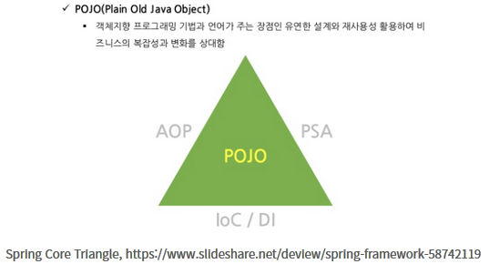
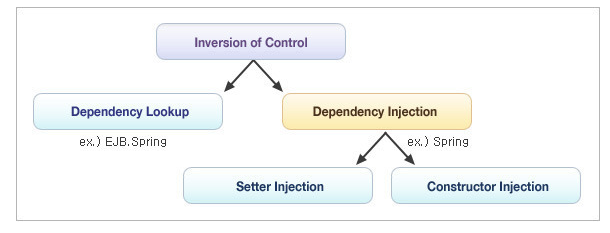
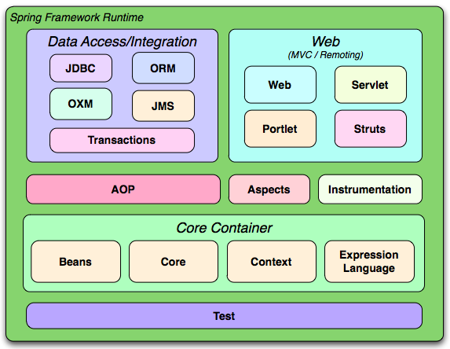
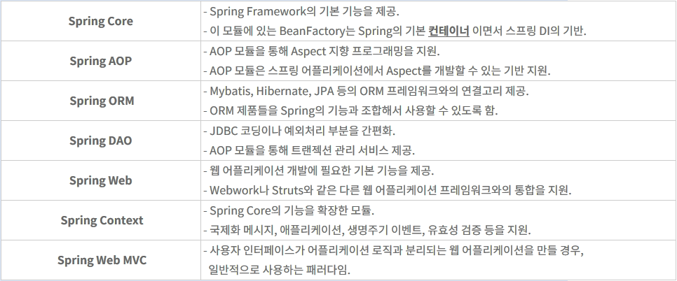
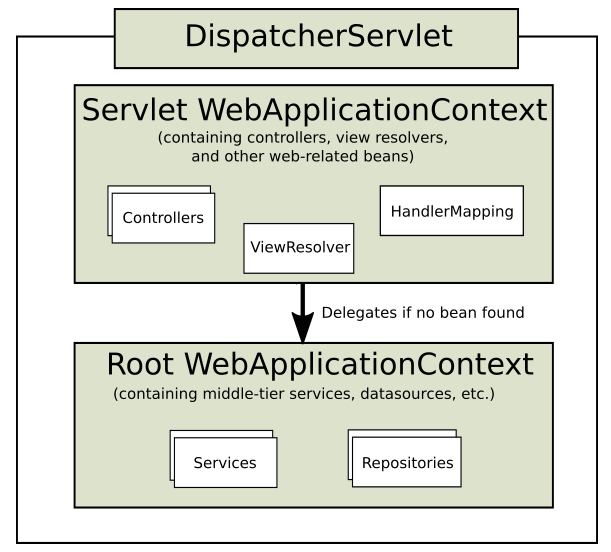
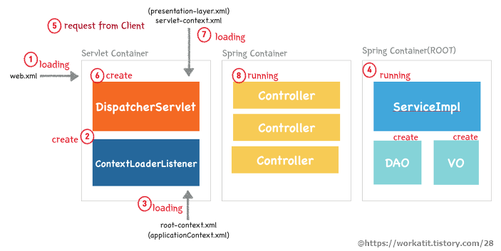
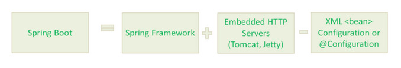

# Spring 정리

POJO(Plain Old Java Object), 처음 자바가 만들어졌을 당시의 자바가 추구했던 객체 지향 언어로서의 특징을 가지고 개발 중심, 무겁거나 복잡하지 않은 개발 가치로 회기하자는 의미에서 나온 용어이다.

스프링 프레임워크는 자바 개발시 개발자가 자유롭게 객체 지향적 설계를 하면서도 간결한 코딩, 코드 재사용 등의 필수 기능을 단순한 형태로 사용하기 위해 나온 POJO 기반의 프레임워크이다.

# 1. 개념



## 1-1 PSA (Portable Service Abstraction)

서블릿 어플리케이션임에도 불구하고 서블릿이 전혀 존재하지 않는다. 단지 @Controller 애노테이션이 붙어있는 클래스에서 @GetMapping, @PostMapping과 같은 @RequestMapping 애노테이션을 사용해서 요청을 매핑한다.

실제로는 내부적으로 서블릿 기반으로 코드가 동작하지만 서블릿 기술은 추상화 계층에 의해 숨겨져 있는 것이다.

이렇게 추상화 계층을 사용해서 어떤 기술을 내부에 숨기고 개발자에게 편의성을 제공해주는 것을 Service Abstraction이라 한다.

더하여 Service Abstraction으로 제공되는 기술을 다른 기술 스택으로 간편하게 바꿀 수 있는 확장성을 갖고 있는 것이 Portable Service Abstraction이다.

Spring은 Spring Web MVC, Spring Transaction, Spring Cache 등의 다양한 PSA를 제공한다.

> 스프링에서는 WAS를 TOMCAT에서 다른 플랫폼으로 변경하더라고 소스코드를 수정할 필요가 없다. PSA 기능 덕분에

## 1-2 AOP (Aspect Oriented Programming)

AOP는 관점 지향 프로그래밍이라고 불린다. 관점 지향은 쉽게 말해 어떤 로직을 기준으로 핵심적인 관점, 부가적인 관점으로 나누어서 보고 그 관점을 기준으로 각각 모듈화하겠다는 것이다.

여기서 모듈화란 어떤 공통된 로직이나 기능을 하나의 단위로 묶는 것을 말한다.

### 1-2-1. AOP 주요 개념

- Aspect : 위에서 설명한 흩어진 관심사를 모듈화 한 것. 주로 부가기능을 모듈화함.
- Target : Aspect를 적용하는 곳 (클래스, 메서드 .. )
- Advice : 실질적으로 어떤 일을 해야할 지에 대한 것, 실질적인 부가기능을 담은 구현체
- JointPoint : Advice가 적용될 위치, 끼어들 수 있는 지점. 메서드 진입 지점, 생성자 호출 시점, 필드에서 값을 꺼내올 때 등 다양한 시점에 적용가능
- PointCut : JointPoint의 상세한 스펙을 정의한 것. 'A란 메서드의 진입 시점에 호출할 것'과 같이 더욱 구체적으로 Advice가 실행될 지점을 정할 수 있음

### 1-2-2. AOP 특징

- 프록시 패턴 기반의 AOP 구현체, 프록시 객체를 쓰는 이유는 접근 제어 및 부가기능을 추가하기 위해서임
- 스프링 빈에만 AOP를 적용 가능
- 모든 AOP 기능을 제공하는 것이 아닌 스프링 IoC와 연동하여 엔터프라이즈 애플리케이션에서 가장 흔한 문제(중복코드, 프록시 클래스 작성의 번거로움, 객체들 간 관계 복잡도 증가 ...)에 대한 해결책을 지원하는 것이 목적

## 1-3 IOC/DI (Inversion of Control / Dependency Injection)

### 1-3-1. IOC 컨테이너

#### 1-3-1-1. BeanFactory

- BeanFactory 인터페이스는 IoC컨테이터의 기능을 정의하고 있는 인터페이스이며, Bean의 생성 및 의존성 주입, 생명주기(lifecycle) 관리 등의 기능을 제공한다. 여기서 Bean이란 IoC컨테이너에 의해 생성되고 관리되는 객체를 의미한다.

- 컨테이너가 구동될 때 객체를 생성하는 것이 아니라, 클라이언트로의 요청에 의해서만 객체를 생성함(Lazy Loading)

#### 1-3-1-2. ApplicationContext

- 컨테이너가 구동되는 시점에 bean에 등록되어 있는 클래스를 객체화 함. (Eager Loading)
- BeanFactory 인터페이스를 상속받는 ApplicationContext는 BeanFactory가 제공하는 기능 외에 AOP, 메세지처리, 이벤트 처리 등의 기능을 제공한다.
- 모든 ApplicationContext 구현체는 BeanFactory의 기능을 모두 제공하므로, 특별한 경우를 제외하고는 ApplicationContext를 사용하는 것이 바람직하다.

### 1-3-2. DI

DI란 IoC를 구현하는 방법으로 IoC와 DI의 관계에 대해 알아보자.



# 2. 스프링에서 DI 의존성 주입 방법

## 2.1 Field 주입

```java
@Autowired
private SampleObject sampleObject;
```

매우 간단하지만 아래와 같은 단점으로 권장되지 않는 방법이다.

#### 2-1-1. 불변성 위반

- 필드 주입 객체는 final로 선언할 수 없다.

#### 2-1-2. 순환 의존성 알수 없음

- 순환 의존 현상이 발생하더라도 Exception을 안뱉으므로 알 수 없다.
  서로 끊임없이 참조하다 결국 StackOverFlowError로 죽는다.

#### 2-1-3. DI 컨테이너의 결합성과 테스트 용이성 위배

- 필요한 의존성을 전달하면 독립적으로 인스턴스화 가능해야 한다.
- 하지만 필드 주입을 사용하면 필요한 의존성을 가진 클래스를 인스턴스화 할 수 없다.

#### 2-1-4. 단일 책임의 원칙

- 하나의 클래스에서 주입되는 클래스가 많아질수록 해당 클래스가 책임지는 상황이 많이 발생하게 되는데 이는 리팩토링이 되어야할 상황이다.
- 이 때 필드 주입 방식은 비교적 간단한 코드로 의존성을 주입하므로 다른 방식에 비해서 무분별하게 의존성을 주입하기 쉽다.

### 2.2 Setter 주입

```java
private SampleObject sampleObject;

@Autowired
public void setSampleObject(SampleObject sampleObject){
    this.sampleObject = sampleObject;
}
```

### 2.3 Construtor 주입 (권장되는 방법)

```java
@Service
public class Sample(){
    private final SampleObject sampleObject;

    public Sample(SampleObject sampleObject){
        this.sampleObject = sampleObject;
    }
}

```

# 3. 스프링 구조





## 3-1. Core Container

- Beans : 스프링 컨테이너가 관리하는 Java 객체이며, ApplicationContext.getBean() 으로 얻을수 있다.
- Core : BeanFactory를 기반으로 Bean들을 제어할 수 있는 기능 (IoC or DI) 등의 개발 환경 제공한다.
- Context : JNDI(Java Naming and Directory Interface) 레지스트리와 유사한 프레임 워크 스타일 방식으로 객체에 액세스하는 수단
- Expression Language : 런타임에 개체 그래프를 쿼리하고 조작 할 수있는 강력한 표현 언어를 제공한다. (속성 값 설정 및 가져 오기, 속성 할당, 메서드 호출, 배열, 컬렉션 및 인덱서의 컨텍스트 액세스, 논리 및 산술 연산자, 명명 된 변수, Spring의 IoC 컨테이너에서 이름 별 개체 검색을 지원 등)

> 스프링의 컨텍스트란?
> 기본적으로 스프링은 root-context와 servlet-context가 생성된다. 이때, root-context에서 생성되는 빈들은 모든 영역에서 공유(사용)할 수 있고, servlet-context 에서 생성되는 빈들은 해당 컨텍스트에서만 사용할 수 있다. root 와 servlet에서 겹치는 빈이 생길 경우 servlet에서 생성한 빈을 사용하게 된다.



## 3-2. Data Access/Integration

- JDBC : 데이터베이스 공급 업체별(Oracle, PostgreSQL 등) 지루한 JDBC 코딩 및 구문 분석을 수행 할 필요가 없도록 해주는 JDBC 추상화 계층을 제공한다.
- ORM : JPA, JDO, Hibernate 및 iBatis를 포함한 인기있는 객체 관계형 매핑 API에 대한 통합 계층을 제공한다.
- OXM : JAXB, Castor, XMLBeans, JiBX 및 XStream에 대한 객체 / XML 매핑 구현을 지원하는 추상화 계층을 제공한다.
- Transaction : 특수 인터페이스를 구현하는 클래스와 모든 POJO (일반 오래된 Java 객체)에 대해 프로그래밍 방식 및 선언적 트랜잭션 관리를 지원한다.

## 3-3. Web

Web, Web-Servlet, Web-Struts 및 Web-Portlet 모듈로 구성된다.

Spring의 웹 모듈은 멀티 파트 파일 업로드 기능과 서블릿 리스너 및 웹 지향 애플리케이션 컨텍스트를 사용하는 IoC 컨테이너 초기화와 같은 기본적인 웹 지향 통합 기능을 제공한다.

Spring의 원격 지원의 웹 관련 부분도 포함합니다. Web-Servlet 모듈에는 웹 애플리케이션을위한 Spring의 MVC (model-view-controller) 구현이 포함되어 있다.

## 3-4. AOP and Instrumentation

Spring의 AOP 모듈은 분리되어야하는 기능을 구현하는 코드를 명확하게 분리하기 위해 메소드 인터셉터와 포인트 컷을 정의 할 수 있도록 AOP Alliance 호환 측면 지향 프로그래밍 구현을 제공한다.

## 3-5. Test

JUnit 또는 TestNG로 Spring 컴포넌트 테스트를 지원한다.

ApplicationContexts의 일관된 로딩과 이러한 컨텍스트의 캐싱을 제공한다.

또한 코드를 격리하여 테스트하는 데 사용할 수있는 모의 객체도 제공한다.

# 4. 스프링 구동 순서



1. Web Application 실행 Tomcat(WAS)에 의해 web.xml이 loading됨.
2. web.xml에 등록되어 있는 ContextLoaderListener(ServletContextListener 구현, ApplicationContext생성 역할)가 생성됨.
3. 생성된 ContextLoader는 root-context.xml을 Loading.
4. Root-context.xml에 등록되어 있는 Spring Container가 구동됨. 이때 DAO, VO 객체들이 생성됨.
5. Client로부터 Request 요청이 온다.
6. DispatcherServlet(Servlet)이 생성됨. ( DispatcherServlet은 Client의 요청을 Controller로 분기함. – Handler-Mapping)
7. DispatcherServlet은 servlet-context.xml을 Loading. ( DispatcherSevlet은 독립된 Context를 구성하면서 서로 참조불가.)
8. 두번째 Spring Container가 구동되며 응답에 맞는 Controller들이 동작함. 이때 첫번째 Spring Container가 구동 시작됨.

# 5. 스프링 부트란?



# Docker에서 Spring 프로젝트 사용 Tib

### 1. Spring Project dockerfile 작성

- Dockerfile

```Dockerfile
FROM java:8
EXPOSE 8080
ARG JAR_FILE=./lib
ARG CONFIG_FILE=./config/application.properties
ADD ${JAR_FILE} lib
ADD ${CONFIG_FILE} application.properties
CMD ["java","-cp","/application.properties","-jar","lib/demo-1.0.jar"]

#base image
FROM openjdk:8
ADD config /home/vagrant/sepas/config
ADD lib /home/vagrant/sepas/lib
ENV TZ=Asia/Seoul
CMD ["java","-jar","/home/vagrant/sepas/lib/sepas-demo-0.0.1-SNAPSHOT.jar","--spring.config.location=/home/vagrant/sepas/config/application.yml"]
```

### 2. Spring Project 외부 파일 설정

```py
$ nohup java -`Dlog4j.configurationFile=`./target/config/log4j2.xml -jar target/lib/maven-sepas-demo-0.0.1-SNAPSHOT.jar --spring.config.location=file:./target/config/application.properties 1> /dev/null 2>&1 &
```
