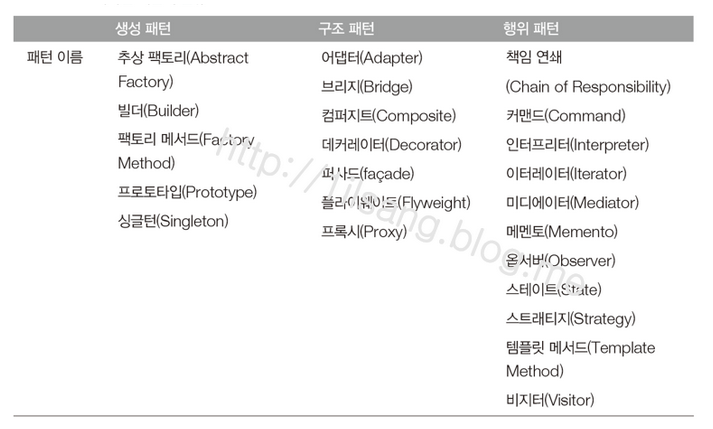
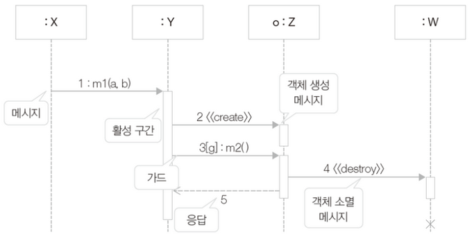
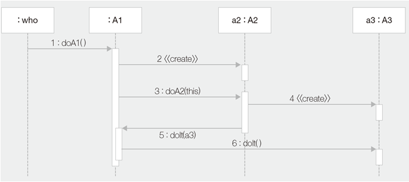
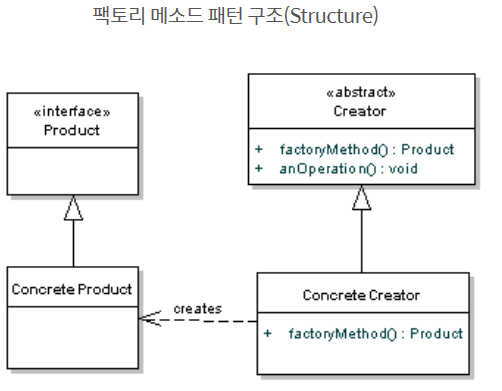
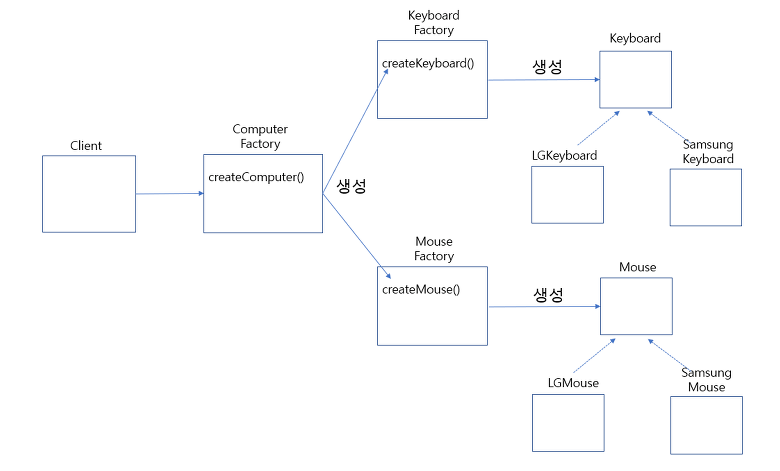
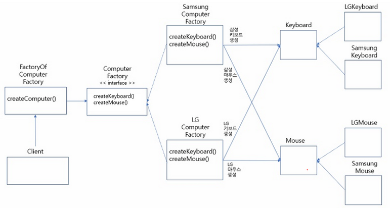
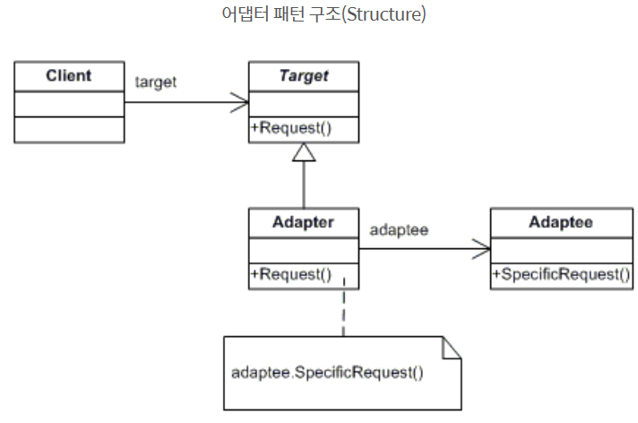

# GoF 디자인 패턴

## 0. 디자인 패턴이란

소프트웨어를 설계할 때 자주 발생하는 문제들의 해결법을 모아놓은 것이 바로 디자인 패턴이다.

디자인 패턴을 사용함으로써 콘텍스트, 문제, 해결이라는 3개의 필수적인 문제들의 해법을 모아놓은 것이다.
 - context : 문제가 발생하는 여러 상황을 기술
 - problem : 패턴이 적용되어 해결될 필요가 있는 디자인 이슈
 - solution : 요소들 사이의 관계, 책임, 협력 등을 기술
```
// context
클래스가 객체 생성 과정을 제어해야 하는 상황

// problem
어플리케이션이 전역적으로 접근하고 관리할 필요가 있는 데이터를 포함한다. 동시에 이러한 데이터는 시스템에 유일하다. 
어떤 방식으로 클래스에서 생성되는 객체의 수를 제어하고 클래스의 인터페이스에 접근하는 것을 제어해야 하는가?

// solution
클래스의 생성자를 public으로 정의하지 말고 private이나 protected로 선언하여 외부에서 생성자를 이용해 객체를 생성할 수 없게 ...
```

> 위의 상황을 디자인 패턴으로 한마디로 정의하자면 바로 '싱글톤 패턴으로 설계하라'가 될 것이다.


1. 생성 패턴 - 객체의 생성에 관련된 패턴

|특징|설명|
|:-:|:-|
|1|생성 패턴은 시스템이 어떤 class를 사용하는지에 대한 정보를 캡슐화 한다.|
|2|생성 패턴은 이들 클래스의 인스턴스들이 어떻게 만들고 어떻게 결합하는지에 대한 부분을 완전히 가려준다.|

- 싱글톤
- 팩토리 메소드
- 추상 팩토리 메소드
- 프로토타입
- 빌더

2. 구조 패턴 - 클래스나 객체를 조합해 더 큰 구조를 만드는 패턴

|특징|설명|
|:-:|:-|
|1|작은 클래스들을 상속과 합성을 이용하여 더 큰 클래스를 생성하는 방법이다.|
|2|이 패턴을 사용하면 서로 독립적으로 개발한 클래스 라이브러리를 마치 하나인 양 사용할 수 있다.|
|3|또한 여러 인터페이스를 합성(composite)하여 서로 다른 인터페이스들의 통일된 추상을 제공한다.|

> 포인트는 인터페이스나 구현을 복합하는 것이 아니라 객체를 합성하는 방법을 제공한다는 것이다. 이는 컴파일 단계에서가 아닌 런타임 단계에서 복합 방법이나 대상을 변경할 수 있다는 점에서 유연성을 가진다.

- 어댑터
- 파사드
- 브릿지

3. 행위 패턴 - 클래스 사이의 알고리즘이나 책임 분배에 관련된 패턴이다.



패턴의 흐름에 사용할 다이아그램은 아래와 같다.


```
1. 이름
[객체 이름 : 클래스 이름]
[가드 : 메서드 이름]

2. 화살표
- 채워진 화살표 : 동기
- 빈 화살표 : 비동기
- 점선 화살표 : 응답 메세지 (생략 가능)

3. 선
- 점선 : 생명선
- 점선 위의 사각형 : 활성 구간

4. 가드
화살표가 활성화되기 위한 성립 조건
```

예시)

위의 순차 다이어그램을 코드화해보면 아래와 같다.
```java
public class who {
  doA1();
}

public class A1 {
  public void doA1(){
    A2 a2 = new A2();
    a2.doA2(this);
  }
  public void doIt(A3 a3){
    a3.doIt();
  }
}

class A2 {
  public void doA2(A1 a1){
    A3 a3 = new A3();
    a1.doIt(a3);
  }
}

class A3 {
  public void doIt(){
    ...
  }
}

...> main에서 who클래스의 doA1() 호출
```

# 1. 생성 패턴

## 1-1. 싱글톤 패턴

코드 내 어디서든 오직 하나의 인스턴스만 사용할 수 있도록 객체를 생성하는 방법을 말한다.

사용 예시 - DB 커넥션, Pool을 담당하는 인스턴스나 시스템 전역의 로깅을 담당하는 로거 등

```java
// 잘 못된 싱글톤 패턴 - 멀티 스레드 환경
class Printer {
    private static Printer printer = null;
    private Printer() {}

    public static Printer getPrinter() {
        if(printer==null){
            printer = new Printer();
        }
        return printer;
    }

    public void print(String string){
        System.out.println(string);
    }
}
```

```java
// 1. Thread-safe한 톤 패턴
class Printer {
    private static Printer printer = new Printer();
    private int cnt = 0;
    private Printer() {}

    public static Printer getPrinter() {
        return printer;
    }

    public void print(String string){
        cnt++;
        System.out.println(string);
    }
}

// 2. Thread-safe한 싱글톤 패턴
class Printer {
    private static Printer printer = null;
    private int cnt = 0;
    private Printer() {}

    public synchronized static Printer getPrinter() {
        if(printer==null){
            printer = new Printer();
        }
        return printer;
    }

    public void print(String string){
        synchronized(this) {
            cnt++;
            System.out.println(string);
        }
    }
}

// 3. 싱글톤 패턴 없이 정적 클래스 만으로 Thread-safe한 코드
class Printer {
    private static int cnt = 0;
    private Printer() {}

    public synchronized static void print(String string){
        cnt++;
        System.out.println(string);
    }
}
```

> 위의 3번 코드는 싱글톤 패턴없이 Thread-safety 하면서 바인딩이 없어 성능상 이점을 가지는 코드도 작성할 수 있지만, 이 방법을 사용하지 않는 이유는 interface 때문이다. Interface는 static 선언이 불가능 하다.

## 1-2. 팩토리 메소드 패턴



팩토리 메소드 패턴은 아래와 같은 장단점을 가지고 있다.
- 생성할 클래스를 미리 알지 못해도 팩토리 클래스가 객체 생성 담당
- 객체의 자료형이 하위 클래스에 의해서 결정된다. -> 확장 용이성
- 동일한 형태로 프로그래밍 가능
- 확장성 있는 전체 프로젝트 구성 가능
- 객체가 늘어날 때 마다 하위 클래스 재정의로 인한 불필요한 많은 클래스 생성 가능성 존재

> 활용법으로 static 팩토리 메소드 패턴이 존재한다. -> 위의 특징에 더해 호출시마다 새로운 객체를 사용할 필요가 없다는 장점이 있다.

### 1-2-1. Shape.java
```java
public interface Shape {
    void draw();
}
```

### 1-2-2. Circle.java
```java
public class Circle implements Shape {
    @Override
    public void draw() {
        System.out.println("Circle - draw() Method.");
    }
}
```

### 1-2-3. Rectangle.java
```java
public class Rectangle implements Shape {
    @Override
    public void draw() {
        System.out.println("Rectangle - draw() Method.");
    }
}
```

### 1-2-4. Square.java
```java
public class Square implements Shape {
    @Override
    public void draw() {
        System.out.println("Square - draw() Method.");
    }
}
```

### 1-2-5. ShapeFactory.java
```java
public class ShapeFactory {
    public Shape createShape(String shapeName) throws NullPointerException {
        this.shapeName = shapeName;
        if (shapeName != null){
            if (shapeName.equalsIgnoreCase("CIRCLE"))
                return new Circle();
            else if (shapeName.equalsIgnoreCase("RECTANGLE"))
                return new Rectangle();
            else if (shapeName.equalsIgnoreCase("SQUARE"))
                return new Square();
            else
                throw new NullPointerException("This Class is not implementation. " + shapeName);
        } else
            return null;
    }
}
```

### 1-2-6. FactoryPatternTest.class
```java
public class FactoryPatternTest {
    public static void main(String[] args) {
        ShapeFactory factory = new ShapeFactory();
        try {
            Shape shape = factory.createShape("CIRCLE");
            shape.draw();

            shape = factory.createShape("RECTANGLE");
            shape.draw();

            shape = factory.createShape("SQUARE");
            shape.draw();

            shape = factory.createShape("HALF-CIRCLE");
            shape.draw();
        } catch (NullPointerException e) {
            System.out.println(e);
        }
    }
}
```

## 1-3. 프로토타입 패턴

활용예시) DB로 부터 어떤 데이터를 가져온 뒤, 다수의 수정 또는 값을 활용해야할 경우 그 때마다 DB에서 조회해서 쓰는 것이 아니라 캐시의 데이터로부터 CLONE() 하여서 사용하는 것이 성능상 이점을 가져갈 수 있다.

- 클래스가 런타임에 인스턴스화 되는 경우
- 객체 생성 비용이 비싸거나 복잡한 경우
- 응용 프로그램의 클래스 수를 최소로 유지하려는 경우

### 1-3-1. EmployeeRecord.java
```java
public class EmployeeRecord implements Cloneable{
    private static final Gson gson = new Gson();
    private int id;
    private String name;
    private String designation;
    private double salary;
    private String address;

    public EmployeeRecord() {}

    @Builder
    public EmployeeRecord(int id, String name, String designation, double salary, String address) {
        this.id = id;
        this.name = name;
        this.designation = designation;
        this.salary = salary;
        this.address = address;
    }

    public void print() {
        System.out.println(gson.toJson(this));
    }

    @Override
    protected Object clone() throws CloneNotSupportedException {
        return this;
```

### 1-3-2. main.java
```java
public class main {
    public static void main(String[] args) throws CloneNotSupportedException {
        int eid = 100301;
        String ename = "홍길동";
        String edesignation = "직함";
        double esalary = 200000;
        String eaddress = "서울시 서초구";

        EmployeeRecord employeeRecord1 = EmployeeRecord
                .builder()
                .id(eid)
                .name(ename)
                .designation(edesignation)
                .salary(esalary)
                .address(eaddress)
                .build();
        employeeRecord1.print();
        System.out.println("================");

        EmployeeRecord employeeRecord2 = (EmployeeRecord) employeeRecord1.clone();
        employeeRecord2.print();

        boolean equals = employeeRecord2.equals(employeeRecord1);
        System.out.println("equals : "+equals);
    }
}
```
## 1-4. 빌더 패턴

> 인자가 설정된 빌더는 훌륭한 추상적 팩토리다.

> 복잡한 객체의 구성을 표현에서 분리하여 동일한 구성 프로세스가 다른 표현을 만들 수 있도록 한다. 즉 객체의 생성과 표현을 분리하라.


### 1-4-1. Shape.java
```java
public interface Shape {
    void draw();
}
```

### 1-4-2. Circle.java
```java
public class Circle implements Shape {
    @Override
    public void draw() {
        System.out.println("Circle draw() Method");
    }
}
```

### 1-4-3. CircleWithSize.java
```java
public class CircleWithSize implements Shape {
    private int size;

    public CircleWithSize(int size) {
        this.size = size;
    }

    @Override
    public void draw() {
        System.out.println("CircleWithSize draw() Method with size: " + this.size);
    }
}
```

### 1-4-4. CircleWithSizeAndTransparency.java
```java
public class CircleWithSizeAndTransparency implements Shape {
    private int size;
    private boolean transparency;

    public CircleWithSizeAndTransparency(int size, boolean transparency) {
        this.size = size;
        this.transparency = transparency;
    }

    @Override
    public void draw() {
        System.out.println("CircleWithSizeAndTransparency draw() Method with size: "+ this.size +" transparency: "+this.transparency);
    }
}
```

### 1-4-5. ShapeFactory.java
```java
public class ShapeFactory {
    // required parameters
    private String name;
    // optional parameters
    private int size;
    private boolean isTransparency;

    private ShapeFactory(ShapeFactoryBuilder builder) {
        this.name = builder.name;
        this.size = builder.size;
        this.isTransparency = builder.isTransparency;
    }
    
    public static class ShapeFactoryBuilder {
        // required parameters
        private String name;
        // optional parameters
        private int size;
        private boolean isTransparency;

        public ShapeFactoryBuilder(String name) {
            this.name = name;
        }

        public ShapeFactoryBuilder setSize(int size) {
            this.size = size;
            return this;
        }

        public ShapeFactoryBuilder setIsTransparency(boolean isTransparency){
            this.isTransparency = isTransparency;
            return this;
        }

        public ShapeFactory build(){
            return new ShapeFactory(this);
        }
    }

    public Shape createShape() throws NullPointerException {
        if (size!=0){
            if (isTransparency)
                return new CircleWithSizeAndTransparency(size, true);
            return new CircleWithSize(size);
        } else
            return new Circle();
    }
}
```

### 1-4-6. Main.java
```java
public class Main {
    public static void main(String[] args) {
        ShapeFactory factory = new ShapeFactory.ShapeFactoryBuilder("Small Shape")
                .setSize(10)
                .setIsTransparency(true)
                .build();
        try {
            Shape shape = factory.createShape();
            shape.draw();
        } catch (NullPointerException e) {
            System.out.println(e);
        }
    }
}
```

## 1-5. 추상 팩토리 메소드 패턴

팩토리 메소드 패턴 - 조건에 따른 객체 생성을 팩토리 클래스로 위임하여 팩토리 클래스에서 객체를 생성하는 패턴


추상 팩토리 메소드 패턴 - 서로 관련이 있는 객체들을 통으로 묶어서 팩토리 클래스를 만들고, 이들 팩토리를 조건에 따라 생성하도록 다시 팩토리를 만들어서 객체를 생성하는 패턴


### 1-5-1. Computer.java
```java
public interface Computer {
    Keyboard createKeyboard();
    Mouse createMouse();
}
```

### 1-5-2. ComputerFactory.java
```java
public class ComputerFactory {
    Computer computer = null;

    public void createComputer(Brand brand) {
        switch (brand){
            case SAMSUNG:
                computer = new SamsungComputerFactory();
                break;
            case LG:
                computer = new LGComputerFactory();
                break;
            default:
                System.out.println(brand + " is not definition.");
        }
        computer.createKeyboard().create();
        computer.createMouse().create();
    }
}
```

### 1-5-3. SamsungComputerFactory.java
```java
public class SamsungComputerFactory implements Computer{
    @Override
    public SamsungKeyboard createKeyboard() {
        return new SamsungKeyboard();
    }

    @Override
    public SamsungMouse createMouse() {
        return new SamsungMouse();
    }
}

```

### 1-5-4. LGComputerFactory.java
```java
public class LGComputerFactory implements Computer{
    @Override
    public LGKeyboard createKeyboard() {
        return new LGKeyboard();
    }

    @Override
    public LGMouse createMouse() {
        return new LGMouse();
    }
}
```

### 1-5-5. Keyboard.java
```java
public interface Keyboard {
    void create();
}
```

### 1-5-6. SamsungKeyboard.java
```java
public class SamsungKeyboard implements Keyboard{
    @Override
    public void create() {
        System.out.println("Samsung 제품의 키보드를 생산하였습니다.");
    }
}
```

### 1-5-7. LGKeyboard.java
```java
public class LGKeyboard implements Keyboard{
    @Override
    public void create() {
        System.out.println("LG 제품의 키보드를 생산하였습니다.");
    }
}
```

### 1-5-8. Mouse.java
```java
public interface Mouse {
    void create();
}
```

### 1-5-9. SamsungMouse.java
```java
public class SamsungMouse implements Mouse{
    @Override
    public void create() {
        System.out.println("Samsung 제품의 마우스를 생산하였습니다.");
    }
}
```

### 1-5-10. LGMouse.java
```java
public class LGMouse implements Mouse{
    @Override
    public void create() {
        System.out.println("LG 제품의 마우스를 생산하였습니다.");
    }
}
```

### 1-5-11. Brand.java
```java
public enum Brand {
    SAMSUNG(1000000),
    LG(700000);

    int price;

    Brand(int price) {
        this.price = price;
    }
}
```

### 1-5-12. Main.java
```java
public class Main {

    public static void main(String[] args) {
        ComputerFactory computerFactory = new ComputerFactory();
        computerFactory.createComputer(Brand.SAMSUNG);
    }
}
```

# 2. 구조 패턴

## 2-1. 어댑터 패턴

한 클래스의 인터페이스를 사용하고자 하는 다른 인터페이스로 변환할 때 주로 사용하며, 인터페이스 호환성이 맞지 않는 클래스와도 연관 관계로 연결하여 사용할 수 있게 해주는 패턴이다.

어댑터 패턴은 아래와 같은 특징을 가지고 있다.
- 관계가 없는 인터페이스간 같이 사용 가능?(인터페이스 분리의 원칙에 어긋나는것 아닌가)
- 프로그램 검사 용이
- 클래스 재사용성 증가

### 2-1-1. MediaPlayer.java
```java
public interface MediaPlayer {
    void play(String fileName);
}
```

### 2-1-2. MediaPackage.java
```java
public interface MediaPackage {
    void playFile(String fileName);
}
```

### 2-1-3. MP3.java
```java
public class MP3 implements MediaPlayer{
    @Override
    public void play(String fileName) {
        System.out.println("Playing MP3 File "+fileName);
    }
}
```

### 2-1-4. MP4.java
```java
public class MP4 implements MediaPlayer{
    @Override
    public void play(String fileName) {
        System.out.println("Playing MP4 File "+fileName);
    }
}
```

### 2-1-5. MKV.java
```java
public class MKV implements MediaPackage{
    @Override
    public void playFile(String fileName) {
        System.out.println("Playing MKV File "+fileName);
    }
}
```

### 2-1-6. FormatAdapter.java
```java
/**
 * 다른 인터페이스의 구현 클래스를 주입 받아서 변환하려는 인터페이스의 기능에 집어 넣어서 사용하는 것이 이 패턴의 핵심이다.
 **/
public class FormatAdapter implements MediaPlayer{
    private MediaPackage mediaPackage;

    public FormatAdapter(MediaPackage m){
        this.mediaPackage = m;
    }

    @Override
    public void play(String fileName) {
        System.out.println("Using Adapter --> ");
        mediaPackage.playFile(fileName);
    }
}
```

### 2-1-7. Main.java
```java
public class Main {
    public static void main(String[] args) {
        MediaPlayer mediaPlayer = new MP3();
        mediaPlayer.play("file.mp3");

        mediaPlayer = new MP4();
        mediaPlayer.play("file.mp4");

        mediaPlayer = new FormatAdapter(new MKV());
        mediaPlayer.play("file.mkv");
    }
}
```

## 2-2. 퍼사드 패턴

퍼사드 패턴은 어떤 서브 시스템의 일련의 인터페이스에 대한 통합된 인터페이스를 제공한다. 퍼사드에서 고수준 인터페이스를 정의하기 때문에 서브 시스템을 더 쉽게 사용할 수 있다.

예시) 전자레인지
우리는 전자레인지의 버튼만 클릭하면 음식을 데울 수 있다. 
여기서 전자레인지가 동작하는 원리나 일련의 과정들을 이해할 필요가 전혀 없다는 것이다.
이는 제조사들이 단순한 버튼으로 전자레인지를 동작 시킬 수 있도록 편리한 인터페이스를 제공하기 때문이다.


### 2-2-1. Switch.java
```java
```

### 2-2-2. Cooler.java
```java
public class Cooler implements Switch{

    @Override
    public void on() {
        System.out.println("쿨러 작동 시작...");
    }

    @Override
    public void off() {
        System.out.println("쿨러 작동 중지...");
    }
}
```

### 2-2-3. Magnetron.java
```java
public class Magnetron implements Switch{
    @Override
    public void on() {
        System.out.println("마이크로파 발생기 켜짐...");
    }

    @Override
    public void off() {
        System.out.println("마이크로파 발생기 꺼짐...");
    }
}
```

### 2-2-4. TimerChecker.java
```java
public class TimerChecker implements Switch{
    private static long TIME_INTERVAL = 1000;
    private final int EXPIRED_TIME;
    private Timer timer;
    private TimerTask timerTask;
    int count = 0;
    MicrowaveFacade microwaveFacade;

    public TimerChecker(int millsec, MicrowaveFacade microwaveFacade) {
        super();
        this.EXPIRED_TIME = millsec;
        this.count = EXPIRED_TIME/1000;
        timer = new Timer();
        this.microwaveFacade = microwaveFacade;
        timerTask = new TimerTask() {
            @Override
            public void run() {
                if (count> 0){
                    System.out.println("Timer.. "+(count--) + " 초");
                } else {
                    System.out.println("조리가 완료되었습니다.");
                    timer.cancel();
                    microwaveFacade.off();
                }
            }
        };
    }

    @Override
    public void on() {
        timer.schedule(timerTask, 0, TIME_INTERVAL);
    }

    @Override
    public void off() {
        timer.cancel();
    }
}
```

### 2-2-5. TurnTable.java
```java
public class TurnTable implements Switch{
    @Override
    public void on() {
        System.out.println("TurnTable 기동...");
    }

    @Override
    public void off() {
        System.out.println("TurnTable 중지...");
    }
}

```

### 2-2-6. Mode.java
```java
public enum  Mode {
    FAST(5000,"FAST_MODE"),
    SLOW(10000, "SLOW_MODE");

    int value;
    String name;

    Mode(int value, String name) {
        this.value = value;
        this.name = name;
    }

    public int getValue() {
        return value;
    }

    public String getName() {
        return name;
    }
}
```

### 2-2-7. MicrowaveFacade.java
```java
public class MicrowaveFacade {
    private final Cooler cooler;
    private final Magnetron magnetron;
    private final TimerChecker timerChecker;
    private final TurnTable turnTable;
    Switch[] switches;
    boolean isActive = false;

    public MicrowaveFacade(Mode mode) {
        super();
        cooler = new Cooler();
        magnetron = new Magnetron();
        timerChecker = new TimerChecker(mode.getValue(), this);
        turnTable = new TurnTable();
        switches = new Switch[] {cooler, magnetron, timerChecker, turnTable};
    }

    public void on(){
        for (int i = 0; i < switches.length; i++) {
            switches[i].on();
        }
        isActive = true;
    }

    public void off(){
        for (int i = 0; i < switches.length; i++) {
            switches[i].off();
        }
        isActive = false;
    }
}
```

### 2-2-8. Main.java
```java
public class Main {
    public static void main(String[] args) {
        MicrowaveFacade microwaveFacade = new MicrowaveFacade(Mode.FAST);
        microwaveFacade.on();
    }
}
```

## 2-3. 브릿지 패턴

브릿지 패턴은 Flyweight, Adapter, Decorator 패턴처럼 구조 패턴 중 하나로 두 인터페이스에 계층 구조를 가지고 있을 때, 인터페이스를 구현으로부터 분리하고 클라이언트 프로그램으로 부터 구현 세부 사항을 숨기기 위해 사용되는 패턴이다.

> 어댑터 패턴이 서로 다른 인터페이스를 연결해주는 것이라면 브릿지는 기능(추상) 계층과 구현 계층을 연결해주는 것이다.

|특징|설명|
|:-:|:-|
|1|인터페이스와 구현을 분리할 수 있다.|
|2|확장성을 향상 시킨다.|
|3|클라이언트로부터 구현 정보를 숨길 수 있다.|
|사용처|확장에 용이하고 구현에서 변경 사항이 클라이언트에 영향을 미치지 않는 곳에서 주로 사용한다.|

### 2-3-1. Shape.java
```java
public abstract class Shape {
    protected Color color;

    public Shape(Color color) {
        this.color = color;
    }

    public void draw() {
        System.out.println("그리기 시작");
    }

    abstract public void applyColor();
}
```
### 2-3-2. Color.java
```java
public interface Color {
    void applyColor();
}
```
### 2-3-3. Pentagon.java
```java
public class Pentagon extends Shape{
    public Pentagon(Color color) {
        super(color);
    }

    @Override
    public void applyColor() {
        System.out.println("pentagon filled with color");
        color.applyColor();
        draw();
    }
}

```
### 2-3-4. Triangle.java
```java
public class Triangle extends Shape{
    public Triangle(Color color) {
        super(color);
    }

    @Override
    public void applyColor() {
        System.out.println("triangle filled with color");
        color.applyColor();
        draw();
    }
}
```
### 2-3-5. RedColor.java
```java
public class RedColor implements Color{
    @Override
    public void applyColor() {
        System.out.println("red");
    }
}
```
### 2-3-6. GreenColor.java
```java
public class GreenColor implements Color{
    @Override
    public void applyColor() {
        System.out.println("green");
    }
}
```
### 2-3-7. Main.java
```java
/**
 * Adapter 패턴이 서로 다른 인터페이스를 연결해주는 거라면
 * Bridge 패턴은 구현 계층과 기능(추상)계층을 연결해주는 것이다.
 **/
public class Main {
    public static void main(String[] args) {
        Shape triangle = new Triangle(new RedColor());
        triangle.applyColor();

        Shape pentagon = new Pentagon(new GreenColor());
        pentagon.applyColor();
    }
}
```

## 2-4. 컴포지트 패턴


|특징|설명|
|:--:|:--|
|1|클라이언트가 단일 객체나 복합 객체를 동일하게 취급하는 것을 목적으로 한다.|
|2|컴포지트의 의도는 트리 구조로 작성하여 전체-부분 관계를 표현하는 것이다.|
|when|복합 객체와 단일 객체의 처리 방법이 다르지 않을 경우, 대표적으로는 Directory-File 경우|

### 2-4-1. ComputerDevice.java (Component)
```java
public interface ComputerDevice {
    int getPrice();
    int getPower();
}
```
### 2-4-2. ComputerComposite.java (Composite)
```java
public class ComputerComposite implements ComputerDevice{
    private List<ComputerDevice> components = Lists.newArrayList();

    public void addComponent(ComputerDevice device) {
        components.add(device);
    }

    public void removeComponent(ComputerDevice device){
        components.remove(device);
    }

    @Override
    public int getPrice() {
        int price = 0;
        for(ComputerDevice component : components) {
            price += component.getPrice();
        }
        return price;
    }

    @Override
    public int getPower() {
        int power = 0;
        for(ComputerDevice component : components) {
            power += component.getPower();
        }
        return power;
    }
}
```
### 2-4-3. Monitor.java (leaf)
```java
public class Monitor implements ComputerDevice{
    private int price;
    private int power;

    @Builder
    public Monitor(int price, int power) {
        this.price = price;
        this.power = power;
    }

    @Override
    public int getPrice() {
        return price;
    }

    @Override
    public int getPower() {
        return power;
    }
}
```
### 2-4-4. Body.java (leaf)
```java
public class Body implements ComputerDevice{
    private int price;
    private int power;

    @Builder
    public Body(int price, int power) {
        this.price = price;
        this.power = power;
    }

    @Override
    public int getPrice() {
        return price;
    }

    @Override
    public int getPower() {
        return power;
    }
}
```
### 2-4-5. Keyboard.java (leaf)
```java
public class Keyboard implements ComputerDevice{
    private int price;
    private int power;

    @Builder
    public Keyboard(int price, int power) {
        this.price = price;
        this.power = power;
    }

    @Override
    public int getPrice() {
        return price;
    }

    @Override
    public int getPower() {
        return power;
    }
}

```
### 2-4-6. Main.java
```java
public class Main {
    public static void main(String[] args) {
        Keyboard keyboard = Keyboard.builder().price(5).power(2).build();
        Body body = Body.builder().price(100).power(70).build();
        Monitor monitor = Monitor.builder().price(20).power(30).build();

        ComputerComposite computerComposite = new ComputerComposite();
        computerComposite.addComponent(keyboard); //leaf (부분) 가 들어갈 수도 있고
        computerComposite.addComponent(body);
        computerComposite.addComponent(monitor);

        ComputerComposite computerComposite1 = new ComputerComposite();
        computerComposite1.addComponent(computerComposite); //composite (전체) 자체가 들어갈 수도 있다.

        int computerPrice = computerComposite.getPrice();
        int computerPower = computerComposite.getPower();
        System.out.println("컴퓨터 가격 : "+computerPrice);
        System.out.println("컴퓨터 전력 : "+computerPower);

        int computer1Price = computerComposite1.getPrice();
        int computer1Power = computerComposite1.getPower();
        System.out.println("컴퓨터1 가격 : "+computer1Price);
        System.out.println("컴퓨터1 전력 : "+computer1Power);
    }
}
```

## 2-5. 데코레이터 패턴

자바의 stream 관련 클래스들이 데코레이터 패턴의 대표적인 예라고 할 수 있다.

|특징|설명|
|:-:|:-|
|1|객체에 추가적인 요건을 동적으로 첨가한다.|
|2|서브클래스를 만드는 것을 통해서 기능을 유연하게 확장할 수 있는 방법을 제공한다.|

|고려할 점|설명|
|:-:|:-|
|1|가급적 인터페이스만을 정의하자. 최대한 가볍게|
|2|저장할 것이 있다면 서브 클래스에서 하자. 되도록 값을 가지는 변수는 정의하지 않는다.|
|3|상속 구조를 통해 Decorator와 Component는 같은 인터페이스를 갖도록 한다. (투과적 인터페이스: Decorator로 계속 감싸도 Component의 메소드는 계속 사용할 수 있도록|
|4|구현하려는 내용이 객체의 겉을 변경하는 것인지 속을 변경하는 것인지 고민하고 겉을 변경할 때 사용하자.|

## 2-5-1. Beverage.java (Component)
```java
public abstract class Beverage {
    public String description = "EMPTY";

    public String getDescription() {
        return this.description;
    }

    public abstract int cost();
}
```

## 2-5-2. Espresso.java
```java
public class Espresso extends Beverage{
    public Espresso() {
        this.description = "에스프레소";
    }

    @Override
    public int cost() {
        return 4000;
    }
}
```

## 2-5-3. HouseBlend.java
```java
public class HouseBlend extends Beverage{
    public HouseBlend() {
        this.description = "하우스블렌드";
    }

    @Override
    public int cost() {
        return 5000;
    }
}
```

## 2-5-4. CondimentDecorator.java (Decorator)
```java
public abstract class CondimentDecorator extends Beverage{
    public abstract String getDescription();
}
```

## 2-5-5. Mocha.java
```java
public class Mocha extends CondimentDecorator{
    private Beverage beverage;

    public Mocha(Beverage beverage) {
        this.beverage = beverage;
    }

    @Override
    public String getDescription() {
        return beverage.getDescription() + ",모카 추가";
    }

    @Override
    public int cost() {
        return 500 + beverage.cost();
    }
}
```

## 2-5-6. Whipping.java
```java
public class Whipping extends CondimentDecorator{
    private Beverage beverage;

    public Whipping(Beverage beverage) {
        this.beverage = beverage;
    }

    @Override
    public String getDescription() {
        return beverage.getDescription() + ", 휘핑 추가";
    }

    @Override
    public int cost() {
        return 500 + beverage.cost();
    }
}
```

## 2-5-7. Main.java
```java
public class Main {
    public static void main(String[] args) {
        Beverage beverage = new HouseBlend();
        System.out.println(beverage.getDescription() + " cost: "+beverage.cost());

        Beverage beverageWithWhipping = new Whipping(beverage);
        System.out.println(beverageWithWhipping.getDescription() + " cost: "+beverageWithWhipping.cost());

        Beverage beverageWithMochaAndWhipping = new Mocha(beverageWithWhipping);
        System.out.println(beverageWithMochaAndWhipping.getDescription()+
                " cost: "+beverageWithMochaAndWhipping.cost());
    }
}
```

## 2-6. 플라이웨이드 패턴

공유를 통하여 대량의 객체들을 효과적으로 지원하는 패턴

|특징|설명|
|:-:|:-|
|1|어플리케이션에 의해 생성되는 객체 수가 많아야 한다. (많다의 기준은?)|
|2|생성된 객체가 오래도록 메모리에 상주하며, 사용되는 횟수가 많다.|
|3|객체의 특성을 내적 속성과 외적 속성으로 나눴을 때, 객체의 외적 특성이 클라이언트 프로그램으로부터 정의 되어야 한다.|

객체의 내적 속성이란? 객체를 유니크하게 관리하는 것을 의미하고
객체의 외적 속성이란? 클라이언트로 부터 설정되어 다른 동작을 수행하도록 사용되는 특성이다.


### 2-6-1. Shape.java
```java
public interface Shape {
    void draw();
}
```

### 2-6-2. Circle.java
```java
public class Circle implements Shape{
    private String color;
    private int x;
    private int y;
    private int radius;

    @Builder
    public Circle(String color, int x, int y, int radius) {
        this.color = color;
        this.x = x;
        this.y = y;
        this.radius = radius;
    }

    @Override
    public void draw() {
        System.out.println(this.toString());
    }

    @Override
    public String toString() {
        return "Circle{" +
                "color='" + color + '\'' +
                ", x=" + x +
                ", y=" + y +
                ", radius=" + radius +
                '}';
    }
}
```

### 2-6-3. Line.java
```java
public class Line implements Shape {
    private String color;
    private int x;
    private int y;
    private int length;

    @Builder
    public Line(String color, int x, int y, int length) {
        this.color = color;
        this.x = x;
        this.y = y;
        this.length = length;
    }

    @Override
    public void draw() {
        System.out.println(this.toString());
    }

    @Override
    public String toString() {
        return "Line{" +
                "color='" + color + '\'' +
                ", x=" + x +
                ", y=" + y +
                ", length=" + length +
                '}';
    }
}
```

### 2-6-4. ShapeType.java
```java
public enum ShapeType {
    LINE(1000000),
    CIRCLE(700000);

    int price;

    ShapeType(int price) {
        this.price = price;
    }
}
```

### 2-6-5. ShapeFactory.java
```java
public class ShapeFactory {
    private static final HashMap<ShapeType,Shape> shapeMap = new HashMap<>();

    public Shape getShape(ShapeType shapeType){
        Shape shape = shapeMap.get(shapeType);
        if (shape==null){
            switch (shapeType){
                case LINE:
                    shape = Line.builder().x(1).y(1).color("blue").length(10).build();
                    break;
                case CIRCLE:
                    shape = Circle.builder().x(1).y(1).color("red").radius(10).build();
                    break;
            }
            System.out.println("=====새로운 객체 생성=====");
            shapeMap.put(shapeType, shape);
        }
        return shape;
    }
}
```

### 2-6-6. Main.java
```java
public class Main {
    public static void main(String[] args) {
        ShapeFactory factory = new ShapeFactory();
        for (int i = 0; i < 10; i++) {
            Shape shape = factory.getShape(ShapeType.CIRCLE);
            shape.draw();
        }
    }
}

```

## 2-7. 프록시 패턴

# 3. 행위 패턴

## 3-1. 스트래티지 패턴

## 3-2. 템플릿 메서드 패턴

## 3-3. 옵저버 패턴