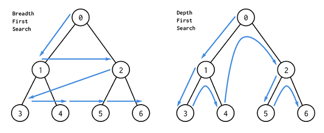

# 소수 찾기

## 언제 쓰나?

특정 수가 소수인지 아닌지를 판별해야 할 때

## 어떻게 쓰나?

```java
public static boolean isPrime(int num) {
    if(num <= 1) return false;

    for(int i=2; i<=Math.sqrt(num); i++) {
        if(num % i == 0) return false;
    }
    return true;
}
```

# 순열 조합(완전탐색)

## 언제 쓰나?

주어진 N 개의 배열안에서 R 개를 선택하여 숫자를 구성해야할 때 가능한 모든 경우의 수를 구할 때

## 어떻게 쓰나?

- 재귀 알고리즘의 형태

```java
/**
    * arr - 원본 순열 구할 배열
    * output - depth 별 순열 결과값
    * visited - 조합 사용 여부
    * depth - 순열 조합을 구하려는 깊이
    * n - 길이
    * r - 순열 크기
    **/
static void perm(int[] arr, int[] output, boolean[] visited, int depth, int n, int r) {
    // 출력 시점
    if (depth == r) {
        StringBuilder s = new StringBuilder();
        for (int i = 0; i < r; i++) {
            s.append(output[i]);
        }
        set.add(Integer.parseInt(s.toString()));
        return;
    }

    // 방문 여부 파악해서 재귀돌리기
    for (int i = 0; i < n; i++) {
        if (!visited[i]) {
            visited[i] = true;
            output[depth] = arr[i];
            perm(arr, output, visited, depth + 1, n, r);
            visited[i] = false;
        }
    }
}
```

# DFS, Depth-Fitst Search (그래프 탐색 - 깊이 우선 탐색)

## 언제 쓰나?

- Stack 순환 호출 또는 재귀로 구현 가능
- 목표 노드 또는 하위 노드가 없는 노드를 찾을 때까지 더 깊고 깊게 진행
- 엔드 포인트에서 아직 완전히 탐색되지 않은 최신 노드로 역 추적

## 어떻게 쓰나?

- 재귀 알고리즘의 형태

## 1. 스택 이용

```java
public static int[][] map;
public static int edge;
public static int vertices;
public static int V;
public static boolean[] visited;

public static void dfs(int start) {

    System.out.print(start + " "); // 출력문
    visited[start] = true; // 시작점 방문

    for (int i = 1; i < map.length; i++) {
        if (map[start][i] == 1 && !visited[i]) { // 표시와 방문여부
            visited[i] = true; // 방문 표시
            dfs(i); // 재귀호출
        }
    }

}

```

## 2. 재귀 이용

```java

```

# BFS, Breadth-First Search (그래프 탐색 - 넓이 우선 탐색)

## 언제 쓰나?

- Queue 인접점 우선 또는 재귀로 구현 가능
- 모든 인접 노드를 탐색하는 그래프 순회 알고리즘
- 가장 가까운 노드를 선택하고 탐색되지 않은 모든 노드를 탐색
- 모든 노드의 모든 이웃을 탐색하고 각 노드가 정확히 한번 방문되고 두번 방문되지 않음

## 어떻게 쓰나?

- 재귀 알고리즘의 형태

## 1. 큐 이용

```java
public static int[][] map;
public static int edge;
public static int vertices;
public static int V;
public static boolean[] visited;

public static void bfs(int start) {

    Queue<Integer> queue = new LinkedList<>();
    visited[start] = true; // 시작점 방문
    queue.offer(start); // 시작점 offer

    while (!queue.isEmpty()) { // queue가 빌때까지
        int x = queue.poll();
        System.out.print(x + " ");

        for (int i = 1; i < map.length; i++) {
            if (map[x][i] == 1 && !visited[i]) { // 표시와 방문여부
                visited[i] = true; // 방문 표시
                queue.offer(i); // queue에 offer
            }
        }
    }
}
```

## 2. 재귀 이용

```java

```


