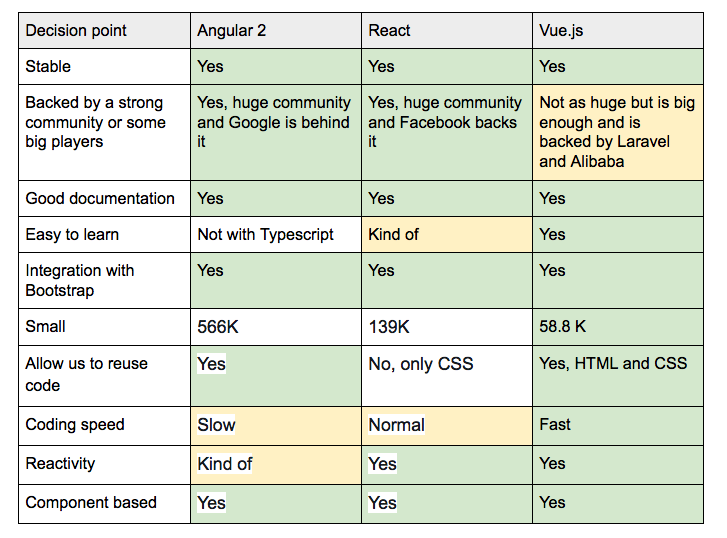

Spring은 Java 백엔드 프레임워크이다.

Node.js는 JavaScript 백엔드 프레임워크이다.

Angular는 프론트엔드 프레임워크이다.

프론트엔드 프레임워크에는 Angular, vue.js, React 가 대표적이다

배우는 순서 vue.js를 시작으로하자

Java (안정성)
Angular + Spring

JavaScript (개발 속도? 객체 관리?)
Angular + Node.js
