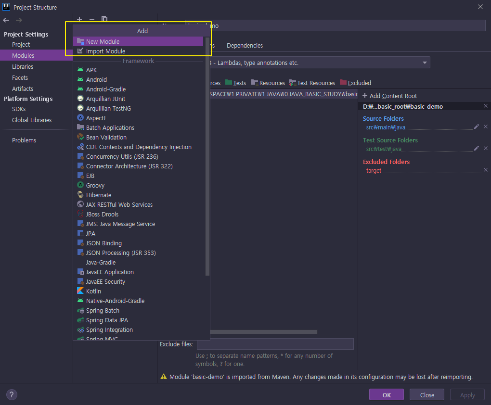
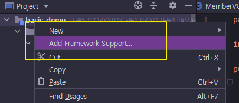

# Intellij Maven Multi Project 구성

## 1. Empty Project 생성

> Intellij Idea > New Project > Empty Project

## 2. Project Settings

> Project Settings(cmd + ;) > Project

#### 2-1. Project SDK

> 1.8 설정

#### 2-2. Project Language

> 8 - Lambdas 설정

## 3. Module 생성

Intellij 에서 모듈이 하나의 프로젝트라고 생각하면 된다.

#### 3-1. Module Add

원하는 프레임워크의 모듈을 생성하면 된다.

> Project Settings(cmd + ;) > Modules



#### 3-2. Module Settings

> Module > Sources > Language level > 8 - Lambdas 설정

> Module > Dependencies > Module SDK > 1.8 설정

## 4. Project 프레임워크 추가

Maven or JPA 등 다양한 프레임워크를 추가 구성하자.



## 5. pom.xml 구성

배포 파일 설정, 디펜던시 버전 관리 등 구성하자.

```xml
<properties>
		<java.v>1.8</java.v>
		<lombok.v>1.18.10</lombok.v>
		<spring.v>2.3.4.RELEASE</spring.v>
		<security.v>2.3.8.RELEASE</security.v>
		<guava.v>29.0-jre</guava.v>
		<gson.v>2.8.5</gson.v>
		<postgres.v>42.2.14</postgres.v>
		<project.build.sourceEncoding>UTF-8</project.build.sourceEncoding>
		<maven.compiler.source>1.8</maven.compiler.source>
		<maven.compiler.target>1.8</maven.compiler.target>
		<maven.test.skip>true</maven.test.skip>
	</properties>


<dependencies>
		<dependency>
			<groupId>org.springframework.boot</groupId>
			<artifactId>spring-boot-starter</artifactId>
			<exclusions>
				<exclusion>
					<groupId>org.springframework.boot</groupId>
					<artifactId>spring-boot-starter-logging</artifactId>
				</exclusion>
			</exclusions>
		</dependency>

		<dependency>
			<groupId>org.springframework.boot</groupId>
			<artifactId>spring-boot-starter-test</artifactId>
			<scope>test</scope>
			<exclusions>
				<exclusion>
					<groupId>org.junit.vintage</groupId>
					<artifactId>junit-vintage-engine</artifactId>
				</exclusion>
			</exclusions>
		</dependency>

		<!-- https://mvnrepository.com/artifact/org.springframework.boot/spring-boot-starter-log4j2 -->
		<dependency>
			<groupId>org.springframework.boot</groupId>
			<artifactId>spring-boot-starter-log4j2</artifactId>
			<version>${spring.v}</version>
		</dependency>

		<!-- https://mvnrepository.com/artifact/org.springframework.boot/spring-boot-starter-web -->
		<dependency>
			<groupId>org.springframework.boot</groupId>
			<artifactId>spring-boot-starter-web</artifactId>
			<version>${spring.v}</version>
		</dependency>

		<!-- https://mvnrepository.com/artifact/org.mybatis.spring.boot/mybatis-spring-boot-starter -->
		<dependency>
			<groupId>org.mybatis.spring.boot</groupId>
			<artifactId>mybatis-spring-boot-starter</artifactId>
			<version>2.1.4</version>
		</dependency>

		<!-- https://mvnrepository.com/artifact/org.projectlombok/lombok -->
		<dependency>
			<groupId>org.projectlombok</groupId>
			<artifactId>lombok</artifactId>
			<version>${lombok.v}</version>
			<scope>provided</scope>
		</dependency>

		<!-- https://mvnrepository.com/artifact/com.google.guava/guava -->
		<dependency>
			<groupId>com.google.guava</groupId>
			<artifactId>guava</artifactId>
			<version>${guava.v}</version>
		</dependency>

		<!-- https://mvnrepository.com/artifact/com.google.code.gson/gson -->
		<dependency>
			<groupId>com.google.code.gson</groupId>
			<artifactId>gson</artifactId>
			<version>${gson.v}</version>
		</dependency>

		<!-- https://mvnrepository.com/artifact/org.json/json -->
		<dependency>
			<groupId>org.json</groupId>
			<artifactId>json</artifactId>
			<version>20200518</version>
		</dependency>

		<dependency>
			<groupId>org.postgresql</groupId>
			<artifactId>postgresql</artifactId>
			<version>${postgres.v}</version>
		</dependency>
	</dependencies>

<build>
		<!--        Intellij 는 default로 /src/main/java를 Sources Root 경로로 사용한다.-->
		<!--        <sourceDirectory>/src/main/java</sourceDirectory>-->
		<resources>
			<resource>
				<directory>src/main/resources</directory>
				<!--<excludes>
                    <exclude>*.xml</exclude>
                </excludes>-->
			</resource>
		</resources>

		<plugins>
			<plugin>
				<groupId>org.apache.maven.plugins</groupId>
				<artifactId>maven-compiler-plugin</artifactId>
				<version>3.8.0</version>
				<configuration>
					<encoding>UTF-8</encoding>
					<compilerArgument>-nowarn</compilerArgument>
					<compilerArgument>-verbose</compilerArgument>
					<compilerArgument>-parameters</compilerArgument>
					<testCompilerArgument>-parameters</testCompilerArgument>
					<source>${java.v}</source>
					<target>${java.v}</target>
				</configuration>
			</plugin>
			<plugin>
				<groupId>org.apache.maven.plugins</groupId>
				<artifactId>maven-dependency-plugin</artifactId>
				<executions>
					<execution>
						<id>copy-dependencies</id>
						<phase>package</phase>
						<goals>
							<goal>copy-dependencies</goal>
						</goals>
						<configuration>
							<outputDirectory>
								${project.basedir}/target/lib
							</outputDirectory>
							<overWriteReleases>false</overWriteReleases>
							<overWriteSnapshots>false</overWriteSnapshots>
							<overWriteIfNewer>true</overWriteIfNewer>
						</configuration>
					</execution>
				</executions>
			</plugin>
			<plugin>
				<artifactId>maven-jar-plugin</artifactId>
				<version>3.0.2</version>
				<configuration>
					<outputDirectory>${project.basedir}/target/lib</outputDirectory>
					<archive>
						<manifest>
							<addClasspath>true</addClasspath>
							<mainClass>
								com.oauth2.authenticationserver.AuthenticationServerApplication
							</mainClass>
						</manifest>
					</archive>
				</configuration>
			</plugin>
			<plugin>
				<artifactId>maven-resources-plugin</artifactId>
				<version>3.0.2</version>
				<executions>
					<execution>
						<id>default-copy-resources</id>
						<phase>process-resources</phase>
						<goals>
							<goal>copy-resources</goal>
						</goals>
						<configuration>
							<overwrite>true</overwrite>
							<outputDirectory>${project.basedir}/target/config</outputDirectory>
							<resources>
								<resource>
									<directory>${project.basedir}/src/main/resources</directory>
									<includes>
										<include>META-INF/**.*</include>
										<include>*.xml</include>
										<include>*.yml</include>
										<include>*.properties</include>
									</includes>
								</resource>
							</resources>
						</configuration>
					</execution>
				</executions>
			</plugin>
			<plugin>
				<groupId>org.apache.maven.plugins</groupId>
				<artifactId>maven-deploy-plugin</artifactId>
				<version>2.8.2</version>
				<configuration>
					<updateReleaseInfo>false</updateReleaseInfo>
				</configuration>
				<executions>
					<execution>
						<id>deploy-executable</id>
						<goals>
							<goal>deploy-file</goal>
						</goals>
						<configuration>
							<file>
								${project.basedir}/target/lib/${project.artifactId}-${project.version}.jar
							</file>
						</configuration>
					</execution>
				</executions>
			</plugin>
		</plugins>
	</build>
```
