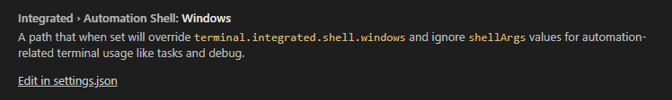

# VS code 터미널 설정 - cmder

## 1. Settings -> Features -> Terminal 로 이동

## 2. Windows의 settings.json 파일 열기



## 3. terminal을 cmder로 지정

```json
{
  "terminal.integrated.shell.windows": "cmd.exe",
  "terminal.integrated.shellArgs.windows": [
    "/K",
    "D:\\1.APP\\cmder\\vendor\\init.bat"
  ]
}
```

## 4. terminal 재기동
