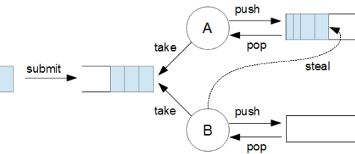

[1. Low Level Concurrency](#1-low-level-concurrency)

[2. High Level Concurrency](#2-high-level-concurrency)

[2.1 Java5 - ExecutorService](#21-java5---executorservice)

[2.2 Java7 - ForkJoinPool](#22-java7---forkjoinpool)

[2.3 Java8 - CompletableFuture](#23-java8---completablefuture)

[2.4 Java8 - WorkStealingPool](#24-java8---workstealingpool)

# 동기 / 비동기 / 블락 / 논블락 정리

1. 동기 / 비동기
  * 주체 : Thread
  * 관점 : 시간

  > 요청과 결과가 동시에 일어나는 것을 의미한다. Thread 의 입장에서 요청한 작업의 결과를 기다리면 동기, 기다리지 않으면 비동기

  > 결과물을 돌려받는 시점이 중요. 요청 후 작업이 끝날때까지 기다린 뒤, 결과물을 가져오면 동기

2. 블락 / 논블락
  * 주체 : Thread
  * 관점 : 행위

  > Thread 의 입장에서 자신에게 할당된 작업을 끝낸 뒤, 다른 스레드들의 전체 작업이 끝날 때까지 기다린다면 블락, 기다리지 않고 할 일을 한다면 논블락

* Future 예제
  * Main Thread 입장 - 비동기 / 논블락
  * Exeuctor Thread 입장 - 동기 / 블락

  > get()은 결과 처리가 완료될 때까지 블락킹된다.

# 1. Low Level Concurrency
1. Synchronized
    * java에서 지원하는 동기화 키워드
    * 특정 객체 or 메서드에 lock을 걸 수 있다.
~~~java
List<String> list = Lists.newArrayList();
synchronized(list){
  list.add("data");
}
~~~
2. GuardedBlock
3. Starvation
4. Deadlock
5. Immutable
~~~
1. "Setter"메소드를 제공하지 마십시오. 필드 또는 필드가 참조하는 객체를 수정하는 메소드입니다.

2. 모든 필드를 final 및 private으로 설정하십시오.

3. 서브 클래스가 메소드를 대체하도록 허용하지 마십시오.
   - 가장 간단한 방법은 클래스를 final로 선언하는 것입니다.
   - 생성자를 private으로 만들고 팩토리 메소드에서 인스턴스를 생성하는 것입니다.
~~~

6. Monitor Lock
7. Mutex
8. wait() / notify()
9. Reentrant

# 2. High Level Concurrency
1. ThreadPoolExecutor
2. ForkJoinPool
3. CompletableFuture
4. WorkStealingPool

## 2.1 Java5 - ExecutorService
Java 5부터 지원된 기능으로 비동기 처리 결과의 return 값을 받을 때 사용한다.

* ExecutorService
  * newFixedThreadPool - ExecutorService의 구현체 (팩토리 메소드)

~~~java
ExecutorService exeuctorService = Executors.newFixedThreadPool(n);

for(int num : numList){
    Future<T> task = executorService.submit(()->{
      T t = null;
      /*
      * logic 작성
      */
      return t;
    });
}

T result = task.get();

exeuctorService.shutdown();
~~~

## 2.2 Java7 - ForkJoinPool
Java 7부터 지원된 기능으로 Fork Join Framework의 대표적인 클래스이며, 쓰레드 풀의 일종이다.

* Recursive~ 를 구현해야 한다.
    1. RecursiveTask - return 값이 존재함
    2. RecursiveAction - return 값이 없음

> 즉 ForkJoinPool 은 newCachedThreadPool 이나 newFixedThreadPool 처럼 ExecutorService 의 구현체이다.

기본 개념은 큰 업무를 작은 업무 단위로 쪼개고, 그것을 각기 다른 CPU에서 병렬로 실행한후 결과를 취합하는 방식이다.

핵심 기술은 work-stealling 이라는 기술이다. 이것은 유휴 상태의 쓰레드를 없애는 방식인데, 세부 동작은 아래와 같다.

만약 위 그림처럼 B 쓰레드가 모든 일을 다 처리해서 더이상 할일이 없는 경우, CPU자원이 놀게 된다(Idle).
이런 상황에서 work-stealling이 동작하게 되면 A 쓰레드 큐에 남은 Task를 B에서 가져와서 처리를 하는 식으로 구현을 해주면 CPU가 놀지않고 최적의 성능을 낼 수 있다.

~~~java
public class SimpleForkJoinTask {
    public static void main(String[] args) {
        int nThreads = Runtime.getRuntime().availableProcessors();
        System.out.println("가용한 스레드 수 : "+nThreads);

        int[] numbers = new int[1000];

        for (int i=0;i<numbers.length;i++){
            numbers[i] = i;
        }

        ForkJoinPool forkJoinPool = new ForkJoinPool(nThreads);
        Long result = forkJoinPool.invoke(new Sum(0, numbers.length, numbers));
        System.out.println(result);
    }

    static class Sum extends RecursiveTask<Long>{
        int low;
        int high;
        int[] array;

        public Sum(int low, int high, int[] array) {
            this.low = low;
            this.high = high;
            this.array = array;
        }

        @Override
        protected Long compute() {
            if (high-low<=10){
                long sum = 0;
                for(int i=low;i<high;++i){
                    sum += array[i];
                }

                return sum;
            } else {
                int mid = low + (high - low) / 2;
                Sum left = new Sum(low,mid,array);
                Sum right = new Sum(mid,high,array);
                left.fork();
                long rightResult = right.compute();
                long leftResult = left.join();

                return leftResult + rightResult;
            }
        }
    }
}

~~~

## 2.3 Java8 - CompletableFuture
Java 8부터 지원된 기능으로 Java 5에서 나왔던 Future 의 제한 사항들을 개선한 모델이다.

1. Future 결과값을 가지고 Non-Blocking 상태로 어떤 행동을 수행할 수 없다.
2. Multi Future Task 들의 비동기 흐름을 만들 수가 없다. 하나의 Future 가 완료된 후, 다음 Future 로의 연결이 안된다.
3. Multi Future Task 들을 서로 연결할 수 없다. 병렬로 실해하고 완료된 후, 어떤 기능을 실행하고 싶은 다른 것이 있어도 할 수 없다.
4. Future 는 결과값에 대한 어떠한 Exception 처리를 할 수 없다.

> CompletableFuture 는 위의 Future 가 가지는 제한 사항들을 모두 수행할 수 있다.

~~~java
ExecutorService exeuctorService = Executors.newFixedThreadPool(n);

CompletableFuture<T> completableFuture = new CompletableFuture<>();

for(int num : numList){
    completableFuture = CompletableFuture.supplyAsync(()->{
      T t = null;
        /*
        * logic 작성
        */
        return t;
    }, exeuctorService)
    .exceptionally(throwable -> {
                  log.error("실패에 대한 로그", throwable);
                  throw new RuntimeException();
  });
}

T result = task.get();

exeuctorService.shutdown();
~~~

## 2.4 Java8 - WorkStealingPool
* WorkStealingPool
  * ExecutorService의 WorkStealingPool은 ForkJoinPool의 Recursive~ 를 직접 구현하지 않고도 ForkJoinPool을 사용할 수 있게 해준다.
~~~java
ExecutorService exeuctorService = new WorkStealingPool(n);

Future<T> task = executorService.submit(()->{
  T t = null;
  /*
  * logic 작성
  */
  return t;
});

T result = task.get();

exeuctorService.shutdown();
~~~
