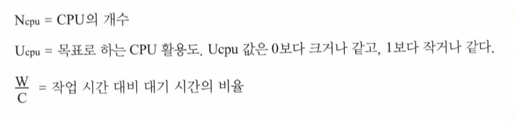

# Chapter 8.  Applying Thread Pools

[8.1 작업과 실행 정책 간의 보이지 않는 연결 관계](#81-작업과-실행-정책-간의-보이지-않는-연결-관계)

[8.2 스레드 풀 크기 조절](#82-스레드-풀-크기-조절)

[8.3 ThreadPoolExecutor 설정](#83-threadpoolexecutor-설정)

[* 집중 대응 정책](#집중-대응-정책)

[* 스레드 팩토리](#스레드-팩토리)

[8.4 ThreadPoolExecutor 상속](#84-threadpoolexecutor-상속)

[8.5 재귀 함수 병렬화](#85-재귀-함수-병렬화)

[* 요약](#요약)

8장에서는 스레드 풀을 설정하고 튜닝하는데 사용할 수 있는 고급 옵션을 살펴보고, 작업 실행 프레임웍을 사용할 때 흔히 발생할 수 있는 난관을 헤쳐 나갈 수 있는 방법과 함께 Executor를 사용하는 고급 예제를 소개한다.

# 8.1 작업과 실행 정책 간의 보이지 않는 연결 관계

Executor 프레임웍은 작업의 정의 부분과 실행 부분을 서로 분리시켜 준다.

그러나 아래처럼 일정 조건을 갖춘 실행 정책이 필요한 작업에서는 실행할 수 없기도 하다.

* 의존성이 있는 작업
  > 독립적인 작업은 대부분 문제없이 작동한다. 그러나 다른 작업에 의존성을 갖는 작업은 활동성 문제(liveness problem)이 발생할 수 있다.

* 스레드 한정 기법을 사용하는 작업
  > 단일 스레드는 병렬 프로그램 입장에서 안전하게 동작한다. 이런점을 이용해서 작업을 사용하는 객체 수를 스레드 수에 한정해서 스레드 안정성을 유지한다면 쉽게 스레드 안정성을 잃어버릴수 있다.

* 응답 시간이 민감한 작업
  > GUI 어플리케이션은 응답 시간이 중요하다. 오랫동안 실행될 작업 몇개만 등록하더라도 응답 성능이 크게 떨어진다.

* ThreadLocal을 사용하는 작업
  > ThreadLocal을 사용하면 각 스레드에서 같은 이름의 값을 각자의 버전으로 유지할 수 있다. 그런데 Executor는 기존 스레드를 최대한 재사용한다. 작업이 없을때는 스레드를 제거하기도하고, 작업이 몰릴때는 스레드를 추가하기도 하기때문에 ThreadLocal을 편법으로 활용해 작업 간에 값을 전달하는 용도로 사용해서는 안된다.

> 스레드풀은 동일하고 서로 독립적인 다수의 작업을 실행할 때 가장 효과적이다.

> 데드락이 아니더라도 실행 시간이 긴 작업을 제한 없이 대기하도록 하는 대신 일정 시간 동안만 대기하도록 제한하는 것이 더 좋다.

> 스레드가 대기하는 도중에 지정한 시간이 지나면 실패했다고 기록하고 종료한 뒤, 큐의 맨 뒤에 추가하는 등의 대책을 세울 수 있다.

## 예제 8.1 단일 스레드 Executor에서 데드락이 발생하는 작업 구조, 이런 코드는 금물!
~~~java
public class ThreadDeadlock {
    ExecutorService exec = Executors.newSingleThreadExecutor();

    public class RenderPageTask implements Callable<String> {
        public String call() throws Exception {
            Future<String> header, footer;
            header = exec.submit(new LoadFileTask("header.html"));
            footer = exec.submit(new LoadFileTask("footer.html"));
            String page = renderBody();
            // Will deadlock -- task waiting for result of subtask
            return header.get() + page + footer.get();
        }
    }
}
~~~

> 위처럼 단일 스레드로 동작하는 Executor에서 해당 작업의 결과물을 가져다가 실행하는 로직에서 스레드 자원 반납 전에 다른 작업을 시도한다면 스레드 자원을 확보하고자 할것이고 Executor로 부터 자원을 받기 위해 계속 대기하는 데드락 현상이 발생할 것이다.

# 8.2 스레드 풀 크기 조절

1. 스레드 풀의 크기는 설정 파일이나 Runtime.avilableProcessors 등의 메소드 결과 값에 따라 동적으로 지정되도록 해야 한다.
2. CPU를 많이 사용하는 작업의 경우 N개의 CPU가 있다면 스레드 수를 N+1 개로 맞추는 것이 최적의 성능을 발휘할 것이다.
3. I/O 작업이 많거나 기타 블로킹 작업이 많은 경우 스레드 풀의 크기를 훨씬 크게 잡을 필요가 있다.

> 스레드 풀을 사용하면 CPU 자원뿐만 아니라 메모리, 파일 핸들, 소켓 핸들, 데이터베이스 연결과 같은 자원의 사용량도 적절히 조절할 수 있다.

# 8.3 ThreadPoolExecutor 설정

> Executors 클래스의 newCachedThreadPool, newFiexedThreadPool, newScheduleThreadPool 등의 팩토리 메소드는 ThreadPoolExecutor의 구현 클래스이다.

> 스레드 풀에서 작업할 대상이 독립적인 경우에만 스레드의 개수를 제한할 수 있다. 다른 작업에 의존성을 갖는 작업을 실행해야 할 경우 newCachedThreadPool을 사용하여 데드락이 발생할 수 있는 상황을 없애야 한다.

## 예제 8.2 ThreadPoolExecutor의 범용 생성 메소드
~~~java
public ThreadPoolExecutor(int corePoolSize,
                          int maximumPoolSize,
                          long keepAliveTime,
                          TimeUnit unit,
                          BlockingQueue<Runnable> workQueue,
                          ThreadFactory threadFactory,
                          RejectedExecutionHandler handler) {
    ...
}
~~~

# 집중 대응 정책
크기가 제한된 큐에 작업이 가득차면 실행할 수 있는 정책을 의미한다.

1. 기본적으로는 중단(abort) 정책
   > * RuntimeException을 상속받은 RejectedExecutionException을 발생

2. 제거(discard) 정책
   > * 큐가 가득 찼을 때 이후 들어오는 작업을 아무 반응없이 제거
   > * 오래된 항목을 먼저 제거할 수도 있다.

3. 호출자 실행(caller runs) 정책
   > * 일종의 속도 조절 방법으로 초과하는 작업을 프로듀서에게 거꾸로 넘기는 방법
   > * 점진적으로 어플리케이션의 성능을 떨어지도록 조절할 수 있다.

> 스레드 풀에 적용할 집중 대응 정책은 예제 8.3처럼 Executor를 생성할 때 지정할 수 있다.

## 예제 8.3 스레드 개수와 작업 큐의 크기가 제한된 스레드 풀을 만들면서 호출자 실행 정책을 지정하는 모습
~~~java
ThreadPoolExecutor executor
            = new ThreadPoolExecutor(N_THREADS N_THREADS,
            0L,
            TimeUnit.MILLISECONDS,
            new LinkedBlockingQueue<Runnable>(CAPACITY));
executor.setRejectedExecutionHandler(
        new ThreadPoolExecutor.CallerRunsPolicy());
~~~

> 작업 큐가 가득 찼을 때, execute 메소드가 그저 대기하도록 하는 집중 대응 정책은 따로 구현된 것이 없지만 예제 8.4처럼 semaphore를 사용하여 구현할 수 있다.

## 예제 8.4 Semaphore를 사용해 작업 실행 속도를 조절
~~~java
@ThreadSafe
public class BoundedExecutor {
    private final Executor exec;
    private final Semaphore semaphore;

    public BoundedExecutor(Executor exec, int bound) {
        this.exec = exec;
        this.semaphore = new Semaphore(bound);
    }

    public void submitTask(final Runnable command) throws InterruptedException {
        semaphore.acquire();
        try {
            exec.execute(new Runnable() {
                public void run() {
                    try {
                        command.run();
                    } finally {
                        semaphore.release();
                    }
                }
            });
        } catch (RejectedExecutionException e) {
            semaphore.release();
        }
    }
}
~~~

# 스레드 팩토리
스레드 풀에서 새로운 스레드를 생성할 시점이 되면 스레드 팩토리를 통해 생성한다.

이 때 기본 값은 데몬이 아니면서 아무런 설정도 변경하지 않는 new Thread() 를 생성하도록 되어 있다.

> 하지만 기본 스레드가 아닌 직접 여러 설정을 가진 스레드를 생성해야 하는 여러 경우가 있을 것이다.
> * 스레드마다 의미 있는 이름 지정
> * UncaughtExceptionHandler를 직접 지정
> * 새로 생성한 스레드의 실행 우선 순위 지정 (권장X)
> * 데몬 상태를 직접 지정 (권장X)

## 예제 8.5 ThreadFactory 인터페이스
~~~java
public interface ThreadFactory {
    Thread newThread(Runnable r);
}
~~~

## 예제 8.6 직접 작성한 스레드 팩토리
~~~java
public class MyThreadFactory implements ThreadFactory {
    private final String poolName;

    public MyThreadFactory(String poolName) {
        this.poolName = poolName;
    }

    public Thread newThread(Runnable runnable) {
        return new MyAppThread(runnable, poolName);
    }
}
~~~

## 예제 8.7 직접 작성한 스레드 클래스
~~~java
public class MyAppThread extends Thread {
    public static final String DEFAULT_NAME = "MyAppThread";
    private static volatile boolean debugLifecycle = false;
    private static final AtomicInteger created = new AtomicInteger();
    private static final AtomicInteger alive = new AtomicInteger();
    private static final Logger log = Logger.getAnonymousLogger();

    public MyAppThread(Runnable r) {
        this(r, DEFAULT_NAME);
    }

    public MyAppThread(Runnable runnable, String name) {
        super(runnable, name + "-" + created.incrementAndGet());
        setUncaughtExceptionHandler(new Thread.UncaughtExceptionHandler() {
            public void uncaughtException(Thread t, Throwable e) {
                log.log(Level.SEVERE, "UNCAUGHT in thread " + t.getName(), e);
            }
        });
    }

    public void run() {
        // Copy debug flag to ensure consistent value throughout.
        boolean debug = debugLifecycle;
        if (debug) log.log(Level.FINE, "Created " + getName());
        try {
            alive.incrementAndGet();
            super.run();
        } finally {
            alive.decrementAndGet();
            if (debug) log.log(Level.FINE, "Exiting " + getName());
        }
    }

    public static int getThreadsCreated() {
        return created.get();
    }

    public static int getThreadsAlive() {
        return alive.get();
    }

    public static boolean getDebug() {
        return debugLifecycle;
    }

    public static void setDebug(boolean b) {
        debugLifecycle = b;
    }
}
~~~

# 8.4 ThreadPoolExecutor 상속

> ThreadPoolExecutor는 상속받은 하위 클래스가 오버라이드해 사용할 수 있도록 beforeExecute, afterExecute, terminated 와 같은 여러가지 훅도 제공하고 있으며, 이런 훅을 사용하면 훨씬 다양한 기능을 구사할 수 있다.

## 예제 8.8 기본 팩토리 메소드로 만들어진 Executor의 설정 변경 모습
~~~java
ExecutorService exec = Executors.newCachedThreadPool();
if(exec instanceof ThreadPoolExecutor)
    ((ThreadPoolExecutor)exec).setCorePoolSize(10);
else
    throw new AssertionError("Oops, bad assumption");
~~~

## 예제 8.9 ThreadPoolExecutor를 상속받아 로그와 시간 측정 기능을 추가한 클래스
~~~java
public class TimingThreadPool extends ThreadPoolExecutor {
    private final ThreadLocal<Long> startTime = new ThreadLocal<Long>();
    private final Logger log = Logger.getLogger("TimingThreadPool");
    private final AtomicLong numTasks = new AtomicLong();
    private final AtomicLong totalTime = new AtomicLong();

    protected void beforeExecute(Thread t, Runnable r) {
        super.beforeExecute(t, r);
        log.fine(String.format("Thread %s: start %s", t, r));
        startTime.set(System.nanoTime());
    }

    protected void afterExecute(Runnable r, Throwable t) {
        try {
            long endTime = System.nanoTime();
            long taskTime = endTime - startTime.get();
            numTasks.incrementAndGet();
            totalTime.addAndGet(taskTime);
            log.fine(String.format("Thread %s: end %s, time=%dns", t, r, taskTime));
        } finally {
            super.afterExecute(r, t);
        }
    }

    protected void terminated() {
        try {
            log.info(String.format("Terminated: avg time=%dns", totalTime.get() / numTasks.get()));
        } finally {
            super.terminated();
        }
    }
}
~~~

# 8.5 재귀 함수 병렬화

> 특정 작업을 여러번 실행하는 반복문이 있을 때, 반복되는 각 작업이 서로 독립적이라면 병렬화해서 성능의 이점을 얻을 수 있다. 특히 반복문 내부의 작업을 개별적인 작업으로 구분해 실행하느라 추가되는 약간의 부하가 부담되지 않을 만큼 적지 않은 시간이 걸리는 작업이라야 더 효과를 볼 수 있다.

## 예제 8.10 순차적인 실행 구조를 병렬화
~~~java
void processSequentially(List<Element> elements) {
        for (Element e : elements) process(e);
}

void processInParallel(Executor exec, List<Element> elements) {
    for (final Element e : elements)
        exec.execute(new Runnable() {
            public void run() {
                process(e);
            }
        });
}
~~~

## 예제 8.11 순차적인 재귀 함수를 병렬화한 모습
~~~java
public <T> void sequentialRecursive(List<Node<T>> nodes, Collection<T> results) {
      for (Node<T> n : nodes) {
          results.add(n.compute());
          sequentialRecursive(n.getChildren(), results);
      }
}

public <T> void parallelRecursive(final Executor exec, List<Node<T>> nodes, final Collection<T> results) {
    for (final Node<T> n : nodes) {
        exec.execute(new Runnable() {
            public void run() {
                results.add(n.compute());
            }
        });
        parallelRecursive(exec, n.getChildren(), results);
    }
}
~~~

## 예제 8.12 병렬 연산 작업이 모두 끝나기를 기다리는 예제
~~~java
public <T> Collection<T> getParallelResults(List<Node<T>> nodes) throws InterruptedException {
    ExecutorService exec = Executors.newCachedThreadPool();
    Queue<T> resultQueue = new ConcurrentLinkedQueue<T>();
    parallelRecursive(exec, nodes, resultQueue);
    exec.shutdown();
    exec.awaitTermination(Long.MAX_VALUE, TimeUnit.SECONDS);
    return resultQueue;
}
~~~

퍼즐을 프로그램으로 풀어내려면 '퍼즐' 이라는 대상을 초기 위치, 목표 위치, 정상적인 이동 규칙 등의 세가지로 추상화하고 이 개념을 묶어 퍼즐이라고 정의하자.

## 예제 8.13 블록 이동 퍼즐 과 같은 퍼즐을 풀기 위한 인터페이스
~~~java
public interface Puzzle<P, M> {
    P initialPosition();
    boolean isGoal(P position);
    Set<M> legalMoves(P position);
    P move(P position, M move);
}
~~~

## 예제 8.14 퍼즐 풀기 프레임웍의 Node 클래스
~~~java
@Immutable
static class Node<P, M> {
    final P pos;
    final M move;
    final Node<P, M> prev;

    Node(P pos, M move, Node<P, M> prev) {...}

    List<M> asMoveList() {
        List<M> solution = new LinkedList<M>();
        for (Node<P, M> n = this; n.move != null; n = n.prev) solution.add(0, n.move);
        return solution;
    }
}
~~~

## 예제 8.15 순차적으로 동작하는 퍼즐 풀기 프로그램
~~~java
public class SequentialPuzzleSolver<P, M> {
    private final Puzzle<P, M> puzzle;
    private final Set
 seen = new HashSet
();

    public SequentialPuzzleSolver(Puzzle<P, M> puzzle) {
        this.puzzle = puzzle;
    }

    public List<M> solve() {
        P pos = puzzle.initialPosition();
        return search(new Node<P, M>(pos, null, null));
    }

    private List<M> search(Node<P, M> node) {
        if (!seen.contains(node.pos)) {
            seen.add(node.pos);
            if (puzzle.isGoal(node.pos)) return node.asMoveList();
            for (M move : puzzle.legalMoves(node.pos)) {
                P pos = puzzle.move(node.pos, move);
                Node<P, M> child = new Node<P, M>(pos, move, node);
                List<M> result = search(child);
                if (result != null) return result;
            }
        }
        return null;
    }

    static class Node<P, M> {  /*  Listing 8.14  */
    }
}
~~~

## 예제 8.16 병렬로 동작하는 퍼즐 풀기 프로그램
~~~java
public class ConcurrentPuzzleSolver<P, M> {
    private final Puzzle<P, M> puzzle;
    private final ExecutorService exec;
    private final ConcurrentMap<P, Boolean> seen;
    final ValueLatch<Node<P, M>> solution = new ValueLatch<Node<P, M>>();     ...

    public List<M> solve() throws InterruptedException {
        try {
            P p = puzzle.initialPosition();
            exec.execute(newTask(p, null, null));             // block until solution found
            Node<P, M> solnNode = solution.getValue();
            return (solnNode == null) ? null : solnNode.asMoveList();
        } finally {
            exec.shutdown();
        }
    }

    protected Runnable newTask(P p, M m, Node<P, M> n) {
        return new SolverTask(p, m, n);
    }

    class SolverTask extends Node<P, M> implements Runnable {         ...

        public void run() {
            if (solution.isSet() || seen.putIfAbsent(pos, true) != null)
                return; // already solved or seen this position
            if (puzzle.isGoal(pos)) solution.setValue(this);
            else for (M m : puzzle.legalMoves(pos)) exec.execute(newTask(puzzle.move(pos, m), m, this));
        }
    }
}
~~~

## 예제 8.17 ConcurrentPuzzleSolver에서 사용했던 결과 값을 포함하는 래치
~~~java
@ThreadSafe
public class ValueLatch<T> {
    @GuardedBy("this")
    private T value = null;
    private final CountDownLatch done = new CountDownLatch(1);

    public boolean isSet() {
        return (done.getCount() == 0);
    }

    public synchronized void setValue(T newValue) {
        if (!isSet()) {
            value = newValue;
            done.countDown();
        }
    }

    public T getValue() throws InterruptedException {
        done.await();
        synchronized (this) {
            return value;
        }
    }
}
~~~

## 예제 8.18 최종 결과가 없다는 사실을 확인하는 기능이 추가된 버전
~~~java
public class PuzzleSolver<P, M> extends ConcurrentPuzzleSolver<P, M> {     ...
    private final AtomicInteger taskCount = new AtomicInteger(0);

    protected Runnable newTask(P p, M m, Node<P, M> n) {
        return new CountingSolverTask(p, m, n);
    }

    class CountingSolverTask extends SolverTask {
        CountingSolverTask(P pos, M move, Node<P, M> prev) {
            super(pos, move, prev);
            taskCount.incrementAndGet();
        }

        public void run() {
            try {
                super.run();
            } finally {
                if (taskCount.decrementAndGet() == 0) solution.setValue(null);
            }
        }
    }
}
~~~

# 요약

Executor 프레임웍은 작업을 병렬로 동작시킬 수 있는 강력함과 유연성을 고루 갖추고 있다.
* 스레드를 생성하거나 제거하는 정책
* 큐에 쌓인 작업을 처리하는 방법
* 밀린 작업을 처리하는 방법
* 여러가지 훅 메서드 제공

# 8.1 작업과 실행 정책 간의 보이지 않는 연결 관계
> 스레드풀은 동일하고 서로 독립적인 다수의 작업을 실행할 때 가장 효과적이다.

> 데드락이 아니더라도 실행 시간이 긴 작업을 제한 없이 대기하도록 하는 대신 일정 시간 동안만 대기하도록 제한하는 것이 더 좋다.

# 8.2 스레드 풀 크기 조절
1. 스레드 풀의 크기는 설정 파일이나 Runtime.avilableProcessors 등의 메소드 결과 값에 따라 동적으로 지정되도록 해야 한다.
2. CPU를 많이 사용하는 작업의 경우 N개의 CPU가 있다면 스레드 수를 N+1 개로 맞추는 것이 최적의 성능을 발휘할 것이다.
3. I/O 작업이 많거나 기타 블로킹 작업이 많은 경우 스레드 풀의 크기를 훨씬 크게 잡을 필요가 있다.

# 8.3 ThreadPoolExecutor 설정
> Executors 클래스의 newCachedThreadPool, newFiexedThreadPool, newScheduleThreadPool 등의 팩토리 메소드는 ThreadPoolExecutor의 구현 클래스이다.

> 스레드 풀에서 작업할 대상이 독립적인 경우에만 스레드의 개수를 제한할 수 있다. 다른 작업에 의존성을 갖는 작업을 실행해야 할 경우 newCachedThreadPool을 사용하여 데드락이 발생할 수 있는 상황을 없애야 한다.

# 집중 대응 정책
크기가 제한된 큐에 작업이 가득차면 실행할 수 있는 정책을 의미한다.

1. 기본적으로는 중단(abort) 정책
   > * RuntimeException을 상속받은 RejectedExecutionException을 발생

2. 제거(discard) 정책
   > * 큐가 가득 찼을 때 이후 들어오는 작업을 아무 반응없이 제거
   > * 오래된 항목을 먼저 제거할 수도 있다.

3. 호출자 실행(caller runs) 정책
   > * 일종의 속도 조절 방법으로 초과하는 작업을 프로듀서에게 거꾸로 넘기는 방법
   > * 점진적으로 어플리케이션의 성능을 떨어지도록 조절할 수 있다.

# 스레드 팩토리
기본 스레드가 아닌 직접 여러 설정을 가진 스레드를 생성해야 하는 여러 경우가 있을 것이다.
> * 스레드마다 의미 있는 이름 지정
> * UncaughtExceptionHandler를 직접 지정
> * 새로 생성한 스레드의 실행 우선 순위 지정 (권장X)
> * 데몬 상태를 직접 지정 (권장X)

# 8.4 ThreadPoolExecutor 상속
> ThreadPoolExecutor는 상속받은 하위 클래스가 오버라이드해 사용할 수 있도록 beforeExecute, afterExecute, terminated 와 같은 여러가지 훅도 제공하고 있으며, 이런 훅을 사용하면 훨씬 다양한 기능을 구사할 수 있다.

# 8.5 재귀 함수 병렬화
> 특정 작업을 여러번 실행하는 반복문이 있을 때, 반복되는 각 작업이 서로 독립적이라면 병렬화해서 성능의 이점을 얻을 수 있다. 특히 반복문 내부의 작업을 개별적인 작업으로 구분해 실행하느라 추가되는 약간의 부하가 부담되지 않을 만큼 적지 않은 시간이 걸리는 작업이라야 더 효과를 볼 수 있다.