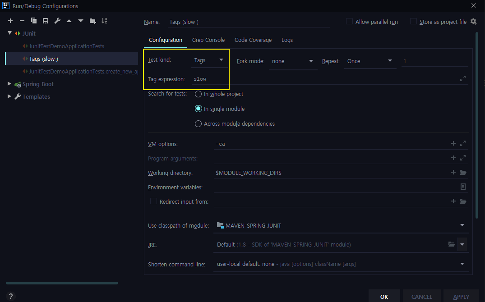

# The Java - 테스트 케이스 작성

> 참조 사이트 - https://docs.google.com/document/d/1j6mU7Q5gng1mAJZUKUVya4Rs0Jvn5wn_bCUp3rq41nQ/edit

## 1. JUnit5 시작

~~~java
@SpringBootTest
class JunitTestDemoApplicationTests {

    @Test
    void contextLoads() {
        App app = new App();
        assertNotNull(app);
        System.out.println("create");
    }

    @Test
    @Disabled
    void create1(){
        System.out.println("create1");
    }

    // 모든 @Test 코드가 실행 되기 전에 딱 한번 실행 된다.
    // private, default 안됨
    @BeforeAll
    static void beforeAll(){
        System.out.println("beforeAll");
    }

    @AfterAll
    static void afterAll(){
        System.out.println("afterAll");
    }

    // 모든 @Test 코드가 실행 되기 앞,뒤에 한번씩 실행 된다.
    @BeforeEach
    void beforeEach(){
        System.out.println("beforeEach");
    }

    @AfterEach
    void afterEach(){
        System.out.println("afterEach");
    }
}
~~~

## 2. JUnit5 테스트 이름 표시하기

~~~java
@SpringBootTest
@DisplayNameGeneration(DisplayNameGenerator.ReplaceUnderscores.class)
class JunitTestDemoApplicationTests {

  @Test
  @DisplayName("App 만들기")
  void create_new_app() {
      App app = new App();
      assertNotNull(app);
      System.out.println("create");
}
~~~

> @DisplayName() 을 추천한다.

## 3. JUnit5 Assertion

### 3.1 assertEquals
~~~java
@Test
@DisplayName("App 만들기🥊")
void create_new_app() {
    App app = new App();

    // Not Null 체크
    assertNotNull(app);

    // 테스트가 실패했을 때 보여지는 메시지를 만들 수 있는데, 단순 String 또는 Lambda를 사용할 수 있다.

    // 메세지를 단순 String으로 보낼 경우 테스트 실패 여부와 상관없이 문자열을 만든다. 항상
    assertEquals(AppStatus.DRAFT, app.getStatus(), "App을 처음 만들면"+ AppStatus.DRAFT + " 상태가 되야 한다.");

    // 반면 람다로 처리해놓으면 테스트 실패 시에만 문자열을 만든다.
    assertEquals(AppStatus.DRAFT, app.getStatus(), () -> "App을 처음 만들면"+ AppStatus.DRAFT + " 상태가 되야 한다.");
    }
~~~

### 3.2 assertAll
~~~java
@Test
@DisplayName("App 만들기🥊")
void create_new_app() {
    App app = new App(-10);

    // 테스트를 한번에 묶어서 실행해줄 수 있다.
    assertAll(
            () -> assertNotNull(app),
            () -> assertEquals(AppStatus.DRAFT, app.getStatus(), () -> "App을 처음 만들면"+ AppStatus.DRAFT + " 상태가 되야 한다."),
            () -> assertTrue(app.getLimit() > 0, "App 최대 참석 갯수는 0보다 커야 한다.")
    );
}
~~~

### 3.3 assertThrows
~~~java
@Test
@DisplayName("App 만들기🥊")
void create_new_app() {
    IllegalArgumentException exception = assertThrows(IllegalArgumentException.class, () -> new App(-10));

    String message = exception.getMessage();
    assertEquals("limit은 0보다 커야 한다.",message);

}
~~~

## 4. JUnit5 조건에 따라 테스트 실행
~~~java
@Test
@DisplayName("App 만들기🥊")
// 기동 운영 환경에 따른 테스트 코드 조건 지정
@EnabledOnOs(OS.MAC)
// 특정 자바 버전에서만 테스트를 선택적으로 수행
@EnabledOnJre({JRE.JAVA_8,JRE.JAVA_9})
// 환경 변수의 값과 일치하는 조건문 지정
@EnabledIfEnvironmentVariable(named = "TEST_ENV", matches = "local")
void create_new_app() {
    String test_env = System.getenv("TEST_ENV");
    System.out.println(test_env);
    assumeTrue("LOCAL".equalsIgnoreCase(test_env));

    App app = new App(-10);
    assertThat(app.getLimit()).isGreaterThan(0);

    assertTimeout(Duration.ofMillis(100),() -> {
        new App(10);
        Thread.sleep(50);
    },"테스트가 100ms을 넘기면 안된다.");
}
~~~

## 5. JUnit5 테스트 태깅

### 5.1 JUnit5 태깅
~~~java
@Tag("fast")
void create_new_app() { }
~~~

### 5.2 build 툴 특정 태깅만 테스트
~~~java
<profiles>
// default로 특정 태깅만 테스트 하겠다.
        <profile>
            <id>default</id>
            <activation>
                <activeByDefault>true</activeByDefault>
            </activation>
            <build>
                <plugins>
                    <plugin>
                        <artifactId>maven-surefire-plugin</artifactId>
                        <configuration>
                            <groups>fast</groups>
                        </configuration>
                    </plugin>
                </plugins>
            </build>
        </profile>

// ci는 모든 태깅을 테스트 하겠다.
        <profile>
            <id>ci</id>
            <build>
                <plugins>
                    <plugin>
                        <artifactId>maven-surefire-plugin</artifactId>
                        <configuration>
                            <groups>fast | slow</groups>
                        </configuration>
                    </plugin>
                </plugins>
            </build>
        </profile>
</profiles>

// terminal
λ ./mvnw.cmd test -P ci
~~~

## 6. JUnit5 커스텀 태그

~~~java
@Target(ElementType.METHOD)
@Test
@Tag("fast")
@Retention(RetentionPolicy.RUNTIME)
public @interface FastTest {
}
~~~

커스텀 태그를 만들어서 사용하면 아래와 같이 @Tag에 (String으로 값을 일일히 매핑하지 않아도 된다.)

아래 코드는 문자열이기 때문에 type-safety하지 않다. 태그 문자열에 오타가 생기더라도 잡아주지 않는다..

~~~java
@Tag("fast")
void create_new_app() { }
~~~

## 7. JUnit5 테스트 반복하기

### 7.1 단순 반복 테스트
~~~java
@DisplayName("반복 테스트")
@RepeatedTest(value = 10, name = "{displayName}, {currentRepetition} / {totalRepetitions}")
void repeatTest(RepetitionInfo repetitionInfo){
    System.out.println("test" + repetitionInfo.getCurrentRepetition() + "/"
    + repetitionInfo.getTotalRepetitions());
}
~~~

### 7.2 다른 인자값으로 반복 테스트
~~~java
@DisplayName("인자 반복 테스트")
@ParameterizedTest(name = "{index} {displayName} message={0}")
@ValueSource(strings = {"날씨가","많이","더워지고","있네요."})
// @EmptySource // 비어있는 문자 추가
// @NullSource // Null 문자 추가
@NullAndEmptySource
void parameterizedTest(String message){
    System.out.println(message);
}
~~~

~~~java
@DisplayName("CVS Source 값")
@ParameterizedTest(name = "{index} {displayName} message={0}")
@ValueSource(ints = {10, 20, 40})
void parameterizedTest3(@ConvertWith(AppConverter.class) App app){
    System.out.println(app.getLimit());
}

static class AppConverter extends SimpleArgumentConverter{
    @Override
    protected Object convert(Object source, Class<?> targetType) throws ArgumentConversionException {
        assertEquals(App.class, targetType, "Can only convert to App");
        return new App(Integer.parseInt(source.toString()));
    }
}

@DisplayName("CVS Source 값1")
@ParameterizedTest(name = "{index} {displayName} message={0}")
@CsvSource({"10, 자바 스터디, 20, 스프링"})
void parameterizedTest4(Integer limit, String name){
    App app = new App(limit, name);
    System.out.println(app);
}

@DisplayName("CVS Source 값2")
@ParameterizedTest(name = "{index} {displayName} message={0}")
@CsvSource({"10, 자바 스터디" ,"20, 스프링"})
void parameterizedTest5(ArgumentsAccessor argumentsAccessor){
    App app = new App(argumentsAccessor.getInteger(0), argumentsAccessor.getString(1));
    System.out.println(app);
}

@DisplayName("CVS Source 값3")
@ParameterizedTest(name = "{index} {displayName} message={0}")
@CsvSource({"10, 자바 스터디" ,"20, 스프링"})
void parameterizedTest6(@AggregateWith(AppAggregator.class) App app){
    System.out.println(app);
}
~~~

## 8. JUnit5 Test Instance

